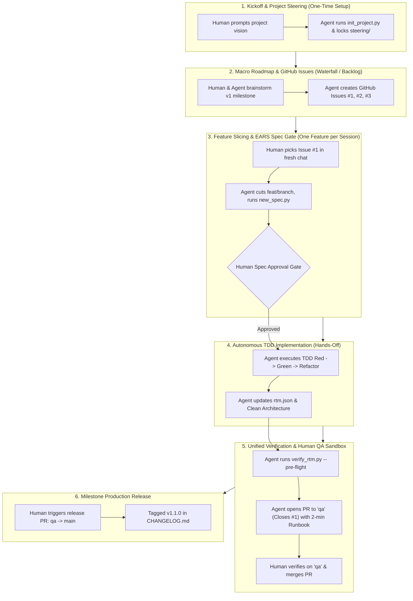

# Agentic SDLC Framework (Antigravity + AWS Kiro SDD Standard)

> **A reusable, production-grade GitHub repository template built for autonomous AI coding agents (specifically Google Antigravity) collaborating with a Human Visionary / Product Owner / QA Tester.**

---

## 🌟 Core Philosophy: Zero-Hallucination & Low Cognitive Load

This framework eliminates the classic pitfalls of AI-assisted engineering (*spec drift, silent regressions, cross-session architectural thrashing, and context rot*) by establishing a structured, automated division of responsibilities:

- **The Human**: Visionary, Product Owner, and Final QA Tester. Directs *what* and *why* with minimal cognitive friction.
- **The AI Agent (Antigravity)**: Principal Software Engineer. Executes the entire SDLC end-to-end (*Socratic spec discovery, architectural modeling, TDD implementation, automated verification, documentation, and PR delivery*).

---

## 📊 Human vs. AI Responsibility Matrix

```
┌────────────────────────────────────────────────────────────────────────┐
│                        THE 6-PHASE SDLC DIVISION                       │
├────────────────────────────┬─────────────────────────────┬─────────────┤
│ Phase                      │ Human Responsibility        │ AI Agent    │
├────────────────────────────┼─────────────────────────────┼─────────────┤
│ 0. Repo Instantiation      │ Click "Use this template"   │ Idle        │
│ 1. Project Kickoff         │ State product vision & idea │ Configures  │
│ 2. Macro Roadmap & Issues  │ Prioritize business backlog │ Drafts cards│
│ 3. Feature Intake & Spec   │ Reviews & Approves Spec     │ Socratic SDD│
│ 4. TDD Implementation      │ Hands-off (Zero friction)   │ Writes TDD  │
│ 5. Human QA & Staging      │ Runs 2-min verification     │ Opens PR    │
│ 6. Milestone Release       │ Approves release to main    │ Preps SemVer│
└────────────────────────────┴─────────────────────────────┴─────────────┘
```

---

## 📐 The 6-Phase SDLC Lifecycle



---

## 📖 Step-by-Step Operating Playbook

### Phase 1: Day 1 Kickoff & Steering (One-Time Setup)
1. Click **Use this template** on GitHub and open the new repository in your editor.
2. Prompt Antigravity:
   > *"I want to build a real-time warehouse inventory service using Python and FastAPI. Let's initialize the project steering."*
3. Antigravity runs `init_project.py`, asks 2–3 structured questions, and populates `steering/product.md`, `steering/tech.md`, and `docs/rtm.json`.

---

### Phase 2: Macro Roadmap & GitHub Issues
1. Brainstorm your milestone breakdown:
   > *"Let's break down our v1 MVP into 3-5 vertical slices and create GitHub Issues."*
2. Antigravity drafts modular feature cards and creates GitHub Issues (`#1 Auth`, `#2 Inventory CRUD`, etc.).

---

### Phase 3: Feature Slicing & Spec Approval Gate
> [!IMPORTANT]
> **Golden Rule of Session Hygiene**: **One Feature, One Session, One Branch.** Always start a fresh Antigravity session when beginning a new GitHub Issue to prevent context rot.

1. Start a fresh session and prompt:
   > *"Work on Issue #1: User Authentication with Magic Links."*
2. Antigravity cuts branch `feat/magic-link-auth` from `qa`, runs `new_spec.py auth`, conducts Socratic discovery, and drafts the 3-file spec in `docs/specs/auth/`:
   - `requirements.md` (EARS user stories + `[REQ-AUTH-001]` tokens)
   - `design.md` (Ports & Adapters, Mermaid sequences)
   - `tasks.md` (TDD checklist)
3. **The Gate**: Review the spec and reply: *"Approved. Proceed with implementation."*

---

### Phase 4: Autonomous TDD Implementation
- **Hands-off**: Antigravity executes `tasks.md` using strict **Red-Green-Refactor TDD**:
  - **RED**: Writes failing unit and integration tests.
  - **GREEN**: Implements minimal code (KISS/YAGNI).
  - **REFACTOR**: Applies Clean Architecture boundaries (DIP/Rule of Three).
- Automatically updates `docs/rtm.json`.

---

### Phase 5: Human QA Testing & Staging Merge
1. Antigravity runs `verify_rtm.py --pre-flight` and opens a PR targeting **`qa`** (`Closes #1`).
2. Follow the **2-Minute Human QA Runbook** included in the PR description.
3. Merge the PR into `qa` (GitHub auto-closes Issue #1).

---

### Phase 6: Milestone Release to Production (`main`)
- When milestone features are tested on `qa`, merge `qa` $\rightarrow$ `main`, tag the SemVer release (`v1.1.0`), and update `CHANGELOG.md`.

---

## 💡 Quick Prompts Cheat-Sheet for the Human

| Situation | Exact Prompt to Use |
| :--- | :--- |
| **Day 1 Kickoff** | `"I want to build [name/idea]. Let's set up the project steering."` |
| **Roadmap Planning** | `"Let's break down our v1 MVP into 3-5 vertical slices and create GitHub Issues."` |
| **Start a Feature** | `"Work on Issue #X: [Issue Title]. Start Socratic discovery and spec drafting."` |
| **Approve Spec** | `"Approved. Proceed with TDD execution."` |
| **Verify Status** | `"Run the pre-flight verification gate and show the RTM summary."` |
| **Release to Prod** | `"All features on qa are verified. Prepare the release PR from qa to main."` |

---

## 📂 Repository Topology

```text
├── .agents/
│   ├── rules/
│   │   ├── architecture.md          # Strategic SOLID vs Tactical KISS/YAGNI
│   │   ├── definition-of-done.md    # Multi-tier verification checklist
│   │   ├── git-workflow.md          # qa branching, Conventional Commits, SemVer
│   │   ├── human-engagement.md      # Socratic interviewing, session hygiene, low friction
│   │   ├── sdd-ears.md              # EARS requirement syntax rules
│   │   └── tdd-invariants.md        # Red-Green-Refactor invariants
│   └── skills/
│       ├── sdd-workflow/            # Spec authoring & bootstrapping skill
│       │   ├── SKILL.md
│       │   ├── scripts/init_project.py # Day 1 project initializer
│       │   └── scripts/new_spec.py  # Deterministic 3-file spec scaffolder
│       ├── adr-manager/             # Architecture Decision Record skill
│       │   ├── SKILL.md
│       │   └── scripts/new_adr.py   # Deterministic ADR scaffolder & indexer
│       ├── rtm-sync/                # Traceability matrix skill
│       │   ├── SKILL.md
│       │   └── scripts/verify_rtm.py# RTM validator & unified DoD pre-flight CLI
│       └── tdd-cycle/               # TDD execution skill
│           └── SKILL.md
├── steering/                        # AWS Kiro Persistent Context Layer
│   ├── product.md                   # Product vision, personas, business goals
│   ├── tech.md                      # Tech stack, execution commands, security rules
│   └── structure.md                 # Workspace topology and layer boundaries
├── docs/
│   ├── architecture/                # Living C4 architecture models (.gitkeep)
│   ├── adr/                         # Architecture Decision Records
│   │   ├── 0000-template.md
│   │   └── 0001-baseline-sdlc.md
│   ├── specs/                       # 3-File feature specifications
│   │   └── _template/               # requirements.md, design.md, tasks.md
│   ├── rtm.json                     # Machine-readable Traceability Matrix
│   └── rtm.schema.json              # JSON Schema validator for RTM
├── src/                             # Clean Architecture source boundaries
│   ├── application/
│   ├── domain/
│   └── infrastructure/
├── tests/                           # Automated test suites
│   ├── integration/
│   └── unit/
├── .github/
│   ├── ISSUE_TEMPLATE/              # Structured issue templates (card, story, bug, epic)
│   └── PULL_REQUEST_TEMPLATE.md     # DoD checklist & Human QA runbook
├── .gitignore                       # Enterprise-grade polyglot gitignore
├── AGENTS.md                        # Master Agent Constitution
├── CHANGELOG.md                     # Semantic versioning changelog
├── GEMINI.md                        # Antigravity entry point alias
└── README.md
```

---

## 🛠️ Deterministic Skill Automation (Context-Optimized)

| Command | Purpose |
| :--- | :--- |
| `python .agents/skills/sdd-workflow/scripts/init_project.py --name "my-app" --vision "..." --lang "..."` | Bootstraps project steering in under 60 seconds. |
| `python .agents/skills/sdd-workflow/scripts/new_spec.py <feature-name> --domain <DOMAIN>` | Scaffolds the 3-file spec with prefilled `[REQ-xxx]` tags. |
| `python .agents/skills/adr-manager/scripts/new_adr.py "<Title>"` | Scaffolds the next sequential ADR from template. |
| `python .agents/skills/rtm-sync/scripts/verify_rtm.py --pre-flight` | Executes the unified Definition of Done gate (RTM + Linters + Tests). |
| `python .agents/skills/rtm-sync/scripts/verify_rtm.py --impact <file>` | Calculates the blast radius of a file change. |
