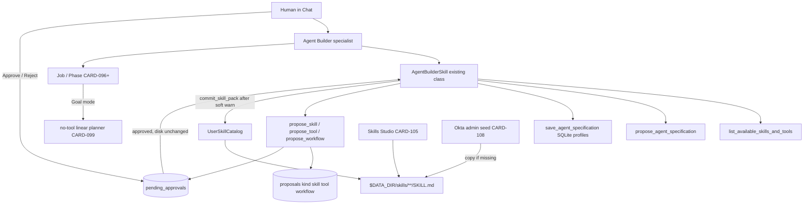
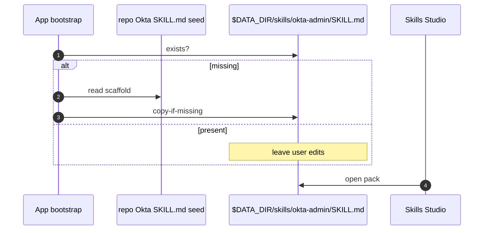

# Technical Design: Agent Builder HITL

> **Linked Spec**: [`requirements.md`](./requirements.md)
> **Applicable ADRs**: `docs/adr/0001-baseline-sdlc.md`, `docs/adr/0013-mcp-standard-client-adapter-and-dynamic-skill-loader.md`
> **Locked architecture**: Slice A Job/Phase and Slice B data dir / Skills Studio stay. Extend `AgentBuilderSkill`. Do not invent a second builder, a second loop, or a second proposals table.

---

## 1. Architectural Overview & C4 Context

Adopt proven patterns only: CARD-101 HITL drafts (`proposals` + `pending_approvals`), agentskills.io `SKILL.md` via `UserSkillCatalog`, CARD-099 Job/Phase + no-tool planner, CARD-078 soft allowlist warning at 12.



Existing modules this slice extends (no new kernel, no second builder):

| Layer | Today | Slice C |
|-------|--------|---------|
| Skill class | `AgentBuilderSkill`: list tools, propose agent spec, save custom agent to SQLite | Same class gains `propose_skill` / `propose_tool` / `propose_workflow` and pack commit |
| Builtin agents | Assistant, AutoReiv, Coding, Conductor, Review. Agent Builder tools live on AutoReiv allowlist | New `agent-builder` specialist. Conductor stays cards/specs. AutoReiv may keep existing agent-spec tools |
| Proposals | `ProposalKind` already has `skill\|tool\|workflow\|followup_job\|agent`. CARD-101 ships `followup_job` only | Wire the three unused kinds. Same table, same statuses `draft\|approved\|rejected` |
| HITL | `pending_approvals` + Chat Approve/Reject. `propose_followup` creates both rows and does not auto-run | Same park. Approve does **not** write `SKILL.md` |
| Packs | `$DATA_DIR/skills` + `UserSkillCatalog` + Skills Studio | Agent Builder commit uses `save_pack` / `render_skill_md`. Same files |
| Job/Phase | Default chat one job one phase. Goal = no-tool linear planner | Agent Builder research phases use that planner. No LangGraph |
| Sprawl | Forge amber banner at 12 tools (CARD-078) | Same threshold on propose/commit. Prefer extend-specialist over new agent |

### 1.1 What AgentBuilderSkill already does (do not replace)

Source: `src/application/skills/agent_builder_skill.py` (REQ-FORGE-005). Registered in `BuiltinAgentRegistry.bootstrap`. Manifest pack id `agent-builder`.

| Tool | Behavior today |
|------|----------------|
| `list_available_skills_and_tools` | Lists master registry tools, `ModelPurpose` values, `AgentTone` values, avatar icon names |
| `propose_agent_specification` | In-memory blueprint from `role` / `objective` / `domain`. Does not persist. Suggests a small `allowed_tool_names` list |
| `save_agent_specification` | `AgentProfileGuardrail.validate` then `register_custom_agent` into SQLite `custom_agents`. **Immediate. No HITL.** |

Those three stay. Pack authoring is additional tools on the **same class**. `save_agent_specification` remains the custom-**agent-profile** path (Forge / SQLite). It is not how user packs land on disk.

AutoReiv today allowlists `propose_agent_specification` and `save_agent_specification` (not `list_available_skills_and_tools`). Slice C mounts the full builder tool set on the new specialist. Do not dump Coding/SDLC/`cli_exec` tools onto Agent Builder (CARD-078).

---

## 2. Sequence Flow

### 2.1 HITL draft (CARD-106)

```mermaid
sequenceDiagram
    autonumber
    actor Human
    participant AB as Agent Builder / tool
    participant Store as proposals + pending_approvals
    participant Disk as $DATA_DIR/skills

    Human->>AB: need an Okta / homelab skill
    AB->>AB: research (Job/Phase; no SKILL.md write)
    AB->>Store: propose_skill/tool/workflow payload what why how where
    Store-->>AB: proposal_id + approval_id status draft
    Note over Disk: unchanged
    AB-->>Human: draft parked; Chat HITL
    alt Approve
        Human->>Store: Approve
        Store-->>AB: status approved
        Note over Disk: still unchanged
    else Reject
        Human->>Store: Reject
        Store-->>AB: status rejected
        Note over Disk: unchanged
    end
```

Mirror `propose_followup_job` in `src/application/orchestration/followup.py`: create proposal + `create_approval`, return `auto_run: false`. Do **not** create a follow-up Job for skill/tool/workflow kinds (those kinds are packs, not `template_id=followup_job`).

### 2.2 Research then commit (CARD-107)

```mermaid
sequenceDiagram
    autonumber
    actor Human
    participant Chat
    participant Plan as no-tool planner
    participant Orch as JobPhaseOrchestrator
    participant AB as AgentBuilderSkill
    participant Cat as UserSkillCatalog

    Human->>Chat: Goal on, talk to Agent Builder
    Chat->>Plan: no tools; linear research phases
    Plan->>Orch: persist Job + Phases
    Note over Plan: survey, draft playbook, declare tools, HITL propose
    Orch->>AB: stream_turn per phase
    AB->>AB: propose_* draft (CARD-106)
    Human->>Chat: Approve
    AB->>AB: soft sprawl warning if allowlist >= 12 or new agent
    AB->>Cat: commit_skill_pack if approved
    Cat->>Cat: save_pack jailed to $DATA_DIR/skills
```

Default Chat (Goal off) remains one Job + one Phase + `stream_turn` (CARD-099). Agent Builder may still `propose_*` in that single phase.

### 2.3 Okta seed (CARD-108)



---

## 3. Data Contracts & Interfaces

### 3.1 Proposal payload (skill | tool | workflow)

Reuse `Proposal` / `ProposalKind` / `ProposalStatus` in `src/domain/orchestration/models.py`. New JSON body, not new columns.

```json
{
  "what": "Okta admin playbook for homelab directory ops",
  "why": "Operator resets / assigns in Okta without a live API skill yet",
  "how": "SKILL.md SOP plus JSON tool stubs; no Python builtin",
  "where": "skills/okta-admin/SKILL.md",
  "kind": "skill",
  "sprawl_warning": null,
  "prefer_existing_agent_id": "autoreiv",
  "target_pack_id": "okta-admin",
  "requested_by_agent_id": "agent-builder",
  "requested_by_session_id": "..."
}
```

`where` is stored relative to `$DATA_DIR` (or as a jailed absolute under it). Traversal (`..`, extra roots) is rejected the same way `UserSkillCatalog.resolve_skill_md` jails pack ids.

| Kind | `what` | `how` | `where` typical |
|------|--------|-------|-----------------|
| `skill` | New or replacement pack | Playbook SOP + optional JSON tools | `skills/<slug>/SKILL.md` |
| `tool` | One declared tool | JSON stub (`name`, `description`, `parameters`) to merge into an existing pack | `skills/<slug>/SKILL.md` |
| `workflow` | Ordered SOP | Playbook steps in `SKILL.md` body. Not job-template YAML | `skills/<slug>/SKILL.md` |

`workflow` in Slice C is **not** `$DATA_DIR/templates/jobs/` and does not set `jobs.template_id`. That remains a later card.

Approve/Reject: extend the CARD-101 decision helper to honor `skill|tool|workflow` without calling `UserSkillCatalog.save_pack`. `followup_job` keep current job queued/cancel behavior.

### 3.2 Agent Builder profile

New builtin next to Conductor/Review in `src/domain/agents/profiles.py`:

```text
id: agent-builder
name: Agent Builder
purpose: GENERAL (talks to human)
tone: FRIENDLY or TECHNICAL
avatar: sparkles (already in AgentBuilderSkill.avatars)
```

System prompt (intent, not final copy): you are AutoReiv's Agent Builder. You talk to the human about skills, tools, and workflows. You research with Job/Phase. You emit HITL drafts via `propose_skill` / `propose_tool` / `propose_workflow`. You never auto-write `SKILL.md` or Python under `src/`. After Approve, you may commit a pack into `$DATA_DIR/skills` through the same files Skills Studio edits. Prefer adding tools/skills to an existing specialist over a new agent when the allowlist would exceed 12. You are not Conductor: you do not write SDLC cards or hand Ready work to Coding.

Suggested allowlist (keep under 12):

- `list_available_skills_and_tools`
- `propose_agent_specification`
- `save_agent_specification` (custom **profiles** only; sprawl-warn if allowlist >= 12)
- `propose_skill`, `propose_tool`, `propose_workflow`
- `commit_skill_pack` (approved proposals only)
- `list_user_skill_packs`, `skill_view`
- `lookup_agents` (optional `handoff_to_agent` if needed to consult a specialist)

Do **not** mount `write_project_file`, `execute_code`, `cli_exec`, or Conductor card/spec tools.

`propose_skill` / `propose_tool` / `propose_workflow` are allowlisted on Agent Builder. They may also be allowlisted on Assistant / AutoReiv (discovery), **not** on Coding, Review, or Conductor.

### 3.3 Tools added on AgentBuilderSkill

```python
# Same class. Additional registrations in register_tools.

propose_skill(what, why, how, where, pack_id=None, prefer_existing_agent_id=None)
propose_tool(what, why, how, where, pack_id, tool_json, prefer_existing_agent_id=None)
propose_workflow(what, why, how, where, pack_id=None)
commit_skill_pack(proposal_id)  # CARD-107; requires status=approved; UserSkillCatalog.save_pack
```

Implementation may live in a helper next to `followup.py` (e.g. `src/application/orchestration/skill_proposals.py`) **called from** `AgentBuilderSkill`. That is not a second builder skill.

`commit_skill_pack` algorithm:

1. Load proposal. Fail if kind not `skill|tool|workflow` or status not `approved`.
2. Jail `where` under `$DATA_DIR/skills`.
3. Compute sprawl: if target agent allowlist would be >= 12, include warning in the tool result. Soft. Human already Approved the draft; commit may still write unless a later card adds a second confirm.
4. Write via `UserSkillCatalog.save_pack` / merge JSON tool into existing `SKILL.md` body.
5. Return path. Skills Studio list/open must see it without a second format.

### 3.4 Sprawl warning (CARD-078)

Reuse threshold 12. Payload field `sprawl_warning`:

```text
Allowlist for specialist 'autoreiv' would be 13 (>= 12). Prefer adding tools/skills
on that specialist instead of creating a new agent. This is a warning, not a block.
```

When the draft is a **new agent** (`save_agent_specification` / `ProposalKind.AGENT` later): warn to extend an existing specialist first. Slice C does not have to HITL-gate `save_agent_specification`, but Agent Builder must surface the warning before that save and before pack commit.

### 3.5 Okta admin scaffold (CARD-108)

Repo seed (example path; implementation may sit next to other seeds):

```text
src/infrastructure/skills/seeds/okta-admin/SKILL.md
```

Copy-if-missing to `$DATA_DIR/skills/okta-admin/SKILL.md`. Do not overwrite dest.

Minimum `SKILL.md`:

````markdown
---
name: okta-admin
description: Homelab Okta admin playbook. Directory, groups, apps, and MFA SOP. No live Okta API.
---

# Okta Admin (homelab)

Operate Okta as an admin using this playbook. Declared tools are **stubs**.
They do not call Okta and do not read API tokens. Open this pack in Skills Studio.

## When to use
- Find or unlock a homelab user
- Assign an application to a person or group
- Check MFA enrollment

## SOP
1. Identify the user (login or email) with the human.
2. Confirm the action.
3. Follow the named procedure. Do not invent live API calls.

## Declared tools (stubs)

```json
{
  "name": "okta_list_users",
  "description": "Stub: list Okta users by login or email. Not wired to the Okta API.",
  "parameters": {
    "type": "object",
    "properties": {
      "query": {"type": "string", "description": "Login, email, or name fragment"}
    }
  }
}
```
````

Also stub at least `okta_reset_or_unlock` and `okta_assign_app` with `name` + `parameters`. `DynamicSkillLoader` already requires those keys. Handlers remain CARD-104 playbook stubs (honest "not an executable Python builtin").

No Okta base URL, token env, or HTTP client in this card.

### 3.6 HTTP / UI

No new Studio. Chat HITL Approve/Reject already exists. Skills Studio already lists/edits `$DATA_DIR/skills`. Agent Builder is a builtin in the existing agent picker.

Optional: show `sprawl_warning` text on the HITL card (reuse approval arguments_json). Do not add a Settings field. Do not warn on Chat for unrelated agents (CARD-078: Forge banner stays Forge).

---

## 4. Error Handling & Edge Cases

| Error Scenario | Detection Point | Handling / Fallback | User Response |
| :--- | :--- | :--- | :--- |
| Missing what/why/how/where | `propose_*` | Fail closed; no proposal row | Honest error |
| `where` escapes `$DATA_DIR/skills` | propose / commit | Reject | 400 / tool error; no write |
| `propose_*` with empty store | Skill | Fail; no disk write | Honest error |
| Approve on non-draft | Decision helper | Idempotent no-op | Status unchanged; no write |
| `commit_skill_pack` on `draft` or `rejected` | Commit | Fail closed | Tell human to Approve first |
| Commit while dest `SKILL.md` exists | Commit / tool merge | Merge tool JSON or refuse replace without explicit overwrite flag | Do not clobber playbook silently |
| Allowlist would be >= 12 | propose / commit | Soft warning in payload and tool result | Draft still created; commit not hard-blocked |
| New agent vs existing specialist | propose / save_agent_specification | Soft warning naming the specialist to extend | Human may proceed |
| User pack tool name collides with builtin | Commit / mount | CARD-104 builtin wins | Honest log; pack still listed |
| Okta seed dest exists | Bootstrap | Skip copy | User edits kept |
| Okta stub invoked | Playbook handler | No HTTP | CARD-104 stub error string |
| Goal planner returns a DAG | Planner (CARD-099) | Forbidden | Linear phases only |
| Second builder class added | Review | Out of spec | Extend `AgentBuilderSkill` only |

---

## 5. UI wireframes

### 5.1 Chat — Agent Builder + HITL (CARD-106, CARD-107)

```text
| Chat agent: [ Agent Builder v ]
| Goal [ ]  Verify [ ]

Human: I need an Okta admin skill for the homelab.
Agent Builder: I will survey existing packs and specialists, then park a draft.
               I will not write SKILL.md until you Approve.

[HITL] propose_skill  status: pending
  what: Okta admin playbook
  why:  homelab directory ops without a live API
  how:  SKILL.md SOP + JSON stubs
  where: $DATA_DIR/skills/okta-admin/SKILL.md
  warning: (none)  or  allowlist would be 13; prefer extend autoreiv
  [ Approve ]  [ Reject ]
```

Approve does not start a ReAct loop and does not write disk. After Approve, Agent Builder may `commit_skill_pack` with the same soft warning.

### 5.2 Skills Studio — Okta pack (CARD-108)

Existing Skills Studio tab (CARD-105). After seed or commit:

```text
Packs                         | okta-admin
- okta-admin                  | Homelab Okta admin playbook. ...
- ...                         | Tools: okta_list_users, okta_reset_or_unlock, okta_assign_app
                              | SKILL.md editor (SOP + JSON stubs)
```

No Agent Builder panel inside Forge. No live Okta login in Studio.

---

## 6. Mapping to existing code (implementation later; this card is spec-only)

- Extend `src/application/skills/agent_builder_skill.py` only. Register new tools next to the existing three.
- Helper for proposal rows: follow `src/application/orchestration/followup.py` + `ProposalRepositoryMixin`. Decision path next to `apply_followup_decision` (extend or sibling; do not fork a second approvals store).
- Builtin profile: `src/domain/agents/profiles.py` `BUILTIN_PROFILES`. Manifest `agent-builder` already exists in `src/application/skills/manifest.py` for the Python tools; add the Chat specialist id.
- Commit: `src/application/skills/user_catalog.py` `save_pack` / `render_skill_md` / `resolve_skill_md`.
- Job/Phase: no new orchestrator. Chat already creates jobs (CARD-099). Goal path already no-tool planner.
- Okta seed: copy-if-missing during data-dir bootstrap or catalog init; source file under repo seeds, dest `$DATA_DIR/skills/okta-admin/SKILL.md`.
- HITL UI: `src/web/routers/hitl.py` + existing Chat Approve/Reject. Pass sprawl text in `arguments_json`.
- Tests: proposals kinds already validated in domain models; add propose/commit jail tests; Okta seed copy-if-missing; no HTTP to Okta.

---

## 7. Non-goals (do not design)

SkillOpt / ACE nightly, LangGraph, training weights, replacing Conductor, live Okta credentials or API, job-template YAML runner, Python `BuiltinSkill` modules under `src/` for user packs, a second builder class, a second proposals table, changing Slice A Job/Phase or Slice B Skills Studio contracts, CARD-014 DAG.
