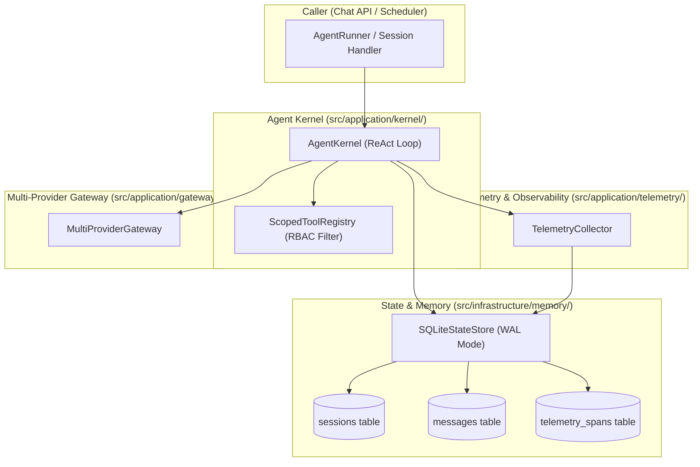
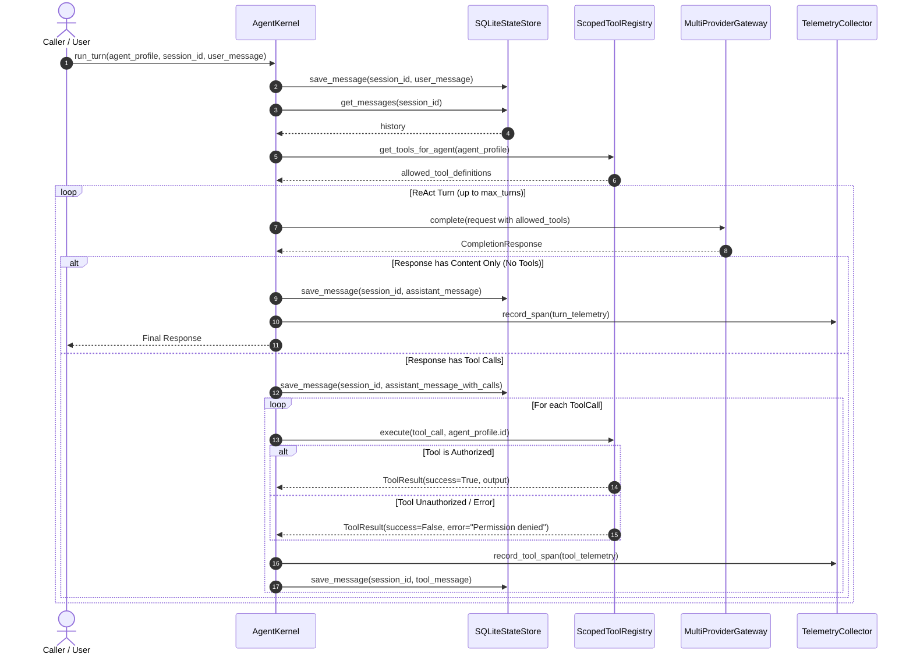

# Technical Design: Agent Kernel, Scoped Memory & Telemetry Engine

> **Linked Spec**: [`requirements.md`](./requirements.md)  
> **Applicable ADRs**: [`docs/adr/0003-agent-kernel-scoped-tool-registry-and-sqlite-state-persistence.md`](../../adr/0003-agent-kernel-scoped-tool-registry-and-sqlite-state-persistence.md)

---

## 1. Architectural Overview & Component Topology



---

## 2. Sequence Flow: Agent ReAct Execution Loop



---

## 3. Data Contracts & Domain Models

### 3.1 Kernel & Agent Profile Models (`src/domain/kernel/models.py`)

```python
from enum import Enum
from typing import List, Dict, Any, Optional
from pydantic import BaseModel, Field


class AgentTone(str, Enum):
    CONCISE = "concise"
    TECHNICAL = "technical"
    FRIENDLY = "friendly"
    ACADEMIC = "academic"
    SOCRATIC = "socratic"
    DEFAULT = "default"


class AgentProfile(BaseModel):
    id: str = Field(description="Unique agent identifier (e.g. 'general-assistant')")
    name: str = Field(description="Human readable name")
    description: str = Field(description="Agent role summary")
    system_prompt: str = Field(description="Base persona prompt")
    tone: AgentTone = Field(default=AgentTone.DEFAULT)
    model: str = Field(default="default", description="Model override or purpose tag")
    allowed_tool_names: List[str] = Field(default_factory=list, description="Authorized tool IDs")
    max_turns: int = Field(default=10, ge=1, le=50)


class ToolResult(BaseModel):
    call_id: str
    tool_name: str
    output: Any
    success: bool = True
    error: Optional[str] = None
    duration_ms: float = 0.0


class KernelEventType(str, Enum):
    TOKEN = "token"
    TOOL_START = "tool_start"
    TOOL_END = "tool_end"
    TURN_END = "turn_end"
    ERROR = "error"


class KernelEvent(BaseModel):
    event_type: KernelEventType
    content: str = ""
    reasoning_content: str = ""
    tool_call: Optional[Dict[str, Any]] = None
    tool_result: Optional[ToolResult] = None
    is_finished: bool = False
```

### 3.2 Memory & Telemetry Models (`src/domain/memory/models.py` & `src/domain/telemetry/models.py`)

```python
from datetime import datetime
from typing import Optional, Dict, Any
from pydantic import BaseModel, Field


class Session(BaseModel):
    id: str
    agent_id: str
    title: str = "New Conversation"
    created_at: datetime
    updated_at: datetime


class TelemetrySpan(BaseModel):
    id: str
    session_id: Optional[str] = None
    agent_id: Optional[str] = None
    span_type: str = "turn"  # "turn" or "tool"
    name: str
    duration_ms: float
    prompt_tokens: int = 0
    completion_tokens: int = 0
    success: bool = True
    error_message: Optional[str] = None
    metadata: Dict[str, Any] = Field(default_factory=dict)
    created_at: datetime
```

---

## 4. SQLite WAL Database Schema (`src/infrastructure/memory/schema.sql`)

```sql
PRAGMA journal_mode = WAL;
PRAGMA busy_timeout = 5000;
PRAGMA foreign_keys = ON;

CREATE TABLE IF NOT EXISTS sessions (
    id TEXT PRIMARY KEY,
    agent_id TEXT NOT NULL,
    title TEXT NOT NULL,
    created_at TIMESTAMP DEFAULT CURRENT_TIMESTAMP,
    updated_at TIMESTAMP DEFAULT CURRENT_TIMESTAMP
);

CREATE TABLE IF NOT EXISTS messages (
    id TEXT PRIMARY KEY,
    session_id TEXT NOT NULL REFERENCES sessions(id) ON DELETE CASCADE,
    agent_id TEXT NOT NULL,
    role TEXT NOT NULL,
    content TEXT NOT NULL,
    tool_calls_json TEXT,
    tool_call_id TEXT,
    name TEXT,
    sequence_num INTEGER NOT NULL,
    created_at TIMESTAMP DEFAULT CURRENT_TIMESTAMP
);

CREATE INDEX IF NOT EXISTS idx_messages_session ON messages(session_id, sequence_num);

CREATE TABLE IF NOT EXISTS telemetry_spans (
    id TEXT PRIMARY KEY,
    session_id TEXT,
    agent_id TEXT,
    span_type TEXT NOT NULL,
    name TEXT NOT NULL,
    duration_ms REAL NOT NULL,
    prompt_tokens INTEGER DEFAULT 0,
    completion_tokens INTEGER DEFAULT 0,
    success BOOLEAN NOT NULL DEFAULT 1,
    error_message TEXT,
    metadata_json TEXT,
    created_at TIMESTAMP DEFAULT CURRENT_TIMESTAMP
);

CREATE INDEX IF NOT EXISTS idx_telemetry_agent ON telemetry_spans(agent_id, created_at);
CREATE INDEX IF NOT EXISTS idx_telemetry_span_type ON telemetry_spans(span_type, created_at);
```

---

## 5. Error Handling & Edge Cases

| Scenario | Detection Point | Handling | Outcome |
| :--- | :--- | :--- | :--- |
| Unauthorized Tool Call | `ScopedToolRegistry.execute()` | Check against `allowed_tool_names` | Returns `ToolResult(success=False, error="Tool ... unauthorized for agent ...")` back to LLM |
| Unknown Tool Requested | `ScopedToolRegistry.execute()` | Lookup in registry | Returns `ToolResult(success=False, error="Tool not found")` |
| Infinite Loop / Cycle | `AgentKernel._check_cycle()` | Detects identical consecutive tool arguments | Terminates turn with warning message |
| Database Locked / Busy | `SQLiteStateStore` | `PRAGMA busy_timeout=5000` + retry logic | Recovers cleanly under concurrent calls |
