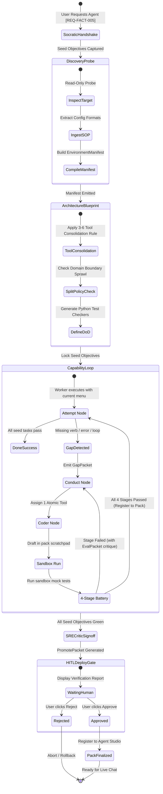
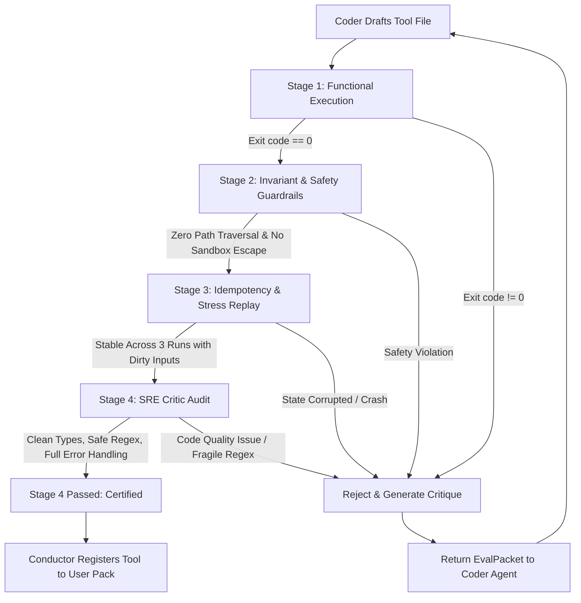

# Technical Design: Autonomous Agent Pack Factory and Self-Testing Capability Loop

> **Spec Reference**: [docs/specs/agent-pack-factory/requirements.md](file:///D:/Projects/Active/AutoReiv/docs/specs/agent-pack-factory/requirements.md)  
> **Architecture Level**: System Architecture & Multi-Agent State Engine  
> **Primary Modules**: `src.application.orchestration.factory`, `src.application.skills.sandbox_worker`, `src.infrastructure.memory.repositories`  
> **Target Release**: v0.20.0  

---

## 1. Architectural Context & Component Diagram (C4 Level 2)

The Autonomous Agent Pack Factory operates as a durable background control-plane subsystem. It orchestrates five specialized platform agents through a conditional graph, producing battle-tested User Agent Packs inside `$DATA_DIR/packs/<agent_id>/`.

```
+-----------------------------------------------------------------------------------------+
| AutoReiv Platform                                                                       |
|                                                                                         |
|  +-----------------------+              +---------------------------------------------+ |
|  |     Chat Studio       |              |             FactoryOrchestrator             | |
|  |  [x] Train Agent      |              |          (Deterministic Graph Walker)       | |
|  |  Socratic Handshake   |              +----------------------+----------------------+ |
|  +-----------+-----------+                                     |                        |
|              | HTTP / Event                                    | Advances Graph Nodes   |
|              v                                                 v                        |
|  +-----------------------+              +---------------------------------------------+ |
|  |    Factory Router     |              |           The Factory Agent Roster          | |
|  | /api/factory/jobs     |              |  (Core Platform Packs, show_in_chat: false) | |
|  +-----------+-----------+              |                                             | |
|              |                          |  1. Conductor (Graph / Pack Coordinator)    | |
|              |                          |  2. Inspector (Read-only Environment Probe) | |
|              |                          |  3. Coder     (Atomic Python Tool Author)   | |
|              |                          |  4. Runner    (Sandbox Mock Execution)      | |
|              |                          |  5. Critic    (SRE Skeptic / 4-Stage Gate)  | |
|              |                          +----------------------+----------------------+ |
|              v                                                 |                        |
|  +-----------------------+                                     | Authored Files & Tools |
|  | Factory SQLite Store  |                                     v                        |
|  | - factory_jobs        |              +---------------------------------------------+ |
|  | - factory_graphs      |              |            Isolated Local Sandbox           | |
|  | - factory_packets     |              |    (EphemeralSandbox + Mock Environment)    | |
|  | - factory_evals       |              +----------------------+----------------------+ |
|  +-----------------------+                                     |                        |
+----------------------------------------------------------------|------------------------+
                                                                 v
                               +---------------------------------------------------------+
                               | Output: User Agent Pack ($DATA_DIR/packs/<agent_id>/)    |
                               |                                                         |
                               |  - pack.json               (Manifest & 3-6 tool menu)   |
                               |  - tools/<tool_name>.py    (Verified Python callables)  |
                               |  - skills/<skill>/SKILL.md (Domain SOP runbooks)        |
                               |  - <agent_slug>_memory.db  (Shelf 1 pinned seed memory) |
                               +---------------------------------------------------------+
```

---

## 2. Factory State Machine & The Rinse Graph

The core reasoning engine is encoded as a deterministic state graph. The orchestrator advances nodes based on typed results; **no language model sits inside the graph transition loop**.



---

## 3. The 4-Stage Verification Battery Pipeline

To eliminate hallucinations and prevent broken code from ever being registered into a User Agent Pack, every drafted tool must sequentially pass four distinct evaluation gates:



---

## 4. SQLite Schema Additions (`database/autoreiv.db`)

The factory state engine is persisted in SQLite to ensure durability across application restarts.

```sql
-- 1. Factory Training Jobs
CREATE TABLE IF NOT EXISTS factory_jobs (
    id TEXT PRIMARY KEY,
    target_agent_id TEXT NOT NULL,
    session_id TEXT NOT NULL,
    status TEXT NOT NULL DEFAULT 'queued', -- queued, running, waiting_approval, done, failed, cancelled
    seed_intent TEXT NOT NULL,
    target_host TEXT,
    environment_manifest_json TEXT,
    active_graph_id TEXT NOT NULL,
    current_node_id TEXT NOT NULL,
    budget_max_cycles INTEGER DEFAULT 25,
    cycles_consumed INTEGER DEFAULT 0,
    created_at TIMESTAMP DEFAULT CURRENT_TIMESTAMP,
    updated_at TIMESTAMP DEFAULT CURRENT_TIMESTAMP
);

CREATE INDEX IF NOT EXISTS idx_factory_jobs_status ON factory_jobs(status);

-- 2. Versioned Capability Graphs
CREATE TABLE IF NOT EXISTS factory_graphs (
    id TEXT PRIMARY KEY,
    name TEXT NOT NULL,
    version INTEGER DEFAULT 1,
    nodes_json TEXT NOT NULL, -- Array of GraphNode definitions
    edges_json TEXT NOT NULL, -- Array of conditional edge rules
    created_at TIMESTAMP DEFAULT CURRENT_TIMESTAMP
);

-- 3. Typed Inter-Room Packet Store
CREATE TABLE IF NOT EXISTS factory_packets (
    id TEXT PRIMARY KEY,
    job_id TEXT NOT NULL REFERENCES factory_jobs(id) ON DELETE CASCADE,
    packet_type TEXT NOT NULL, -- work, gap, eval, promote
    sender_role TEXT NOT NULL, -- conductor, inspector, coder, sandbox_runner, critic
    recipient_role TEXT NOT NULL,
    node_id TEXT NOT NULL,
    payload_json TEXT NOT NULL,
    created_at TIMESTAMP DEFAULT CURRENT_TIMESTAMP
);

CREATE INDEX IF NOT EXISTS idx_factory_packets_job ON factory_packets(job_id, created_at);

-- 4. Evaluation Battery Runs
CREATE TABLE IF NOT EXISTS factory_eval_runs (
    id TEXT PRIMARY KEY,
    job_id TEXT NOT NULL REFERENCES factory_jobs(id) ON DELETE CASCADE,
    tool_name TEXT NOT NULL,
    stage_1_functional BOOLEAN NOT NULL DEFAULT 0,
    stage_2_safety BOOLEAN NOT NULL DEFAULT 0,
    stage_3_idempotency BOOLEAN NOT NULL DEFAULT 0,
    stage_4_critic BOOLEAN NOT NULL DEFAULT 0,
    stdout_log TEXT,
    stderr_log TEXT,
    critic_notes TEXT,
    duration_ms REAL NOT NULL,
    overall_passed BOOLEAN NOT NULL DEFAULT 0,
    created_at TIMESTAMP DEFAULT CURRENT_TIMESTAMP
);

CREATE INDEX IF NOT EXISTS idx_factory_eval_job ON factory_eval_runs(job_id, tool_name);
```

---

## 5. UI Contract: Chat Studio Socratic Handshake & Training Toggle

### 5.1 Chat Options Floating Deck Toggle
```text
+-----------------------------------------------------------------------------------+
|  [ Prompt Textarea: "Build me a Palworld game server agent on my Linux box"    ]  |
|                                                                                   |
|  [⚙️ Options]  [ ] Self-Verify   [ ] Auto-Run   [x] 🏭 Train Agent (Lab Loop)     |
|                                                                    [ ➤ Send ]     |
+-----------------------------------------------------------------------------------+
```

### 5.2 30-Second Socratic Handshake Modal (`#trainAgentHandshakeModal`)
```text
+-----------------------------------------------------------------------------------+
| 🏭 Train New Specialist Agent: Palworld Server Host                               |
+-----------------------------------------------------------------------------------+
| AutoReiv will run an autonomous lab training loop to author and verify tools.    |
| Please answer 3 quick questions to establish the seed objectives:                |
|                                                                                   |
| 1. Target Environment:                                                            |
|    (o) Remote Linux Host over SSH (Host / IP: [ 192.168.1.150                 ] ) |
|    ( ) Local Machine Directory    (Path:      [                               ] ) |
|                                                                                   |
| 2. Primary Objectives (Select recommended starter goals):                        |
|    [x] (A) Server Lifecycle (Check status, Start, Stop, Restart safely)           |
|    [x] (B) Configuration Management (Read/edit PalWorldSettings.ini values)       |
|    [x] (C) Automated Save Game Backups (Create timestamped .tar.gz archives)      |
|                                                                                   |
| 3. Safety & Approval Policy:                                                      |
|    (o) Require Human Approval for Server Restarts & Config Writes (Recommended)   |
|    ( ) Autonomous execution within sandbox mock only                              |
|                                                                                   |
| [ Cancel ]                                         [ 🚀 Launch Overnight Loop ]   |
+-----------------------------------------------------------------------------------+
```

---

## 6. Anti-Bloat Consolidation & Split Policies

### 6.1 Tool Consolidation Gate
- **Heuristic**: When a proposed tool shares an identical target entity (e.g. system service or config file) with another tool, reject separate tool files and merge into a single polymorphic action dispatcher:
  ```python
  # Consolidated Tool Pattern
  def palworld_service(action: Literal["status", "start", "stop", "restart"]) -> Dict[str, Any]:
      ...
  ```
- **Ceiling**: A User Agent Pack is flagged with a bloat warning if active tool count exceeds 6.

### 6.2 Agent Split Policy
- **Trigger**: When an agent accumulates tools across $\ge 2$ distinct operational domains (e.g., Domain A: Game Application Management vs. Domain B: Host Network / Firewall Configuration), or tool parameter schemas exceed 1,500 prompt tokens.
- **Action**: Conductor pauses the loop, generates two discrete pack manifests (`palworld-host` and `homelab-network`), binds a `handoff_to_agent` contract between them, and presents a split recommendation packet.

---

## 7. Autonomous In-Flight Tool Synthesis & Capability Gap Backlog [CARD-165]

### 7.1 Architecture & Flow
```
User Turn: "Create a VM called test"
       │
       ▼
AgentKernel Execution
       │
       ▼
Agent text: "I don't have the tools to create a VM"
       │
       ▼
CapabilityDetector.detect()
       │
       ├──[ allow_autonomous_training == False ]───────────────────┐
       │                                                           ▼
       │                                              Record CapabilityGap
       │                                            (agent_capability_gaps)
       │                                                           │
       ▼ [ allow_autonomous_training == True ]                     ▼
JitToolSynthesizer.synthesize_and_deploy()           Agent Studio Backlog Card
       │                                            [⚡ Train in Lab] [Dismiss]
       ▼ (bounded by max_training_retries, default 2)
Stream `auto_train_progress` events to Chat Studio
       │
       ▼
VerificationBatteryService (Stages 1–4)
       │
       ├──[ Any Stage Fails ]──> Retry / Log to Backlog on Exhaustion
       │
       ▼ [ 100% Clean Pass on All 4 Stages ]
Auto-Bypass HITL Deploy Gate!
       │
       ▼
Deploy tool to `packs/<agent_id>/tools/<tool>.py`
Register in `tool_registry` & `agent.allowed_tool_names`
       │
       ▼
Resume Paused Turn!
Agent Kernel calls new tool and completes user request seamlessly.
```

