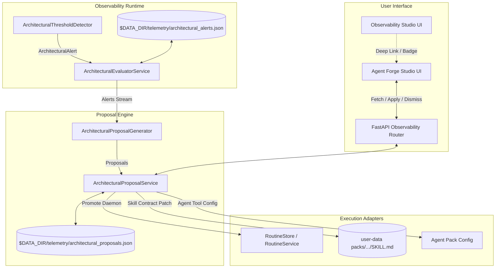
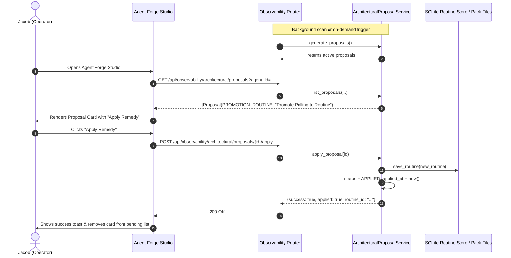

# Technical Design Specification: Architectural Proposal Inbox

> **Component**: `src/application/observability/`, `src/domain/observability/`, `src/web/routers/observability.py`, `src/web/static/modules/studios/forge.js`  
> **Target Release**: v0.18.0 (Milestone 18)  
> **Spec Reference**: [CARD-365](file:///d:/Projects/Active/AutoReiv/docs/cards/CARD-365-architectural-proposal-inbox-in-agent-forge-studio.md) & [ADR-0054](file:///d:/Projects/Active/AutoReiv/docs/adr/0054-autonomic-os-state-machine-demand-paging-and-mechanical-governance.md)

---

## 1. Architectural Architecture & C4 Component Model



---

## 2. Sequence Diagram: Autonomic Proposal Lifecycle



---

## 3. Detailed Component Contracts

### 3.1 Domain Models (`src/domain/observability/models.py`)

```python
class ArchitecturalProposalType(str, Enum):
    PROMOTION_ROUTINE = "promotion_routine"
    SKILL_DECOMPOSITION = "skill_decomposition"
    TOOL_PRUNING = "tool_pruning"
    SECURITY_ISOLATION = "security_isolation"
    CONTRACT_REINFORCEMENT = "contract_reinforcement"


class ArchitecturalProposalStatus(str, Enum):
    PENDING = "pending"
    APPLIED = "applied"
    DISMISSED = "dismissed"


class ArchitecturalProposal(BaseModel):
    id: str
    alert_id: str
    proposal_type: ArchitecturalProposalType
    status: ArchitecturalProposalStatus = ArchitecturalProposalStatus.PENDING
    title: str
    description: str
    agent_id: str
    session_id: Optional[str] = None
    impact_summary: str
    action_payload: Dict[str, Any] = Field(default_factory=dict)
    created_at: datetime = Field(default_factory=lambda: datetime.now(timezone.utc))
    applied_at: Optional[datetime] = None
    dismissed_at: Optional[datetime] = None
```

### 3.2 Proposal Generator (`src/application/observability/architectural_proposals.py`)

```python
class ArchitecturalProposalGenerator:
    """Pure domain/application generator synthesizing proposals from architectural alerts."""

    @staticmethod
    def generate_proposals(
        alerts: List[ArchitecturalAlert],
        existing_proposals: Optional[List[ArchitecturalProposal]] = None,
    ) -> List[ArchitecturalProposal]:
        ...
```

### 3.3 Proposal Service (`src/application/observability/architectural_proposals.py`)

```python
class ArchitecturalProposalService:
    def __init__(self, store: Any = None, data_dir: Optional[Path] = None):
        ...

    def list_proposals(
        self,
        status: Optional[str] = "pending",
        agent_id: Optional[str] = None,
        proposal_type: Optional[str] = None,
        limit: int = 50,
    ) -> List[ArchitecturalProposal]:
        ...

    def generate_from_alerts(self, alerts: Optional[List[ArchitecturalAlert]] = None) -> List[ArchitecturalProposal]:
        ...

    def apply_proposal(self, proposal_id: str) -> Dict[str, Any]:
        ...

    def dismiss_proposal(self, proposal_id: str) -> Dict[str, Any]:
        ...
```

---

## 4. UI ASCII Wireframe

```
+----------------------------------------------------------------------------------------------------+
|  Agent Studio > [Companion / SRE Lead v]                                    [New Agent] [Export]  |
+----------------------------------------------------------------------------------------------------+
|  [v] Architectural Governance & Proposal Inbox (2 pending)                       [Scan & Refresh] |
|  +-----------------------------------------------------------------------------------------------+ |
|  | [!] CRITICAL | LIFECYCLE_MISMATCH | Routine Promotion                        [Dismiss] [Apply] | |
|  | Title: Promote Long-Running Chat Polling to Hourly Routine                                     | |
|  | Evidence: Session sess_123 ran 8 unattended consecutive polling turns (avg 42s loop).         | |
|  | Rationale: Free interactive chat context and isolate background execution into Routine daemon. | |
|  | Impact: Reduces prompt context by ~12,000 tokens/turn; guarantees persistent background cron.  | |
|  | Action Remedy: Registers 'SRE Hourly Health Poller' routine (interval: 3600s, ask approval).  | |
|  +-----------------------------------------------------------------------------------------------+ |
|  | [!] HIGH | COGNITIVE_CONFLICT | Verification Contract Reinforcement         [Dismiss] [Apply] | |
|  | Title: Enforce Deterministic Verification Contract on Python Refactor Skill                     | |
|  | Evidence: Session sess_456 mutated file 'core.py' with zero subsequent verification calls.      | |
|  | Rationale: Code mutations must be verified mechanically per ADR-0054 (Rule of Self-Critique).  | |
|  | Action Remedy: Patches SKILL.md frontmatter with `verification: pytest tests/unit/`.          | |
|  +-----------------------------------------------------------------------------------------------+ |
+----------------------------------------------------------------------------------------------------+
|  [>] Identity                                                                                      |
|  [>] Brain (Skills)                                                                                |
|  [>] Hands (Tools)                                                                                 |
+----------------------------------------------------------------------------------------------------+
```
