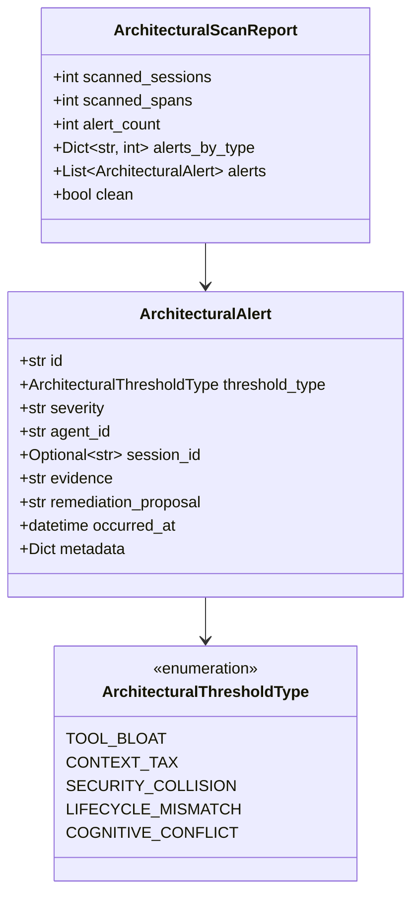

# Technical Design: Architectural Telemetry & Threshold Detectors

> **Spec Reference**: [requirements.md](file:///d:/Projects/Active/AutoReiv/docs/specs/architectural-telemetry/requirements.md)  
> **Card Reference**: [CARD-364](file:///d:/Projects/Active/AutoReiv/docs/cards/CARD-364-architectural-telemetry-threshold-detectors.md)  
> **Grounding**: [ADR-0054](file:///d:/Projects/Active/AutoReiv/docs/adr/0054-autonomic-os-state-machine-demand-paging-and-mechanical-governance.md)

---

## 1. Domain Models (`src/domain/observability/models.py`)



---

## 2. Detection Logic (`src/domain/observability/architectural_detector.py`)

The pure domain detector `ArchitecturalThresholdDetector`:
- `evaluate_turn_span(span: Dict[str, Any]) -> List[ArchitecturalAlert]`
  - Evaluates `active_tool_count` against `MAX_ACTIVE_TOOLS_PER_TURN = 8` (`TOOL_BLOAT`).
  - Evaluates `tool_schema_chars` against `MAX_SCHEMA_CHARS = 4000` (`CONTEXT_TAX`).
- `evaluate_session_messages(session_id: str, agent_id: str, messages: List[ChatMessage]) -> List[ArchitecturalAlert]`
  - Evaluates untrusted inputs (`web_search`, `read_url_content`) vs mutating host levers (`cli_exec`, `write_project_file`, `repo_file_write`, `delete_file`) without HITL (`SECURITY_COLLISION`).
  - Evaluates consecutive autonomous tool/assistant turns without user prompts (`LIFECYCLE_MISMATCH`).
  - Evaluates mutations lacking mechanical verification or test checks (`COGNITIVE_CONFLICT`).

---

## 3. Storage & REST API Design

### REST API
- `POST /api/observability/architectural/scan`
  - Request: `{"lookback_hours": 24}`
  - Response: `ArchitecturalScanReport` JSON
- `GET /api/observability/architectural/alerts`
  - Query params: `threshold_type`, `severity`, `limit`
  - Response: `{"alerts": [...]}`

### CLI: `autoreiv scan-architecture`
```bash
# Scan last 24 hours of telemetry and session transcripts
autoreiv scan-architecture --days 1

# Output clean JSON for automation
autoreiv scan-architecture --json
```
