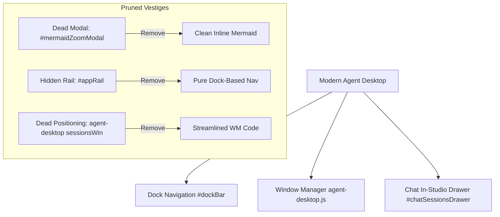

# Technical Design Specification: Audit and Prune Dead UI Controls

> **Spec Status**: In Review  
> **Linked Card**: [CARD-369](file:///d:/Projects/Active/AutoReiv/docs/cards/CARD-369-audit-and-prune-dead-ui-controls-and-vestiges-across-studios.md)  
> **Requirements**: [requirements.md](file:///d:/Projects/Active/AutoReiv/docs/specs/audit-dead-ui/requirements.md)

---

## 1. Architectural Overview
This technical design covers the surgical pruning of dead DOM, vestigial CSS rules, and orphaned JavaScript event bindings that were abandoned during the migration from early single-window/drawer prototypes (CARD-138, CARD-139) to the modern multi-window Agent Desktop architecture (CARD-296, CARD-305).

---

## 2. Component Delta & Detailed Changes

### 2.1 Template Changes (`src/web/templates/index.html`)
1. **Remove `#mermaidZoomModal` (Lines 5281–5345)**:
   - Remove the entire 65-line block including `#mermaidModalCard`, `#mermaidModalTitle`, `#mermaidZoomOutBtn`, `#mermaidZoomLevel`, `#mermaidZoomInBtn`, `#mermaidZoomResetBtn`, `#mermaidFullscreenBtn`, `#mermaidCloseModalBtn`, `#mermaidViewport`, and `#mermaidCanvas`.
2. **Remove `#appRail` (Lines 1379–1422)**:
   - Remove `<nav id="appRail">` and all inner buttons (`#railBtnChat`, `#railBtnVault`, `#railBtnFleet`, `#railBtnFactory`, `#railBtnSettings`).
3. **Clean CSS Rules**:
   - In `<style>` (around lines 180–185), remove `#appRail` from the suppression selector list.

### 2.2 JavaScript Module Cleanups
1. **`src/web/static/app.js`**:
   - In `allModals` array, remove `'mermaidZoomModal'`.
   - Remove `railBtns` object and its event listeners (`switchTab` callers).
   - In `toggleSidebarBtn` listener, remove obsolete references to `sidebar.classList.toggle`.
2. **`src/web/static/modules/ui/modal.js`**:
   - Remove `#mermaidCloseModalBtn` from the close selector strings.
3. **`src/web/static/modules/studios/chat.js`**:
   - In `renderMermaidBlocks` (lines 1830–1862): remove the `.mermaid-actions` wrapper with the `.mermaid-inspect-btn` and the dead `callbacks.openMermaidInspector` call. Render Mermaid diagrams directly inside the container with responsive scrollable overflow.
4. **`src/web/static/modules/ui/agent-desktop.js`**:
   - In `syncHostedViews` (lines 594–616), remove the dead `sessionsWin` and `sidebar` style property calculation block.

### 2.3 Test Suite Alignment
1. **`tests/unit/frontend/dom_audit.test.js`** [NEW]:
   - Assert `#mermaidZoomModal` is absent.
   - Assert `#appRail` is absent.
   - Assert all 11 active studio sections exist.
   - Assert active form triggers (`#promptsEditorSaveBtn`, `#saveToneBtn`) are present.
2. **`tests/unit/frontend/workbench_shell.test.js`**:
   - Update CARD-138 test: verify workbench elements and active studio tabs; retire obsolete `#appRail` presence check.
3. **`tests/unit/frontend/factory_studio.test.js`**:
   - Update CARD-195 test: verify Factory Studio launcher in desktop dock and dedicated view; retire `#railBtnFactory` presence check.
