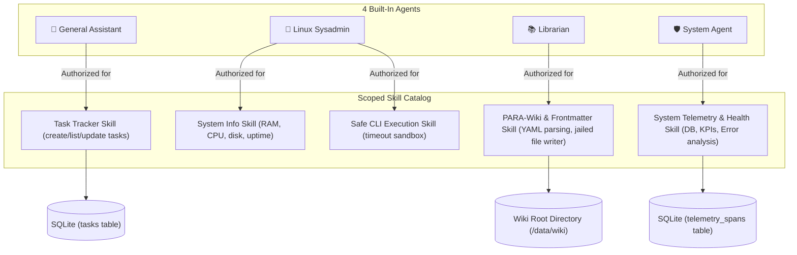

# Technical Design: Built-in Agents & Scoped Skills

> **Linked Spec**: [`requirements.md`](./requirements.md)  
> **Applicable ADRs**: [`docs/adr/0004-built-in-agent-manifests-and-standard-scoped-skills.md`](../../adr/0004-built-in-agent-manifests-and-standard-scoped-skills.md)

---

## 1. Architectural Overview & Agent Permission Matrix



---

## 2. Data Models & Interface Contracts

### 2.1 Task Tracker Models (`src/domain/skills/task_models.py`)

```python
from enum import Enum
from datetime import datetime
from typing import Optional
from pydantic import BaseModel, Field


class TaskPriority(str, Enum):
    LOW = "low"
    MEDIUM = "medium"
    HIGH = "high"
    CRITICAL = "critical"


class TaskStatus(str, Enum):
    PENDING = "pending"
    IN_PROGRESS = "in_progress"
    COMPLETED = "completed"
    CANCELLED = "cancelled"


class Task(BaseModel):
    id: str
    title: str
    description: str = ""
    status: TaskStatus = TaskStatus.PENDING
    priority: TaskPriority = TaskPriority.MEDIUM
    due_date: Optional[str] = None
    created_at: datetime
    updated_at: datetime
```

### 2.2 Wiki Document Models (`src/domain/skills/wiki_models.py`)

```python
from typing import Dict, Any, List, Optional
from pydantic import BaseModel, Field


class WikiNote(BaseModel):
    relative_path: str
    title: str
    category: str = "Inbox"  # PARA categories: Projects, Areas, Resources, Archives, Inbox
    tags: List[str] = Field(default_factory=list)
    frontmatter: Dict[str, Any] = Field(default_factory=dict)
    body: str = ""
    full_content: str = ""
```

### 2.3 System Info Models (`src/domain/skills/sys_models.py`)

```python
from pydantic import BaseModel


class SystemInfoReport(BaseModel):
    os_name: str
    platform_release: str
    architecture: str
    cpu_count: int
    memory_total_gb: float
    memory_available_gb: float
    memory_percent_used: float
    disk_total_gb: float
    disk_free_gb: float
    uptime_seconds: float
```

---

## 3. Database Schema Extension for Tasks

```sql
CREATE TABLE IF NOT EXISTS tasks (
    id TEXT PRIMARY KEY,
    title TEXT NOT NULL,
    description TEXT DEFAULT '',
    status TEXT NOT NULL DEFAULT 'pending',
    priority TEXT NOT NULL DEFAULT 'medium',
    due_date TEXT,
    created_at TIMESTAMP DEFAULT CURRENT_TIMESTAMP,
    updated_at TIMESTAMP DEFAULT CURRENT_TIMESTAMP
);

CREATE INDEX IF NOT EXISTS idx_tasks_status ON tasks(status);
```

---

## 4. Built-in Agent Manifest Configurations (`src/domain/agents/profiles.py`)

1. **`general-assistant`**:
   - Name: "General Assistant"
   - Tone: `AgentTone.FRIENDLY`
   - Allowed Tools: `["create_task", "list_tasks", "update_task_status", "delete_task"]`
2. **`linux-sysadmin`**:
   - Name: "Linux Sysadmin"
   - Tone: `AgentTone.TECHNICAL`
   - Allowed Tools: `["get_system_info", "run_cli_command"]`
3. **`librarian`**:
   - Name: "Librarian"
   - Tone: `AgentTone.ACADEMIC`
   - Allowed Tools: `["parse_yaml_frontmatter", "create_wiki_note", "read_wiki_note", "list_wiki_notes"]`
4. **`system-agent`**:
   - Name: "System Agent"
   - Tone: `AgentTone.CONCISE`
   - Allowed Tools: `["inspect_system_health", "get_agent_usage_summary", "get_tool_health_matrix"]`
