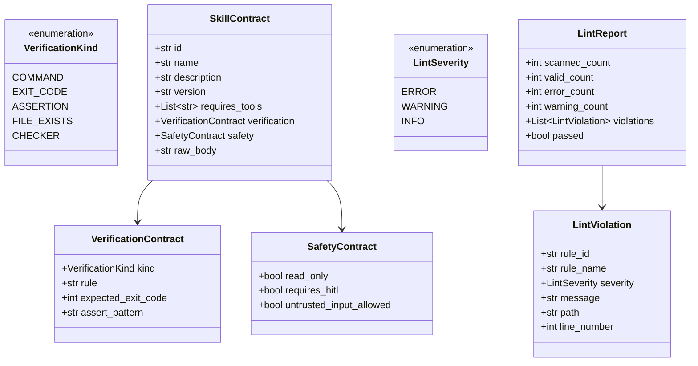

# Technical Design: Mechanical Capability Linter & Contract Compiler

> **Spec Reference**: [requirements.md](file:///d:/Projects/Active/AutoReiv/docs/specs/capability-linter/requirements.md)  
> **Card Reference**: [CARD-363](file:///d:/Projects/Active/AutoReiv/docs/cards/CARD-363-mechanical-capability-linter-contract-compiler.md)  
> **Grounding**: [ADR-0054](file:///d:/Projects/Active/AutoReiv/docs/adr/0054-autonomic-os-state-machine-demand-paging-and-mechanical-governance.md)

---

## 1. Domain Model Architecture (`src/domain/skills/contract.py`)



---

## 2. Mechanical Linting Rules (`src/application/skills/linter.py`)

| Rule ID | Name | Severity | Condition | Remediating Action |
| --- | --- | --- | --- | --- |
| **`CAP-001`** | `tool_budget_cap` | `ERROR` | `len(requires_tools) > 6` | Split bloated skill into two focused SOPs or prune unused tools to respect the Rule of 7. |
| **`CAP-002`** | `mandatory_verification` | `ERROR` | Missing `verification` frontmatter or empty `## Done-when` section | Define testable completion command, exit code, assertion, or file check. |
| **`CAP-003`** | `security_boundary_collision` | `ERROR` | `untrusted_input_allowed: true` AND mutating tools in `requires_tools` without `requires_hitl: true` | Set `requires_hitl: true` or isolate mutating operations to a dedicated service account. |
| **`CAP-004`** | `runbook_size_budget` | `WARNING` | Runbook body length > 8,000 characters (> ~2,000 tokens) | Condense procedural instructions to protect pre-fill KV-cache. |

---

## 3. CLI & REST API Contracts

### CLI: `autoreiv lint-skills`
```bash
# Standard human-readable scan of default platform and user packs
autoreiv lint-skills

# Scan specific directory or file
autoreiv lint-skills platform-packs/

# Machine-readable JSON output for preflight / CI
autoreiv lint-skills --json
```

**Human Output Format**:
```text
AutoReiv Mechanical Capability Linter
Scanned: 12 skills across 3 packs

✅ platform-packs/autoreiv/skills/coding/SKILL.md (4 tools, command verification)
✅ platform-packs/developer/skills/test/SKILL.md (3 tools, exit_code verification)
❌ platform-packs/autoreiv/skills/wiki/SKILL.md
   - [CAP-001 ERROR] Tool budget exceeded: 10 tools declared, maximum allowed is 6.

Result: 1 error found. Lint failed.
```

### REST API: `POST /api/skills/lint`
**Request**:
```json
{
  "content": "---\nname: Test Skill\nrequires_tools:\n  - tool_a\nverification:\n  kind: command\n  rule: pytest\n---\n# Test",
  "path": "packs/custom/skills/test/SKILL.md"
}
```

**Response (200 OK)**:
```json
{
  "valid": true,
  "contract": {
    "name": "Test Skill",
    "requires_tools": ["tool_a"],
    "verification": {
      "kind": "command",
      "rule": "pytest"
    },
    "safety": {
      "read_only": true,
      "requires_hitl": false,
      "untrusted_input_allowed": false
    }
  },
  "violations": []
}
```
