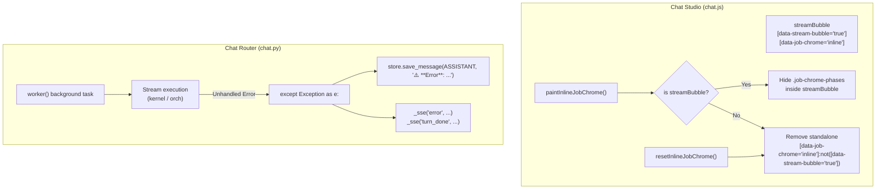

# Technical Design: Chat Stream Bubble Preservation and Error Persistence

> **Spec Reference**: `docs/specs/chat-stream-bubble-and-error-preservation/requirements.md`  
> **Card Reference**: `docs/cards/CARD-380-fix-chat-stream-bubble-removal-and-preserve-error-state.md`

---

## 1. Architecture Overview



---

## 2. Component Design

### 2.1 Chat Studio (`src/web/static/modules/studios/chat.js`)
- In `paintInlineJobChrome()`:
  When `!shouldMountInlineJobChrome(inlineJobChromeModel)`:
  Query `messagesContainer.querySelector('[data-job-chrome="inline"]')`.
  Check if `existing.getAttribute('data-stream-bubble') === 'true'`:
  - If `true`, do **not** call `existing.remove()`. Instead, hide `.job-chrome-phases` inside it (`classList.add('hidden')`).
  - If `false` (or not a stream bubble), call `existing.remove()`.
- In `resetInlineJobChrome()`:
  Only remove elements where `n.getAttribute('data-stream-bubble') !== 'true'`.
- In `executeChatTurn()`:
  Track `let turnHasError = false;`
  In `catch (err)` or when `eventType === 'error'`: set `turnHasError = true`.
  In `finally`: if `turnHasError` is true and SQLite does not yet have an assistant message, do not wipe `messagesContainer` with `renderMessages()`.

### 2.2 Chat Router (`src/web/routers/chat.py`)
- In `worker()`:
  In `except Exception as e:`:
  ```python
  err_msg = f"⚠️ **Error**: {e}"
  try:
      store.save_message(
          session_id=req.session_id,
          agent_id=profile.id,
          message=ChatMessage(role=Role.ASSISTANT, content=err_msg),
      )
  except Exception:
      pass
  await queue.put(_sse("error", {"error": str(e)}))
  await queue.put(_sse("turn_done", {"content": err_msg, "error": str(e)}))
  ```
  This guarantees that all failures are durable in the session transcript.

---

## 3. Interfaces & Data Contracts
No database schema changes are required. Messages table continues to store standard `ChatMessage` entities with `Role.ASSISTANT`.
Existing SSE event contracts (`error`, `turn_done`, `react_state`, `reasoning`, `token`) remain intact.
