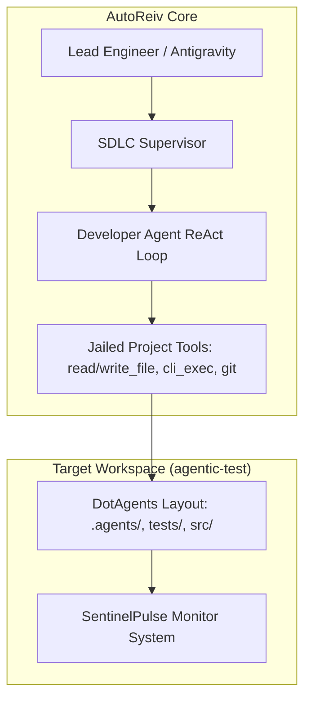
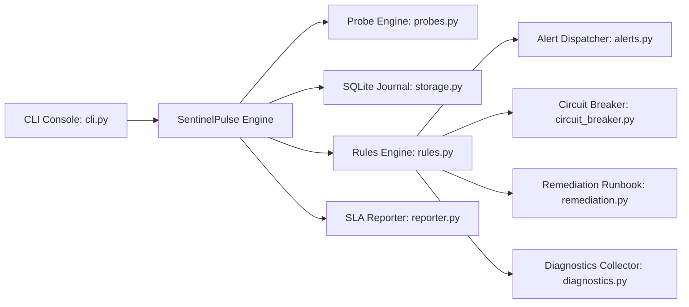
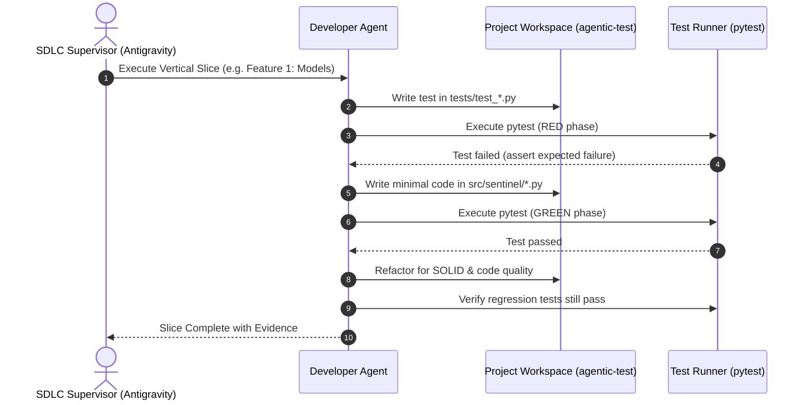

# Technical Design: Developer Agent End-to-End Verification & SDLC Optimization

> **Linked Spec**: [`requirements.md`](./requirements.md)  
> **Applicable ADRs**: `docs/adr/0001-baseline-sdlc.md`

---

## 1. Architectural Overview & C4 Context

The Developer Agent operates within AutoReiv under the supervisory eye of the Lead Engineer. It interacts exclusively with the active project (`agentic-test`) using jailed project tools.



### SentinelPulse Internal Architecture
Inside `agentic-test`, SentinelPulse follows strict **SOLID** principles:
- **SRP**: Every module has one clear responsibility (`models.py` = data structures, `probes.py` = network I/O, `storage.py` = persistence, `rules.py` = anomaly detection).
- **OCP**: Probes implement a common `Probe` protocol; new probe types (e.g. DNS, SSL) can be added without modifying existing probe runners.
- **LSP**: All probe implementations are fully interchangeable.
- **ISP**: Interfaces for Probes, Storage, Alert Sinks, and Remediation Runners are minimal and focused.
- **DIP**: High-level monitoring services depend on abstract ports/protocols, not concrete network sockets or SQLite files directly.



---

## 2. Sequence Flow: Supervised TDD Cycle



---

## 3. Data Contracts & Interfaces

### Core Domain Protocols
```python
from typing import Protocol, List, Optional
from dataclasses import dataclass
from datetime import datetime
from enum import Enum

class ServiceStatus(str, Enum):
    HEALTHY = "HEALTHY"
    DEGRADED = "DEGRADED"
    DOWN = "DOWN"

@dataclass
class ProbeResult:
    target_name: str
    status: ServiceStatus
    latency_ms: float
    timestamp: datetime
    error_message: Optional[str] = None

class Probe(Protocol):
    def execute(self) -> ProbeResult: ...

class StoragePort(Protocol):
    def record_result(self, result: ProbeResult) -> None: ...
    def get_latest_results(self) -> List[ProbeResult]: ...
```

---

## 4. Error Handling & Edge Cases

| Failure Scenario | Detection Layer | Handling & Mitigation |
| :--- | :--- | :--- |
| DNS / Network Unreachable | `probes.py` | Trapped via `socket.gaierror` / `urllib.error.URLError`; marked `DOWN` with clean error description |
| SQLite Lock or Busy | `storage.py` | Transaction retries with WAL mode enabled and short busy timeout |
| Runbook Process Timeout | `remediation.py` | Subprocess terminated via `timeout` handler; recorded as timed out |
| Flapping Service | `rules.py` | Detected via oscillation counter; suppressed by `circuit_breaker.py` |
