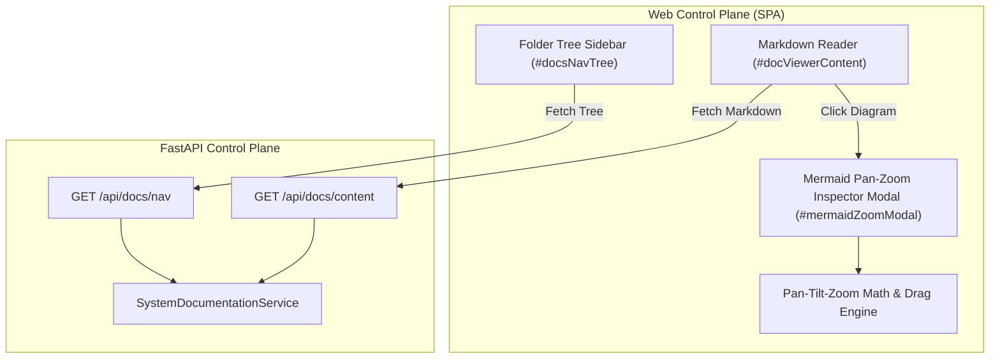

# Design Specification: System Documentation Folder Tree & Mermaid Pan-Zoom Inspector

> **Linked Spec**: [`requirements.md`](./requirements.md) | [`tasks.md`](./tasks.md)  
> **Traceability Key**: `[REQ-DOCS-xxx]`

---

## 1. Component Architecture



---

## 2. Nested Folder Tree Data Contract (`[REQ-DOCS-001]`)

```json
{
  "tree": [
    {
      "name": "Platform Specifications",
      "type": "folder",
      "icon": "folder",
      "children": [
        {
          "name": "routine-management-and-agent-binding",
          "type": "folder",
          "children": [
            {"name": "requirements.md", "type": "file", "path": "docs/specs/routine-management-and-agent-binding/requirements.md", "title": "Requirements"},
            {"name": "design.md", "type": "file", "path": "docs/specs/routine-management-and-agent-binding/design.md", "title": "Design"},
            {"name": "tasks.md", "type": "file", "path": "docs/specs/routine-management-and-agent-binding/tasks.md", "title": "Tasks"}
          ]
        }
      ]
    },
    {
      "name": "Architecture Decision Records (ADRs)",
      "type": "folder",
      "icon": "git-commit",
      "children": [
        {"name": "0019-skill-pack-hierarchy.md", "type": "file", "path": "docs/adr/0019-skill-pack-hierarchy-guardrails-and-system-documentation-browser.md", "title": "ADR-0019"}
      ]
    }
  ]
}
```

---

## 3. Pan-Tilt-Zoom (PTZ) Engine Architecture (`[REQ-DOCS-003]`, `[REQ-DOCS-004]`)

### Mathematical Transform:
- Canvas transformation uses CSS `transform: translate(${panX}px, ${panY}px) scale(${scale})`.
- Mouse Drag: Computes delta `panX += e.clientX - lastX`, `panY += e.clientY - lastY`.
- Wheel Zoom: Scales smoothly between `0.2x` and `5.0x` centered on cursor position or origin.
- Action Controls:
  - `[+]`: Scale up (+25%)
  - `[-]`: Scale down (-25%)
  - `[↺ 100%]`: Reset zoom to scale 1.0 and center `(0, 0)`
  - `[⛶ Fullscreen]`: Toggle modal fullscreen expansion
  - `[✖ Close]`: Escape key or close button
