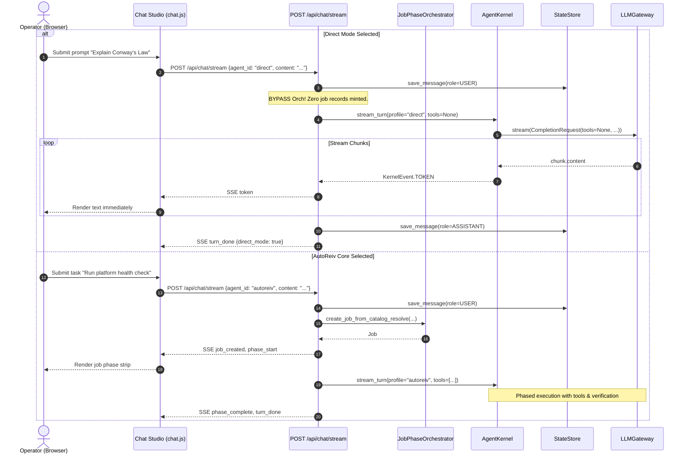

# Technical Design: Dual Engine Front Door (AutoReiv Core & Direct Mode)

> **Spec Reference**: [docs/specs/dual-engine-front-door/requirements.md](file:///d:/Projects/Active/AutoReiv/docs/specs/dual-engine-front-door/requirements.md)  
> **ADR Grounding**: [ADR-0054](file:///d:/Projects/Active/AutoReiv/docs/adr/0054-autonomic-os-state-machine-demand-paging-and-mechanical-governance.md)  
> **Card Reference**: [CARD-361](file:///d:/Projects/Active/AutoReiv/docs/cards/CARD-361-dual-engine-front-door-autoreiv-core-and-direct-mode.md)

---

## 1. System Context & Architecture

```
[ Operator / Web Browser ]
         │
         ├── Selects Mode ──▶ [ Chat Studio Front Door Segmented Control ]
         │                    ├── [ ⚡ AutoReiv Core ] ──▶ Orchestrated State Machine
         │                    └── [ 💬 Direct Mode   ] ──▶ Raw LLM Pass-through
         ▼
[ POST /api/chat/stream ]
         │
         ├── IF agent_id == 'direct' (Direct Mode)
         │        │
         │        ├── 1. Persist User Message to Session
         │        ├── 2. BYPASS JobPhaseOrchestrator (No job, no phases, no catalog resolve)
         │        ├── 3. Kernel Stream Turn with tools=None (0 tool schemas sent to LLM)
         │        ├── 4. Yield SSE token events directly to UI
         │        └── 5. Persist Assistant Message to Session
         │
         └── IF agent_id == 'autoreiv' (AutoReiv Core)
                  │
                  ├── 1. Persist User Message
                  ├── 2. orch.create_job_from_catalog_resolve(...)
                  ├── 3. Phased Execution with demand-paged capabilities & HITL
                  └── 4. Yield job_created, phase_start, token, phase_complete SSE
```

---

## 2. ASCII UI Wireframe: Chat Studio Top Bar

```
┌────────────────────────────────────────────────────────────────────────────────────────┐
│ [≡ Sessions] (•) [  ⚡ AutoReiv Core  |  💬 Direct Mode  ]     [Workbench] [Wiki] [Copy]│
├────────────────────────────────────────────────────────────────────────────────────────┤
│ (Active: AutoReiv Core)                                                                │
│ [Job: #job-101] [Phase 1/3: inspect_environment] [Status: THINKING]                   │
├────────────────────────────────────────────────────────────────────────────────────────┤
│                                                                                        │
│   (Orchestrated phased turn with tools, status strip, and verification badges)         │
│                                                                                        │
└────────────────────────────────────────────────────────────────────────────────────────┘

┌────────────────────────────────────────────────────────────────────────────────────────┐
│ [≡ Sessions] (•) [  ⚡ AutoReiv Core  |  💬 Direct Mode  ]     [Workbench] [Wiki] [Copy]│
├────────────────────────────────────────────────────────────────────────────────────────┤
│ (Active: Direct Mode — Raw LLM Stream • Zero Tools • Sub-Second TTFT)                  │
│                                                                                        │
│   User: What is the capital of France?                                                 │
│   Direct: The capital of France is Paris.                                              │
│                                                                                        │
└────────────────────────────────────────────────────────────────────────────────────────┘
```

### Component Details
- **Dual-Engine Toggle**:
  - Encapsulated in `<div id="chatEngineSelector" class="flex items-center bg-[#141721] p-0.5 rounded-lg border border-white/[0.08]">`
  - Two buttons:
    - `<button id="engineBtnCore" data-engine="autoreiv" ...>⚡ AutoReiv Core</button>`
    - `<button id="engineBtnDirect" data-engine="direct" ...>💬 Direct Mode</button>`
  - Active button has brand highlight (`bg-brand-600 text-white shadow-sm font-semibold`).
  - Inactive button has muted styling (`text-slate-400 hover:text-slate-200`).
  - Bidirectionally synced with hidden/compact `<select id="agentSelect">` to preserve existing e2e test harnesses.

---

## 3. Sequence Flow: Direct Mode Fast-Path vs AutoReiv Core



---

## 4. Data Contracts & Model Specifications

### ChatStreamRequest
No breaking schema change required. Existing request accepts `agent_id: str`:
- `agent_id: "autoreiv"`: AutoReiv Core state-machine orchestrator.
- `agent_id: "direct"`: Direct Mode fast path.

### SSE Events
- Direct Mode emits:
  - `token`: `{"text": str}`
  - `turn_done`: `{"content": str, "direct_mode": true}`
  - `error`: `{"error": str}` (if LLM fails)
- Direct Mode omits:
  - `job_created`
  - `phase_start`
  - `phase_complete`
  - `react_state`

### Frontend Visibility Contract
In `src/web/static/modules/studios/chat.js`:
```javascript
export function isAgentVisibleInChat(agent) {
  if (agent == null) return true;
  // Strictly Dual-Engine front door: AutoReiv Core and Direct Mode only
  return agent.id === 'autoreiv' || agent.id === 'direct';
}
```
All other agents (specialists, service accounts, fleet daemons) are managed via Agent Forge Studio and Routines Studio.
