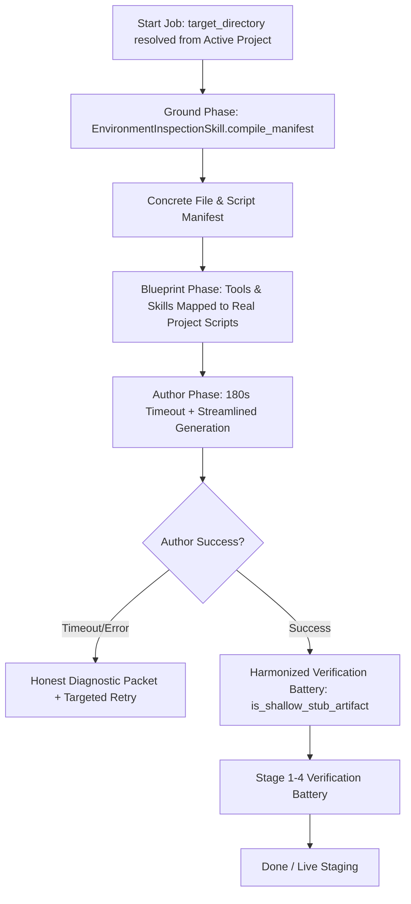

# Technical Design: Factory Studio Real Project Grounding, Decoupled Authoring, and Universal Verification

> Feature: Factory Studio Real Project Grounding, Decoupled Authoring, and Universal Verification  
> Card: CARD-356  
> Domain: `AutoReiv.Factory`

---

## 1. Architecture Overview

This design addresses three tightly coupled failure modes in the Agent Training Factory pipeline:
1. **Grounding Void**: GroundPhase currently operates purely in memory, ignoring project directories. We integrate `EnvironmentInspectionSkill` directly into `GroundPhase` to inspect real on-disk files, building a concrete environment manifest containing discovered file trees, scripts (`.tf`, `.yml`, `.ps1`, `.py`), and configurations.
2. **Author Latency Cliff & Dishonest Fallbacks**: Local large models (`qwen3.8-27b-fp8`) exceed 90 seconds when generating full multi-file JSON bundles. We increase the timeout to 180 seconds, record explicit timeout telemetry, and format prompts to be concise and targeted.
3. **Verification Asymmetry**: `is_shallow_stub_artifact` in `verification_battery.py` strictly checks for `## Purpose`, rejecting the `## Overview` heading produced by `ToolSynthesizer` and the Author system prompt. We harmonize heading acceptance and make domain keyword checks adapt to the manifest.



---

## 2. Component Modifications

### 2.1 Project Directory Resolution (`src/web/routers/agent_training_factory.py`)
When `target_directory` is not supplied in the POST `/api/agent_training_factory/jobs` payload:
- Query `settings` repository for `selected_project`.
- If `selected_project` contains a valid directory path on disk, populate `target_directory = selected_project["path"]`.

### 2.2 Real Grounding with EnvironmentInspectionSkill (`src/application/agent_training_factory/phases/ground.py`)
- Check `getattr(job, "target_directory", None)`.
- If a target directory exists on disk:
  - Instantiate `EnvironmentInspectionSkill()`.
  - Execute `compile_manifest(target_directory)`.
  - Extract `files_tree`, `detected_services`, `detected_formats`, and `domain_sops`.
  - Merge discovered scripts into `discovered_binaries` / `discovered_modules` / `manifest_payload`.
  - Append a "Project Files & Scripts" section into the generated Wiki Operating Manual.

### 2.3 Author Timeout & Diagnostic Logging (`src/application/agent_training_factory/phases/author.py`, `llm.py`)
- Change `timeout=90.0` to `timeout=180.0` in `phase_llm_json`.
- When an exception or timeout occurs:
  - Set `author_notes = f"LLM generation failed: {exc}"`
  - In `phase_llm_json`, capture the exact exception type (e.g. `asyncio.TimeoutError`) in returned telemetry.

### 2.4 Verification Battery Harmonization (`src/application/orchestration/verification_battery.py`)
- In `is_shallow_stub_artifact`:
  - Update heading check:
    ```python
    has_purpose = any(h in low for h in ("## purpose", "## 1. purpose", "## overview", "## 1. overview"))
    if not has_purpose:
        return True
    ```
  - For domain keyword checks: Only require Hyper-V ISO keywords if the intent explicitly references ISO/VHDX/unattend; otherwise check that the artifact mentions key files or capabilities from the grounded manifest.
