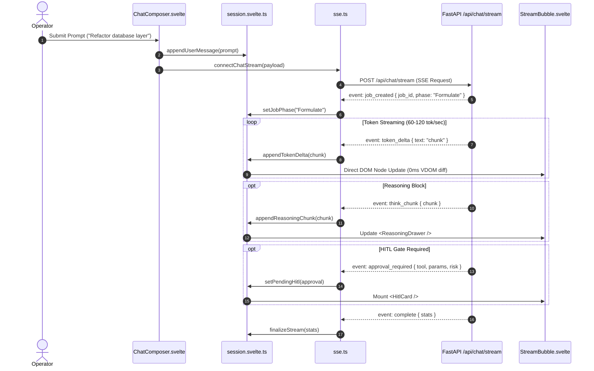
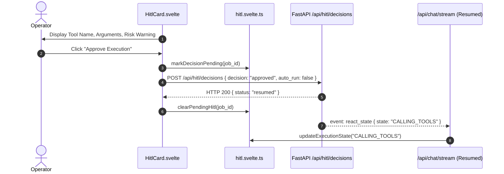

# Technical Design: Frontend Modernization & Cross-Platform Architecture

> **Linked Spec**: [`requirements.md`](./requirements.md)  
> **Applicable ADRs**: [ADR-0053](file:///d:/Projects/Active/AutoReiv/docs/adr/0053-frontend-modernization-and-cross-platform-architecture.md)

---

## 1. Architectural Overview & System Context

The modernized frontend architecture establishes a strict separation of concerns, migrating from monolithic HTML/imperative scripts to a modular, component-driven client.

```mermaid
graph TD
    subgraph Client [Svelte 5 Client Application - src/web/client]
        Shell[Adaptive Shell: Shell.svelte]
        DesktopLayout[Desktop Canvas Layout ≥768px]
        MobileLayout[Mobile Stack Layout <768px]
        
        Shell -->|Viewport >= 768px| DesktopLayout
        Shell -->|Viewport < 768px| MobileLayout

        subgraph WindowManager [Desktop Windowing Engine]
            Dock[Desktop Dock Component]
            WinHost[Window Manager & Z-Index Stack]
            Organize[Organize Menu: Tile/Cascade/Split]
        end
        DesktopLayout --> WindowManager

        subgraph MobileNav [Mobile Navigation Engine]
            BottomNav[Bottom Tab Bar]
            Sheets[Drawer & Sheet Host]
        end
        MobileLayout --> MobileNav

        subgraph Studios [Shared Studio Components]
            ChatStudio[Chat Studio]
            WikiStudio[Wiki Studio]
            ProjectsStudio[Projects Studio]
            AgentsStudio[Agents / Forge Studio]
            FactoryStudio[Factory Studio]
            RoutinesStudio[Routines Studio]
            ObserveStudio[Observability Studio]
            SettingsStudio[Settings Studio]
            EducationStudio[Education Studio]
            LuminaStudio[Lumina Studio]
            PromptsStudio[Prompts Studio]
        end

        DesktopLayout --> Studios
        MobileLayout --> Studios

        subgraph StateLayer [Reactive Runes Stores]
            SessionStore[session.svelte.ts]
            WindowStore[window.svelte.ts]
            HitlStore[hitl.svelte.ts]
            ThemeStore[theme.svelte.ts]
            AgentStore[agent.svelte.ts]
        end
        Studios --> StateLayer

        subgraph ServiceLayer [Communication Services]
            ApiClient[api.ts: Typed REST Client]
            SseClient[sse.ts: Streaming Event Bus]
        end
        StateLayer --> ServiceLayer
    end

    subgraph HostRuntimes [Distribution & Host Platforms]
        WebBrowser[Standard Web Browser: Chrome / Safari]
        TauriDesktop[Tauri 2.0 Desktop: macOS / Windows / Linux]
        TauriMobile[Tauri 2.0 Mobile: iOS / Android]
    end
    Client --> HostRuntimes

    subgraph Backend [AutoReiv Backend - FastAPI]
        Gateway[FastAPI ASGI Router :8000]
        ChatRouter[/api/chat/stream]
        HitlRouter[/api/hitl/decisions]
        StaticMount[/ - Serves dist/index.html & assets]
    end
    ServiceLayer --> Gateway
    HostRuntimes --> StaticMount
```

---

## 2. Directory & Component Structure

All client source code lives in a modern, standard structure under `src/web/client/`:

```text
src/web/
├── client/                     # Modern Svelte 5 + Vite + TypeScript Frontend
│   ├── index.html              # Minimal SPA entry shell (< 40 lines)
│   ├── package.json            # Client dependencies & scripts
│   ├── vite.config.ts          # Vite build config with API proxy
│   ├── svelte.config.js        # Svelte 5 compiler config
│   ├── tailwind.config.ts      # Tailwind CSS v4 design tokens
│   ├── tsconfig.json           # Strict TypeScript configuration
│   └── src/
│       ├── main.ts             # App bootstrap
│       ├── App.svelte          # Root application component
│       ├── app.css             # Global Tailwind tokens, fonts, claymorphism
│       │
│       ├── components/         # Reusable Design System Primitives (DRY)
│       │   ├── ui/
│       │   │   ├── Button.svelte       # Tactile Clay & Flat Enterprise variants
│       │   │   ├── Input.svelte        # Text/number inputs with error states
│       │   │   ├── Textarea.svelte     # Auto-resizing textarea
│       │   │   ├── Select.svelte       # Accessible custom select
│       │   │   ├── Modal.svelte        # Accessible focus-trapped dialog
│       │   │   ├── Sheet.svelte        # Mobile bottom-sheet dialog
│       │   │   ├── Drawer.svelte       # Slide-over sidebar drawer
│       │   │   ├── Badge.svelte        # Status & tier badges
│       │   │   ├── Card.svelte         # Surface container with elevation
│       │   │   ├── Dropdown.svelte     # Flyout action menus
│       │   │   └── Toast.svelte        # Error & connectivity notifications
│       │   ├── desktop/
│       │   │   ├── WindowFrame.svelte  # Draggable/resizable window chrome
│       │   │   ├── Dock.svelte         # OS-style bottom launcher dock
│       │   │   └── OrganizeMenu.svelte # Tile / Cascade / Split actions
│       │   └── mobile/
│       │       ├── BottomNav.svelte    # Mobile bottom navigation bar
│       │       └── MobileHeader.svelte # Mobile app header with drawer toggles
│       │
│       ├── layouts/            # Adaptive Layout Shells
│       │   ├── Shell.svelte                # Viewport detector & adaptive switch
│       │   ├── DesktopCanvasLayout.svelte  # Multi-window desktop manager
│       │   └── MobileStackLayout.svelte    # Mobile tab & view stack manager
│       │
│       ├── studios/            # 11 Modular Studio Views
│       │   ├── chat/
│       │   │   ├── ChatStudio.svelte       # Main chat container
│       │   │   ├── MessageList.svelte      # Virtualized / smooth message list
│       │   │   ├── StreamBubble.svelte     # Progressive markdown & code stream
│       │   │   ├── ReasoningDrawer.svelte  # Collapsible <think> thought block
│       │   │   ├── HitlCard.svelte         # Interactive approval prompt
│       │   │   ├── ChatComposer.svelte     # Text input, modes, file attach
│       │   │   └── SessionsDrawer.svelte   # Session history & search
│       │   ├── wiki/
│       │   │   ├── WikiStudio.svelte
│       │   │   ├── NoteTree.svelte
│       │   │   ├── NoteEditor.svelte
│       │   │   └── GraphView.svelte
│       │   ├── projects/
│       │   │   ├── ProjectsStudio.svelte
│       │   │   └── WorkspaceExplorer.svelte
│       │   ├── agents/
│       │   │   ├── AgentsStudio.svelte
│       │   │   └── ForgeManifestEditor.svelte
│       │   ├── factory/
│       │   │   ├── FactoryStudio.svelte
│       │   │   └── DeliverableModal.svelte
│       │   ├── routines/
│       │   │   ├── RoutinesStudio.svelte
│       │   │   └── RoutineModal.svelte
│       │   ├── observability/
│       │   │   ├── ObservabilityStudio.svelte
│       │   │   └── TelemetryTable.svelte
│       │   ├── settings/
│       │   │   ├── SettingsStudio.svelte
│       │   │   └── ThemeTuner.svelte
│       │   ├── prompts/
│       │   │   └── PromptsStudio.svelte
│       │   ├── education/
│       │   │   ├── EducationStudio.svelte
│       │   │   └── MasteryLedger.svelte
│       │   └── lumina/
│       │       ├── LuminaStudio.svelte
│       │       └── ConceptCinema.svelte
│       │
│       ├── stores/             # Svelte 5 Runes State Stores
│       │   ├── session.svelte.ts       # Active chat session, stream chunks
│       │   ├── window.svelte.ts        # Desktop window positions, z-stack
│       │   ├── hitl.svelte.ts          # Pending approvals, auto-run state
│       │   ├── theme.svelte.ts         # Theme preset, clay tokens, persistence
│       │   ├── agent.svelte.ts         # Platform agents & active companion
│       │   └── connectivity.svelte.ts  # Gateway health & offline banner
│       │
│       ├── services/           # Network & Business Services
│       │   ├── api.ts                  # Typed REST Client
│       │   ├── sse.ts                  # Resilient SSE Event Stream Bus
│       │   ├── markdown.ts             # Marked + Shiki code highlighter
│       │   └── storage.ts              # LocalStorage & IndexedDB helpers
│       │
│       └── types/              # Strict TypeScript Contracts
│           ├── api.d.ts                # REST endpoints and request/response
│           ├── agent.d.ts              # Agent manifest & tool schemas
│           ├── chat.d.ts               # Message, Phase, StreamEvent types
│           └── window.d.ts             # Window state, Dock launcher types
│
├── dist/                       # Production compiled assets (built by Vite)
└── app.py                      # FastAPI server (mounts src/web/dist)
```

---

## 3. Sequence Flows

### 3.1 High-Speed SSE Token Streaming & Reasoning Flow



### 3.2 Human-in-the-Loop (HITL) Decision Flow



---

## 4. State Management with Svelte 5 Runes

Svelte 5 Runes provide lightweight, granular reactivity without external state library boilerplate.

### Window Manager Store (`stores/window.svelte.ts`)
```typescript
export class WindowStore {
  // State runes
  windows = $state<Record<string, WindowState>>({});
  focusedTab = $state<string | null>('chat');
  nextZ = $state<number>(100);

  // Derived computations
  activeWindow = $derived(this.focusedTab ? this.windows[this.focusedTab] : null);
  openWindows = $derived(Object.values(this.windows).filter(w => !w.minimized));

  openWindow(tab: string, defaultSize = { w: 720, h: 560 }) {
    if (!this.windows[tab]) {
      this.windows[tab] = {
        id: tab,
        x: 48 + (Object.keys(this.windows).length % 8) * 28,
        y: 36 + (Object.keys(this.windows).length % 8) * 28,
        w: defaultSize.w,
        h: defaultSize.h,
        minimized: false,
        maximized: false,
        z: ++this.nextZ,
      };
    } else {
      this.windows[tab].minimized = false;
      this.windows[tab].z = ++this.nextZ;
    }
    this.focusedTab = tab;
    this.saveToStorage();
  }

  focusWindow(tab: string) {
    if (this.windows[tab]) {
      this.windows[tab].z = ++this.nextZ;
      this.focusedTab = tab;
    }
  }

  minimizeWindow(tab: string) {
    if (this.windows[tab]) {
      this.windows[tab].minimized = true;
      if (this.focusedTab === tab) this.focusedTab = null;
    }
  }
}

export const windowStore = new WindowStore();
```

### Theme Store (`stores/theme.svelte.ts`)
```typescript
export class ThemeStore {
  currentThemeId = $state<string>('autoreiv-indigo');
  isClaymorphism = $derived(this.currentThemeId === 'claymorphism');

  applyTheme(themeId: string) {
    this.currentThemeId = themeId;
    const theme = PRESET_THEMES[themeId];
    if (!theme) return;

    const root = document.documentElement;
    root.style.setProperty('--theme-brand', theme.brand);
    root.style.setProperty('--theme-bg-base', theme.bgBase);
    root.style.setProperty('--theme-bg-surface', theme.bgSurface);
    root.style.setProperty('--theme-border', theme.border);

    if (this.isClaymorphism) {
      root.setAttribute('data-theme', 'claymorphism');
    } else {
      root.removeAttribute('data-theme');
    }
    localStorage.setItem('autoreiv.theme.v3', themeId);
  }
}

export const themeStore = new ThemeStore();
```

---

## 5. Cross-Platform Tauri 2.0 Architecture

Tauri 2.0 compiles the exact same Svelte 5 application into native applications across all 5 operating systems:

```text
src-tauri/
├── Cargo.toml                  # Rust dependencies (Tauri 2.0)
├── tauri.conf.json             # App identifier, window configs, permissions
├── icons/                      # Multi-resolution icons (macOS .icns, Win .ico, Android/iOS)
├── src/
│   └── main.rs                 # Native runtime entry & background sidecar manager
└── capabilities/
    └── default.json            # Security sandbox permissions
```

### Native Capabilities Mapping
* **macOS / Windows / Linux**: Native window chrome integration, system tray icon, background daemon monitoring, global keyboard shortcuts.
* **iOS / Android**: Native haptic feedback on button clicks (delivering genuine tactile response for Claymorphism), push notifications for HITL approvals, safe-area inset management.
* **Web / LAN Mode**: When accessed via browser, the app functions as a Progressive Web App (PWA) with zero degradation.

---

## 6. Zero-Disruption Production Serving Pipeline

In FastAPI (`src/web/app.py`):
```python
from pathlib import Path
from fastapi import FastAPI
from fastapi.staticfiles import StaticFiles
from fastapi.responses import FileResponse

app = FastAPI()

# Mount API Routers
app.include_router(chat_router, prefix="/api/chat")
app.include_router(hitl_router, prefix="/api/hitl")
# ... other routers

# Production SPA Mount (dist output from Vite)
DIST_DIR = Path(__file__).resolve().parent / "dist"

if DIST_DIR.exists():
    app.mount("/assets", StaticFiles(directory=DIST_DIR / "assets"), name="assets")

    @app.get("/{full_path:path}")
    async def serve_spa(full_path: str):
        file_path = DIST_DIR / full_path
        if file_path.exists() and file_path.is_file():
            return FileResponse(file_path)
        return FileResponse(DIST_DIR / "index.html")
```
This guarantees that `python -m uvicorn src.web.app:app` serves the modernized client instantly with zero proxy configuration needed by the operator.
