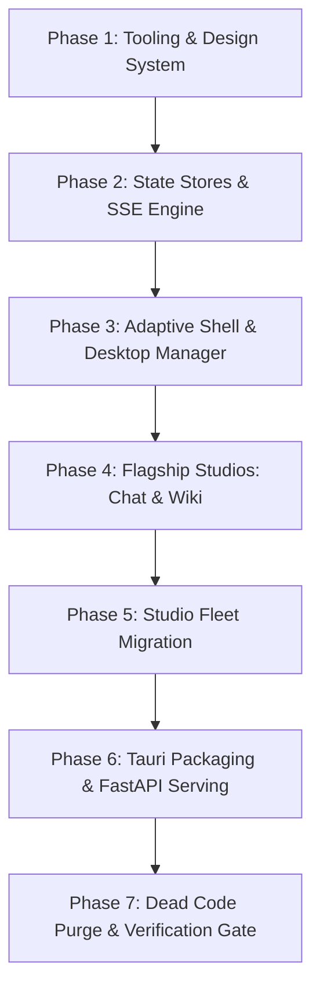

# AutoReiv Frontend Modernization & Cross-Platform Architecture: Master Migration Plan

> **Author**: Antigravity (Principal Software Engineer)  
> **Product Owner & Visionary**: Jacob  
> **Date**: 2026-09-17  
> **Status**: Approved Blueprint  
> **Target Release**: v1.0.0 (Unified Client Architecture)  
> **Related Architecture Records**: [ADR-0053](file:///d:/Projects/Active/AutoReiv/docs/adr/0053-frontend-modernization-and-cross-platform-architecture.md)  
> **Specification Suite**:  
> - [`requirements.md`](file:///d:/Projects/Active/AutoReiv/docs/specs/frontend-modernization/requirements.md) (EARS Requirements)  
> - [`design.md`](file:///d:/Projects/Active/AutoReiv/docs/specs/frontend-modernization/design.md) (Component & System Design)  
> - [`tasks.md`](file:///d:/Projects/Active/AutoReiv/docs/specs/frontend-modernization/tasks.md) (Phased Execution Checklist)  

---

## 1. Executive Summary & Architectural Intent

AutoReiv is a personal agent operating system and autonomous control plane. It integrates 11 studios, runs local and remote LLMs, streams tokens at 60–120 tokens/second, orchestrates multi-agent delegation, enforces human-in-the-loop safety gates, and schedules autonomous background routines.

### The Current Friction
A comprehensive codebase audit reveals that while the Python backend is clean, well-tested (1,647 tests passing), and strictly architected, the presentation layer carries immense technical debt:
1. **The 5,837-line Monolithic HTML Template (`index.html`)**:
   All studio markup, modals, window chrome, and forms are concatenated into a single 405 KB file. Changing a button or modal in one studio risks breaking unrelated layout flows.
2. **700 KB of Imperative DOM Scripts**:
   14 studio modules manually manipulate elements using `$()`, string interpolation (`innerHTML = \`...\``), and defensive class lists (`classList.add('hidden')`). Components are constantly re-invented rather than shared.
3. **High-Frequency Rendering Fragility**:
   LLM token streaming and 120Hz window physics force manual DOM updates that fight browser reflows, causing layout thrashing and fragile scroll locks.
4. **Cross-Platform Accessibility Gap**:
   AutoReiv must operate seamlessly on **macOS, Windows, Linux, Android, and iOS**. The current desktop window layout breaks on 6-inch mobile phone screens, and there is no native application packaging.

### The Objective
Completely replace the legacy presentation layer with an elite, component-driven client built on **Svelte 5 (with Runes)**, **Tailwind CSS v4**, and **Tauri 2.0**, delivering:
* **Pristine, clean, modular code** adhering strictly to SOLID and DRY principles.
* **An Adaptive Shell** that provides a floating multi-window OS workspace on desktop and an intuitive, touch-native app on mobile.
* **Single-codebase cross-platform distribution** for Mac, Windows, Linux, Android, and iOS, plus zero-install web hosting via FastAPI.
* **Zero dead, stale, or redundant code** left behind.

---

## 2. Technology & Architecture Evaluation

We re-evaluated every modern frontend approach against AutoReiv's exact requirements:

| Approach | Streaming (60-120 tok/sec) | 120Hz Window Drag Physics | Mobile Phone UX | Cross-Platform (Mac/Win/Linux/iOS/Android) | Memory Footprint | Verdict |
| :--- | :--- | :--- | :--- | :--- | :--- | :--- |
| **Vanilla ES Modules (Current)** | Brittle manual DOM patching | Manual event listeners | Broken window clipping | Web browser only | Minimal | ❌ **Fragile & Monolithic** |
| **React 19 + Vite** | Virtual DOM diffing tax; drops frames under heavy streams | Requires manual ref caching to prevent re-renders | Excellent with Radix/Tailwind | Tauri or React Native | Medium (~120MB) | ⚠️ **VDOM Overhead** |
| **Flutter (Dart)** | Canvas-rendered; awkward text selection | Smooth 120Hz canvas | Excellent mobile feel | Desktop & Mobile natively | High (~180MB) | ❌ **Poor Text/SVG/Code DX** |
| **React Native / Expo** | Native mobile views | Awkward multi-window desktop support | Native iOS/Android | Fragmented desktop support | Medium (~100MB) | ❌ **Weak Desktop OS Support** |
| **Svelte 5 + Tauri 2.0 (Selected)** | **Direct DOM signals (Runes); 0ms VDOM diffing** | **Native browser speeds; 0ms framework lag** | **Adaptive Stack Mode with Bottom Tabs** | **Single Codebase via Tauri 2.0 & Web** | **Ultra-Low (~35MB)** | ✅ **The Optimal Choice** |

### Why Svelte 5 + Runes?
1. **Zero Virtual DOM**: Svelte 5 compiles away into surgical DOM mutations. Streaming chunks update exact text nodes without touching the rest of the message list.
2. **Granular Reactivity**: `$state` and `$derived` replace clunky store subscribers and React hook dependency arrays, making window physics and state sync effortless.
3. **Single-File Component Encapsulation**: A component owns its template, typed TypeScript logic, and scoped styles in one file.

### Why Tailwind CSS v4 + Design Tokens?
Tailwind v4 uses modern CSS `@theme` variables. This allows instantaneous, zero-cost switching between:
* **Tactile Claymorphism** (CARD-345): Inflated 3D pads, compound inner bevel shadows, and physical click depression.
* **Enterprise Flat** (Indigo, Slate Graphite, Violet, Warm Sand, Teal): Clean, restrained dark-mode surfaces.
* **Light Palette**: Soft alabaster clay or clean crisp light modes.

---

## 3. Target State Architecture

### 3.1 Adaptive Information Architecture (Two-Mode Shell)

The client automatically adapts based on viewport width:

```
[Viewport Width ≥ 768px] ────────▶ Desktop Canvas Mode
                                  • Draggable, resizable, floating windows
                                  • Persistent OS bottom dock & organize menu
                                  • Multi-window tiling & cascade
                                  • Z-index window stacking engine

[Viewport Width < 768px] ────────▶ Mobile Companion Mode
                                  • Pinned native bottom navigation bar
                                  • Full-screen active studio view
                                  • Slide-over drawers for session history
                                  • Touch-native bottom sheets for HITL approvals
                                  • Dynamic safe-area inset & keyboard avoidance
```

Both modes render the **exact same studio components** (`<ChatStudio />`, `<WikiStudio />`, `<RoutinesStudio />`), ensuring zero code duplication.

### 3.2 Directory Layout (`src/web/client/`)

```text
src/web/client/
├── index.html                  # Minimal HTML host (< 40 lines)
├── package.json                # Svelte 5, Vite, Tailwind v4, Lucide-Svelte
├── vite.config.ts              # Proxy /api & /api/chat/stream to FastAPI
├── svelte.config.js            # Svelte 5 Runes compiler configuration
├── tsconfig.json               # Strict TypeScript checks
└── src/
    ├── main.ts                 # Bootstrap entry point
    ├── App.svelte              # Root shell mounting Shell.svelte
    ├── app.css                 # Universal design tokens & claymorphism
    │
    ├── components/
    │   ├── ui/                 # Atomic design system primitives
    │   │   ├── Button.svelte   # Primary, secondary, claymorphic variants
    │   │   ├── Input.svelte    # Text, number, search inputs
    │   │   ├── Textarea.svelte # Auto-expanding composer textarea
    │   │   ├── Select.svelte   # Accessible custom select
    │   │   ├── Modal.svelte    # Focus-trapped dialog
    │   │   ├── Sheet.svelte    # Mobile bottom sheet dialog
    │   │   ├── Drawer.svelte   # Touch-dismissible slide-over
    │   │   ├── Badge.svelte    # Status and role indicator
    │   │   ├── Card.svelte     # Elevated content container
    │   │   └── Toast.svelte    # Alert notifications
    │   ├── desktop/
    │   │   ├── WindowFrame.svelte # Window chrome with minimize/max/close
    │   │   ├── Dock.svelte     # OS bottom dock
    │   │   └── OrganizeMenu.svelte # Window layout manager
    │   └── mobile/
    │       ├── BottomNav.svelte    # Mobile bottom tab navigation
    │       └── MobileHeader.svelte # Compact mobile title bar
    │
    ├── layouts/
    │   ├── Shell.svelte                # Responsive viewport controller
    │   ├── DesktopCanvasLayout.svelte  # Multi-window desktop canvas
    │   └── MobileStackLayout.svelte    # Mobile single-view stack
    │
    ├── studios/                # 11 Modular Studio Views
    │   ├── chat/               # Chat Studio (stream, thought, HITL, composer)
    │   ├── wiki/               # Wiki Studio (tree, markdown, graph)
    │   ├── projects/           # Projects Studio (workspaces, code preview)
    │   ├── agents/             # Agents Studio (manifests, skills, cascades)
    │   ├── factory/            # Factory Studio (training pipeline, rubrics)
    │   ├── routines/           # Routines Studio (cron schedules, builder)
    │   ├── observability/      # Observe Studio (telemetry KPIs, logs)
    │   ├── settings/           # Settings Studio (providers, theme tuner)
    │   ├── prompts/            # Prompts Studio (prompt catalog)
    │   ├── education/          # Education Studio (spaced repetition, labs)
    │   └── lumina/             # Lumina Studio (concept cinema, audio player)
    │
    ├── stores/                 # Reactive Svelte 5 Runes Stores
    │   ├── session.svelte.ts   # Chat sessions, streaming buffer, messages
    │   ├── window.svelte.ts    # Window coordinates, dimensions, focus z-index
    │   ├── hitl.svelte.ts      # Active HITL approvals & auto-run settings
    │   ├── theme.svelte.ts     # Theme preset selection & persistence
    │   ├── agent.svelte.ts     # Roster of platform agents & current companion
    │   └── connectivity.svelte.ts # Gateway ping & offline status
    │
    ├── services/               # Core Networking & Formatting
    │   ├── api.ts              # Typed REST client with error unwrapping
    │   ├── sse.ts              # SSE connection bus with auto-reconnect
    │   ├── markdown.ts         # Marked parser with syntax highlighting
    │   └── storage.ts          # Storage wrapper with JSON validation
    │
    └── types/                  # End-to-End TypeScript Definitions
        ├── api.d.ts
        ├── chat.d.ts
        ├── agent.d.ts
        └── window.d.ts
```

---

## 4. Cross-Platform Delivery Plan

```
                   ┌──────────────────────────────────────┐
                   │    Single Svelte 5 Client Source     │
                   │         (src/web/client/)            │
                   └──────────────────┬───────────────────┘
                                      │
                         npm run build (Vite 6)
                                      │
                                      ▼
                   ┌──────────────────────────────────────┐
                   │      Compiled Static Production      │
                   │          (src/web/dist/)             │
                   └──────────┬────────────────┬──────────┘
                              │                │
             ┌────────────────┴──────┐         └──────────────────────┐
             ▼                       ▼                                ▼
┌─────────────────────────┐ ┌─────────────────────────┐  ┌─────────────────────────┐
│     FastAPI Host        │ │    Tauri 2.0 Desktop     │  │    Tauri 2.0 Mobile     │
├─────────────────────────┤ ├─────────────────────────┤  ├─────────────────────────┤
│ • Statically served at  │ │ • macOS Universal (.dmg)│  │ • iOS App (.ipa)        │
│   http://<host>:8000/   │ │ • Windows x64 (.exe)    │  │ • Android App (.apk)    │
│ • Zero client install   │ │ • Linux (.deb / AppImg) │  │ • Native haptics/push   │
│ • LAN / Tailscale ready │ │ • 35 MB idle RAM usage  │  │ • Connects to homelab   │
└─────────────────────────┘ └─────────────────────────┘  └─────────────────────────┘
```

---

## 5. Phase-by-Phase Migration Strategy

The migration is decomposed into 7 distinct, sequential vertical slices executed under strict TDD:



### Phase 1: Tooling, Build Pipeline & Shared Component Primitives
* **Objective**: Establish `src/web/client/` with Vite, Svelte 5, TypeScript, and Tailwind CSS v4.
* **Deliverables**:
  * Clean, accessible UI primitives: `<Button>`, `<Input>`, `<Textarea>`, `<Select>`, `<Modal>`, `<Sheet>`, `<Drawer>`, `<Card>`, `<Badge>`, `<Toast>`.
  * Universal CSS design tokens supporting Claymorphism and Enterprise Flat palettes.
  * Unit test suite for component primitives verifying keyboard accessibility and styling variants.

### Phase 2: Reactive State Stores & SSE Streaming Engine
* **Objective**: Build the core data and communication backbone.
* **Deliverables**:
  * `services/api.ts`: Typed REST client.
  * `services/sse.ts`: High-speed SSE stream parser handling `token_delta`, `think_chunk`, `approval_required`, and phase events.
  * `stores/session.svelte.ts`: Active conversation manager with zero-VDOM streaming buffer.
  * `stores/window.svelte.ts`: Desktop window state, focus z-index manager, and coordinates.
  * `stores/hitl.svelte.ts`: Real-time approval card state and decision dispatch.
  * `stores/theme.svelte.ts`: Theme switcher with persistence.
  * Unit tests validating store mutations and event bus handling.

### Phase 3: Adaptive Information Architecture Shell
* **Objective**: Construct the dual-mode layout engine.
* **Deliverables**:
  * `layouts/Shell.svelte`: Dynamic viewport listener (768px breakpoint).
  * `layouts/DesktopCanvasLayout.svelte`: Floating window manager with `<WindowFrame>`, `<Dock>`, and `<OrganizeMenu>`.
  * `layouts/MobileStackLayout.svelte`: Mobile view stack with `<BottomNav>` and `<MobileHeader>`.
  * Fluid window drag, edge resize, snap-to-grid, and z-index focus stacking.
  * Integration tests verifying smooth transitions between mobile and desktop viewports.

### Phase 4: Flagship Studios Migration (Chat & Wiki)
* **Objective**: Migrate AutoReiv's primary workhorse studios.
* **Deliverables**:
  * **Chat Studio**: Virtualized message list, progressive stream bubble, collapsible `<think>` reasoning drawer, interactive `<HitlCard>`, session drawer, file attachments, and smart autoscroll with "Jump to latest".
  * **Wiki Studio**: Hierarchical markdown document tree, full editor with live preview, Mermaid graph visualizer, and inbox curation flow.
  * Playwright E2E smoke tests validating streaming chat turns and wiki document creation.

### Phase 5: Studio Fleet Migration
* **Objective**: Convert remaining 9 studios to modular Svelte components.
* **Deliverables**:
  * Projects Studio (Workspace tree, code preview, git context overlay).
  * Agents Studio (Forge manifest editor, model cascade, skill allowlists).
  * Factory Studio (Phase timeline, question batteries, rubrics, deliverable modal).
  * Routines Studio (Schedules, frequency presets, interactive structured schedule builder).
  * Observability Studio (Telemetry KPIs, token attribution table, log streams, audit export).
  * Settings Studio (Provider credentials, model discovery, theme customizer).
  * Prompts Studio (Template catalog).
  * Education Studio (Spaced repetition ledger, course progress, application labs).
  * Lumina Studio (Concept cinema, dual coding visualizer, audio player).

### Phase 6: Cross-Platform Packaging & Production Serving
* **Objective**: Wire up production serving and native app targets.
* **Deliverables**:
  * Configure FastAPI in `src/web/app.py` to serve Vite's compiled `dist/` statically at `/` with SPA route fallback.
  * Set up Tauri 2.0 configuration (`src-tauri/`) for macOS, Windows, Linux desktop targets, and iOS/Android mobile targets.
  * Verify `npm run build` and `npm run tauri build` scripts.

### Phase 7: Dead Code Purge, RTM Synchronization & Definition of Done
* **Objective**: Completely eliminate technical debt and achieve pristine repository status.
* **Deliverables**:
  * Permanently delete legacy `src/web/templates/index.html` (5,837 lines) and `src/web/static/modules/` (700 KB).
  * Remove obsolete tests that scraped HTML strings; ensure all tests validate Svelte components, stores, and API contracts.
  * Synchronize `docs/rtm.json` with all `[REQ-MOD-xxx]` requirements.
  * Pass unified 6-stage preflight gate: Ruff $\rightarrow$ Pytest $\rightarrow$ ESLint $\rightarrow$ Vitest $\rightarrow$ Playwright $\rightarrow$ RTM.
  * Update `CHANGELOG.md` under `[Unreleased]`.

---

## 6. Zero-Downtime Coexistence & Rollback Safety

To guarantee safe development without interrupting normal AutoReiv operations:
1. **Parallel Development**: Svelte client development occurs inside `src/web/client/` on an isolated branch (`feat/frontend-modernization`).
2. **Coexistence During Migration**: FastAPI continues to serve the existing legacy `index.html` until Phase 6 is fully complete and verified.
3. **Atomic Switchover**: The production switchover occurs in a single clean commit that swaps FastAPI's root mount to `dist/index.html`.
4. **Instant Rollback**: If unexpected regressions occur, reverting that single commit immediately restores the legacy static mount.

---

## 7. Verification & Definition of Done

Before declaring the migration complete and merging into `qa`:
* [ ] **100% Studio Feature Parity**: All 11 studios fully verified.
* [ ] **Zero Monolithic HTML**: Legacy `index.html` and imperative DOM scripts are deleted.
* [ ] **Zero Lint / Type Errors**: `npm run lint:frontend` and `npx svelte-check` pass with 0 errors and 0 warnings.
* [ ] **Automated Tests Green**:
  * Backend: 1,647+ pytest tests passing (`pytest -q`).
  * Frontend: 100% of component and store unit tests passing (`npm run test:unit:frontend`).
  * End-to-End: Playwright smoke suite passing (`npm run test:smoke`).
* [ ] **Cross-Platform Verified**: Desktop (macOS, Windows, Linux) and Mobile (iOS, Android, Mobile Web) verified.
* [ ] **RTM Traceability**: `docs/rtm.json` fully synchronized and validated (`verify_rtm.py`).

---

## 8. Exact Goal Prompt for Fresh Implementation Session

When you are ready to begin the implementation, start a **fresh Antigravity session** and provide this exact goal prompt:

```text
/goal Execute the AutoReiv Frontend Modernization & Cross-Platform Migration Plan in accordance with docs/specs/frontend-modernization/migration-plan.md and ADR-0053.

1. Cut an isolated branch `feat/frontend-modernization` from `qa` and scaffold work card `docs/cards/CARD-346-frontend-modernization-svelte-tauri.md`.
2. Execute all 7 phases from `docs/specs/frontend-modernization/tasks.md` using strict Red-Green-Refactor TDD:
   - Phase 1: Initialize `src/web/client` with Vite, Svelte 5 (Runes), TypeScript, Tailwind CSS v4, and reusable component primitives.
   - Phase 2: Implement core reactive stores (`session`, `window`, `hitl`, `theme`) and high-speed SSE streaming engine.
   - Phase 3: Implement the Adaptive Information Architecture Shell (`Shell.svelte`, `DesktopCanvasLayout`, `MobileStackLayout`, `Dock`, `BottomNav`).
   - Phase 4: Migrate Chat Studio (progressive streaming, <think> reasoning drawers, HITL approval cards, autoscroll) and Wiki Studio (notes tree, markdown editor, graph).
   - Phase 5: Migrate the complete studio fleet (Projects, Agents/Forge, Factory, Routines, Observability, Settings, Prompts, Education, Lumina).
   - Phase 6: Configure production FastAPI static serving (`src/web/dist`) and cross-platform Tauri 2.0 desktop/mobile packaging.
   - Phase 7: Purge all legacy dead code (delete monolithic `src/web/templates/index.html` and obsolete `src/web/static/modules`), synchronize `docs/rtm.json`, and pass the full preflight gate (Ruff, Pytest, ESLint, Vitest, Playwright, RTM).
3. The final repository state must be pristine, clean, and elite, strictly adhering to SOLID and DRY principles with zero dead paths, zero raw innerHTML concatenations, and 100% feature parity across macOS, Windows, Linux, Android, iOS, and Web.
```
