# Technical Design Specification: Homelab Domain Orchestration

> **Spec Status**: In Review  
> **Target Release**: CARD-206  
> **Requirements Reference**: [docs/specs/homelab-domain-orchestration/requirements.md](requirements.md)

---

## 1. System Architecture & C4 Component Context

```text
+---------------------------------------------------------------------------------------+
|                                    AutoReiv Web UI                                    |
|   - Chat Studio (Goal Mode Enabled)                                                   |
|   - Multi-Window Desktop Dock -> Workflows Studio & Pending Approvals Drawer          |
+-------------------------------------------+-------------------------------------------+
                                            |
                                            v
+---------------------------------------------------------------------------------------+
|                                    FastAPI Backend                                    |
|   [WorkflowService]                  [JobPhaseOrchestrator]       [AgentKernel]       |
|    - Lists & instantiates recipes     - Executes 4 chapters        - Runs specialist  |
|                                       - Enforces context hygiene     ReAct turns      |
+-------------------------------------------+-------------------------------------------+
                                            |
                       ┌────────────────────┼────────────────────┐
                       ▼                    ▼                    ▼
               [Homelab Admin]     [Homelab Architect]   [Homelab Engineer]
               - inspect_host      - IPAM & VM sizing    - HCL generation
               - cli_exec          - wiki_note_create    - manage_opentofu_hyperv
                                                         - TDD Compiler Loop
```

---

## 2. Sequence Diagram: Phased Fleet Relay & Compiler Loop

```mermaid
sequenceDiagram
    autonumber
    actor Jacob as Human Operator
    participant Coord as Homelab Coordinator
    participant Orch as JobPhaseOrchestrator
    participant Admin as Homelab Admin
    participant Arch as Homelab Architect
    participant Eng as Homelab Engineer
    participant Tool as OpenTofu Tool / Compiler

    Jacob->>Coord: "Deploy isolated Windows Domain lab (DCs + File Server)"
    Coord->>Orch: Instantiate Recipe: homelab-domain-deployment
    
    rect rgb(20, 30, 45)
        Note over Orch,Admin: Phase 1: Host Discovery & Resource Audit
        Orch->>Admin: Audit host compute, RAM, and storage topology
        Admin->>Tool: inspect_host()
        Tool-->>Admin: Host specs (CPU, RAM, Free Disk)
        Admin-->>Orch: Phase 1 Complete (Audit Payload)
    end

    rect rgb(30, 40, 50)
        Note over Orch,Arch: Phase 2: Domain Blueprint & Sizing
        Orch->>Arch: Design isolated domain topology (Audit Payload)
        Arch->>Arch: Calculate sizing (DC01: 2vCPU/4GB, FS01: 2vCPU/4GB)
        Arch-->>Orch: Phase 2 Complete (Blueprint Payload)
    end

    rect rgb(40, 30, 45)
        Note over Orch,Eng: Phase 3: OpenTofu IaC & Compiler Feedback Loop
        Orch->>Eng: Author main.tf for DomainSwitch, DC01, DC02, FS01
        Eng->>Tool: manage_opentofu_hyperv(action="validate")
        alt Compiler Syntax Error
            Tool-->>Eng: Error: line X, invalid attribute
            Eng->>Eng: Self-correct HCL syntax
            Eng->>Tool: manage_opentofu_hyperv(action="validate")
        end
        Tool-->>Eng: Validation Successful (exit code 0)
        Eng->>Tool: manage_opentofu_hyperv(action="plan", dry_run=true)
        Tool-->>Eng: Plan: 3 VMs to add, 1 internal switch to add
        Eng-->>Orch: Phase 3 Complete (Validated HCL & Plan Summary)
    end

    rect rgb(45, 45, 20)
        Note over Orch,Jacob: Phase 4: Human-In-The-Loop Approval Gate
        Orch->>Jacob: Park for Operator Approval: Plan verified (3 to add, 0 to destroy)
        Jacob->>Orch: Approve
        Orch->>Admin: Apply verified configuration
    end
```



---

## 3. Data Contracts & Schema

### 3.1 Domain Deployment Sizing & Spec Contract
```json
{
  "$schema": "https://json-schema.org/draft/2020-12/schema",
  "title": "HomelabDomainDeploymentSpec",
  "type": "object",
  "properties": {
    "domain_name": { "type": "string", "default": "lab.local" },
    "netbios_name": { "type": "string", "default": "LAB" },
    "subnet": { "type": "string", "default": "10.10.10.0/24" },
    "switch_name": { "type": "string", "default": "DomainSwitch" },
    "switch_type": { "type": "string", "enum": ["Internal", "Private"], "default": "Internal" },
    "vms": {
      "type": "array",
      "items": {
        "type": "object",
        "properties": {
          "name": { "type": "string" },
          "role": { "type": "string", "enum": ["domain_controller", "file_server", "member_server"] },
          "vcpus": { "type": "integer", "minimum": 1 },
          "ram_mb": { "type": "integer", "minimum": 2048 },
          "static_ip": { "type": "string" },
          "generation": { "type": "integer", "default": 2 },
          "disks": {
            "type": "array",
            "items": {
              "type": "object",
              "properties": {
                "name": { "type": "string" },
                "size_gb": { "type": "integer" }
              }
            }
          }
        },
        "required": ["name", "role", "vcpus", "ram_mb", "static_ip"]
      }
    }
  },
  "required": ["domain_name", "subnet", "switch_name", "vms"]
}
```

---

## 4. UI Visual Contract & Approval Modal

```text
+---------------------------------------------------------------------------------------+
| [⚡ Autonomous Job: Homelab Domain Deployment]                     [Status: Running]  |
|                                                                                       |
|  Phase Progress:                                                                      |
|  [✓] 1. Host Audit (Admin)            - Checked Hyper-V host capacity (128GB RAM free)|
|  [✓] 2. Domain Architecture (Arch)    - Blueprint designed: DomainSwitch (10.10.10.0) |
|  [✓] 3. OpenTofu IaC (Engineer)       - main.tf generated & validated (0 compiler err)|
|  [▶] 4. Operator Approval (Pending)   - Plan ready: 3 VMs to add, 0 to destroy        |
|                                                                                       |
|  +---------------------------------------------------------------------------------+  |
|  | 🛡️ SAFETY GATE: Infrastructure Apply Approval                                    |  |
|  | Target: Hyper-V Private Switch: DomainSwitch (Internal)                         |  |
|  | VMs: DC01 (10.10.10.10), DC02 (10.10.10.11), FS01 (10.10.10.20)                 |  |
|  | Physical NICs touched: NONE (Host unchanged)                                    |  |
|  |                                                                                 |  |
|  | [ Approve & Apply ]                 [ Reject & Cancel ]                         |  |
|  +---------------------------------------------------------------------------------+  |
+---------------------------------------------------------------------------------------+
```
