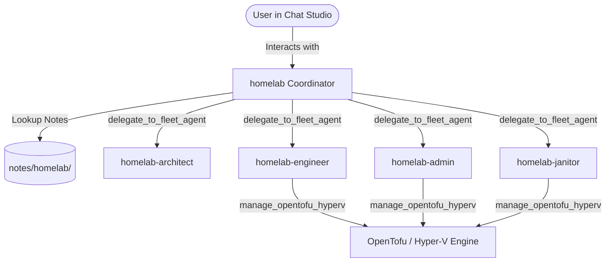

# Technical Design: Homelab Agent Fleet Architecture and Orchestration

> **Spec Reference**: `docs/specs/homelab-fleet-orchestration/requirements.md`  
> **Target Release**: CARD-198  
> **Status**: Approved  

---

## 1. Context & Architecture

The Homelab Fleet Architecture establishes a multi-agent specialized fleet for enterprise homelab and infrastructure management:
- **`homelab`**: Public lead coordinator. Front-of-house agent in Chat Studio.
- **`homelab-architect`**: Internal systems designer. Blueprint authoring in `notes/homelab/`.
- **`homelab-engineer`**: Internal IaC specialist. OpenTofu configuration authoring.
- **`homelab-admin`**: Internal operations specialist. Infrastructure provisioning and monitoring.
- **`homelab-janitor`**: Internal maintenance specialist. Storage and hygiene auditing.

### Component Diagram (C4 Level 2)



---

## 2. Data Contracts & Schema Additions

### Agent Profile & Manifest Visibility
```python
class AgentProfile(BaseModel):
    ...
    visibility: str = "public"  # "public" | "internal"
    fleet: Optional[str] = None  # e.g. "homelab"
```

### Tool Envelope
All OpenTofu and fleet coordination tools return:
```json
{
  "status": "ok | error",
  "action": "...",
  "dry_run": true,
  "...": "..."
}
```

---

## 3. Security & Safety Controls
- Destructive operations require `dry_run=False` explicit override.
- Internal fleet workers are hidden from human chat dropdown to eliminate cognitive load and accidental direct execution.
- Enterprise notes sit strictly in `notes/homelab/` preserving existing Wiki engine boundaries.
