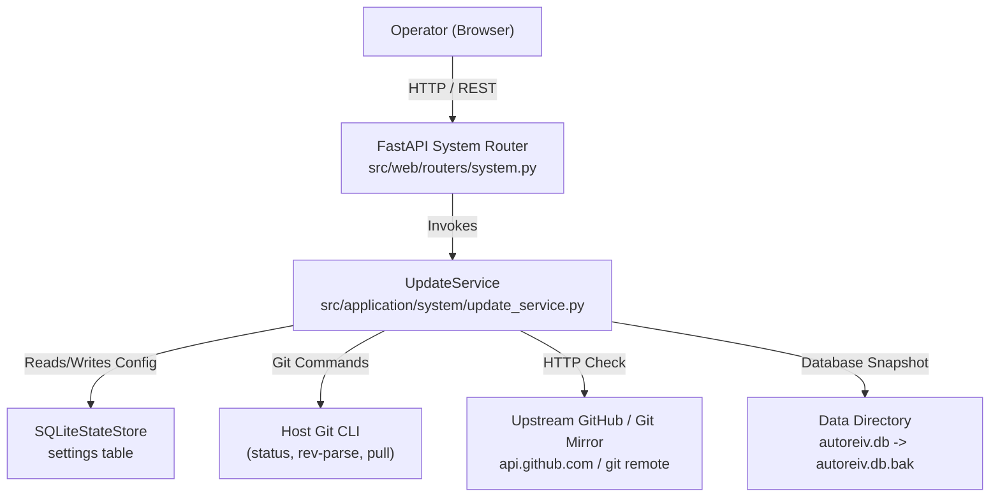

# Technical Design: In-App Software Updates and Upstream Repository Sync

> **Spec Status**: Approved  
> **Target Release**: CARD-196  
> **Primary Component**: AutoReiv.System & AutoReiv.SettingsStudio

---

## 1. System Context & Architecture (C4 Level 2)

---

## 2. Component Design & Responsibilities

### 2.1 Domain Models (`src/domain/system/models.py`)
- `SystemVersionInfo`: Encapsulates installed version, commit SHA, branch, git status, deployment mode, and build timestamp.
- `UpdateConfig`: Upstream repository URL, tracked branch name, check frequency.
- `UpdateCheckResult`: Comparison output between local checkout and remote branch.
- `UpdateApplyResult`: Execution result with pre-flight status, backup file path, old/new commit SHAs, and restart recommendation.

### 2.2 Application Service (`src/application/system/update_service.py`)
- `UpdateService`:
  - `get_version_info() -> SystemVersionInfo`
  - `get_update_config() -> UpdateConfig`
  - `save_update_config(config: UpdateConfig) -> UpdateConfig`
  - `check_for_updates() -> UpdateCheckResult`
  - `apply_update() -> UpdateApplyResult`

### 2.3 Web Router (`src/web/routers/system.py`)
- `GET /api/system/version` -> `SystemVersionInfo`
- `GET /api/system/updates/config` -> `UpdateConfig`
- `PUT /api/system/updates/config` -> `UpdateConfig`
- `GET /api/system/updates/check` -> `UpdateCheckResult`
- `POST /api/system/updates/apply` -> `UpdateApplyResult`
- Also enhances `/health` and `/api/health` to dynamically report the real installed version.

### 2.4 Frontend Settings Studio (`settings.js` & `index.html`)
- In `#view-settings`, a prominent **System & Software Updates** panel:
  - Current Build header with version pill, commit chip, branch, deployment badge.
  - Upstream Repository form with inputs and save button.
  - Live Update Status card with `[ 🔄 Check for Updates ]`, status alert, changelog preview, and `[ 🚀 Apply Update ]` button with confirmation modal.

---

## 3. Safety Guardrails & Invariant Controls

1. **Working Tree Cleanliness**:
   - `git status --porcelain` must be clean. If uncommitted modifications or untracked files are present, update apply immediately returns `{ success: false, message: "Working tree is dirty..." }`.
2. **Database Snapshotting**:
   - Before executing `git pull`, `autoreiv.db` is copied to `autoreiv.db.bak-<timestamp>` in `data_dir` or working directory.
3. **Fast-Forward Only**:
   - Updates are applied strictly using `--ff-only`. If the local branch diverged, git refuses to merge, preserving local commits.
4. **Resilient Failure Handling**:
   - Upstream network errors, DNS failures, or rate-limiting are caught and surfaced cleanly in the UI without crashing the application.
