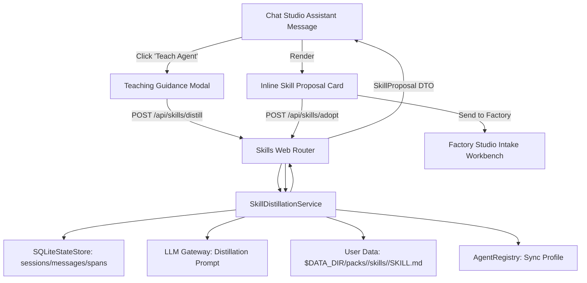
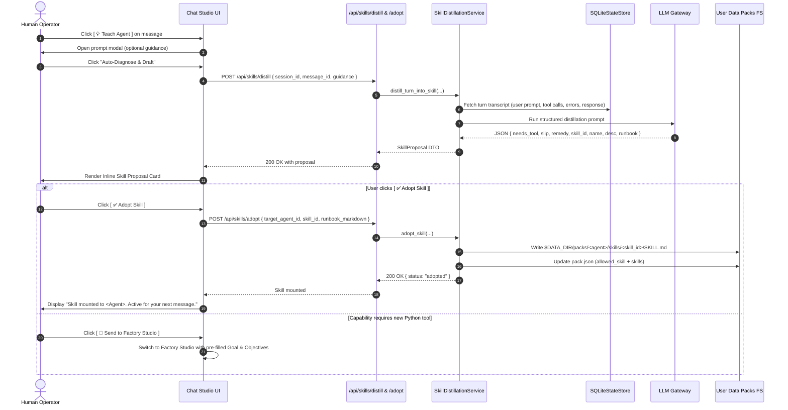

# Technical Design: In-Situ Skill Distillation

> **Linked Spec**: [`requirements.md`](./requirements.md)  
> **Applicable ADRs**: `docs/adr/0052-skill-and-tool-scoping-and-specialist-dispatch.md`

---

## 1. Architectural Overview & C4 Context



---

## 2. Sequence Flow



---

## 3. Data Contracts & Interfaces

### Public REST Endpoints

#### 1. `POST /api/skills/distill`
**Request Payload (`DistillRequest`)**:
```json
{
  "session_id": "sess_123",
  "message_id": "msg_456",
  "guidance": "Always save templates under resources/templates/."
}
```

**Response Payload (`DistillResponse`)**:
```json
{
  "status": "ok",
  "target_agent_id": "autoreiv",
  "skill_id": "wiki-template-canonical-path",
  "name": "Wiki Template Canonical Path",
  "description": "Enforce saving wiki templates to resources/templates/.",
  "plain_summary": {
    "observed_slip": "The agent attempted to save template to notes/resources/.",
    "remedy": "Enforce canonical template paths under resources/templates/ and prohibit general note tools."
  },
  "runbook_markdown": "---\nname: wiki-template-canonical-path\ndescription: Enforce saving wiki templates to resources/templates/.\n---\n\n## When to Use\n...\n\n## Procedure\n...\n\n## Common Pitfalls & Forbidden Paths\n...\n\n## Verification\n...",
  "needs_tool": false,
  "factory_escalation": null
}
```

#### 2. `POST /api/skills/adopt`
**Request Payload (`AdoptSkillRequest`)**:
```json
{
  "target_agent_id": "autoreiv",
  "skill_id": "wiki-template-canonical-path",
  "runbook_markdown": "---\nname: wiki-template-canonical-path\n...\n"
}
```

**Response Payload (`AdoptSkillResponse`)**:
```json
{
  "status": "adopted",
  "target_agent_id": "autoreiv",
  "skill_id": "wiki-template-canonical-path",
  "file_path": "packs/autoreiv/skills/wiki-template-canonical-path/SKILL.md"
}
```

---

## 4. UI Component Architecture

1. **Assistant Message Action Bar**:
   - Add button `.msg-teach-agent-btn` (`[ 💡 Teach Agent ]`) inside `#chatStream` assistant message headers.
2. **Teach Agent Guidance Modal (`#teachAgentModal`)**:
   - Target Agent display pill.
   - Textarea `#teachAgentGuidanceInput` (placeholder: *"What should the agent have done differently? (Optional: leave blank to auto-diagnose from turn context)"*).
   - Buttons: `[ Auto-Diagnose & Draft ]` (primary) and `[ Cancel ]`.
3. **Inline Chat Skill Proposal Card (`.skill-proposal-card`)**:
   - Header with icon `💡 Skill Proposal: <Name>`.
   - Plain summary box with Observed Slip and Recommended Remedy.
   - Accordion preview: `<details><summary>View Raw Runbook (SKILL.md)</summary><pre>...</pre></details>`.
   - Primary action: `[ ✅ Adopt Skill to <Agent> ]` (or `[ 🚀 Send to Factory Studio ]` if `needs_tool` is true).
   - Secondary actions: `[ ✏️ Edit ]`, `[ ✕ Dismiss ]`.


---

## 4. Error Handling & Edge Cases

| Error Scenario | Detection Point | Handling / Fallback | User Response |
| :--- | :--- | :--- | :--- |
| Invalid Payload | API Layer | Schema Validation | HTTP 400 with field details |
| Timeout / Downstream Error | Adapter Layer | Circuit Breaker / Retry | HTTP 503 / Friendly message |
