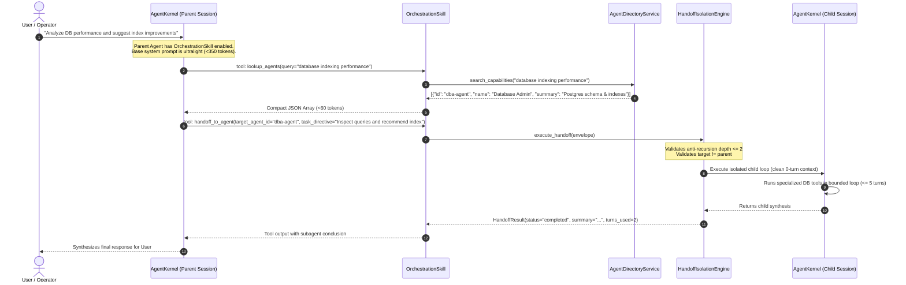

# Design Specification: Lean JIT Agent Discovery and Isolated Subagent Handoff Engine

> **Linked Spec**: [`requirements.md`](./requirements.md) | [`tasks.md`](./tasks.md)  
> **Traceability Key**: `[REQ-ORCH-xxx]`

---

## 1. Architecture & Execution Flow



---

## 2. Core Domain Models (`[REQ-ORCH-001]`, `[REQ-ORCH-003]`)

```python
@dataclass(frozen=True)
class CompactAgentCard:
    """Minimal, token-efficient agent summary for JIT discovery."""

    id: str
    name: str
    summary: str
    skills: list[str]


@dataclass
class HandoffEnvelope:
    """Structured message passing contract across agent boundaries."""

    correlation_id: str
    sender_agent_id: str
    recipient_agent_id: str
    session_id: str
    task_intent: str
    context_payload: dict = field(default_factory=dict)
    max_turns: int = 5
    depth: int = 1
    timeout_seconds: float = 60.0


@dataclass
class HandoffResult:
    """Structured response payload returned to the caller agent."""

    correlation_id: str
    sender_agent_id: str
    recipient_agent_id: str
    status: Literal["completed", "failed", "rejected", "timed_out"]
    summary: str
    turns_used: int = 0
    error_message: Optional[str] = None
```

---

## 3. Anti-Recursion & Token Isolation Guardrails (`[REQ-ORCH-003]`)

1. **Circular Deadlock Prevention**:
   If `recipient_agent_id == sender_agent_id`, immediately return `status="rejected", error="Self-handoff is strictly forbidden."`
2. **Bounded Depth Cascades**:
   If `envelope.depth > 2`, immediately return `status="rejected", error="Maximum delegation depth of 2 tiers reached."`
3. **Turn Bounding**:
   Child execution is strictly capped to `min(max_turns, 10)` turns to prevent runaway loops.
4. **Context Cleanliness**:
   Child session starts with a brand new, empty turn memory containing only the `task_directive` and `input_payload`.
