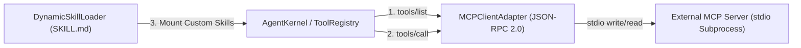

# Technical Design: MCP Standard Client Adapter & Dynamic Skill Loader

> **Linked Spec**: [`requirements.md`](./requirements.md) | [`tasks.md`](./tasks.md)  
> **Applicable ADRs**: `docs/adr/0013-mcp-standard-client-adapter-and-dynamic-skill-loader.md`

---

## 1. System Architecture & MCP JSON-RPC Pipeline



---

## 2. Component Design & Interfaces

### 2.1. `MCPClientAdapter` (`src/infrastructure/mcp/client_adapter.py`)
```python
class MCPClientAdapter:
    async def initialize(self) -> None: ...
    async def list_tools(self) -> List[ToolDefinition]: ...
    async def call_tool(self, name: str, arguments: Dict[str, Any]) -> Dict[str, Any]: ...
```

### 2.2. `DynamicSkillLoader` (`src/application/skills/dynamic_loader.py`)
```python
class DynamicSkillLoader:
    @staticmethod
    def load_skill_from_markdown(path: str) -> Dict[str, Any]: ...
    @staticmethod
    def scan_skills_directory(directory: str) -> List[Dict[str, Any]]: ...
```
