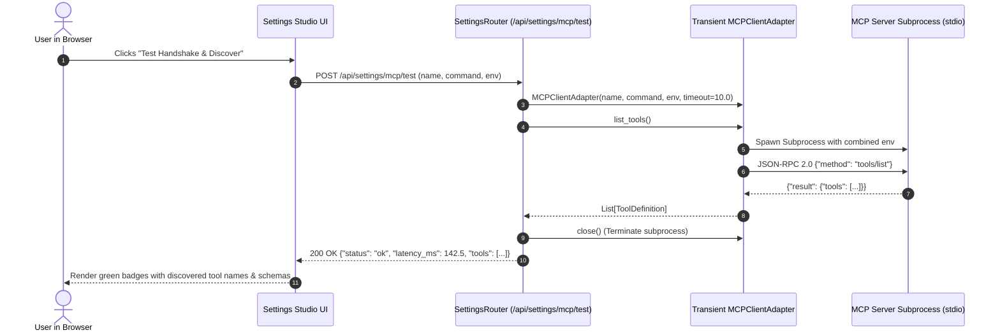

# Technical Architecture & Design: MCP Environment Variables, Live Tool Discovery, and Agent Forge Pack Binding

## 1. System Context & Overview

```
+------------------------------------------------------------------------------------------------+
| SETTINGS STUDIO                                                                                |
|  [ Add MCP Server Modal ]                                                                      |
|   - Server Name & Executable Command                                                           |
|   - Dynamic Key-Value Environment Variables (API Keys / DB URLs)                               |
|   - [ 🔄 Test Handshake & Discover ] --------> POST /api/settings/mcp/test                     |
|                                                      │                                         |
|                                                      ▼                                         |
|                                            Transient MCPClientAdapter                          |
|                                              - Spawns subprocess with env                      |
|                                              - Sends 'tools/list' JSON-RPC                     |
|                                              - Returns tools + latency_ms                      |
|                                              - Terminates subprocess                           |
+------------------------------------------------------------------------------------------------+
| AGENT FORGE STUDIO                                                                             |
|  [ Skill Scopes & Tool Permissions ]                                                           |
|   - Core System Tools (delegate_task, system_info)                                             |
|   - Built-in Wiki Knowledge (wiki_note_create, wiki_note_read)                                 |
|   - External MCP Packs (e.g. [x] MCP: GitHub Tools, [x] MCP: SQLite Database)                  |
|                                                      │                                         |
|                                                      ▼                                         |
|                                            POST /api/settings/agents/{id}                      |
|                                              - Updates allowed_tool_names                      |
+------------------------------------------------------------------------------------------------+
```

---

## 2. Sequence Diagrams

### 2.1 Live Handshake & Tool Discovery Flow (`/api/settings/mcp/test`)


---

## 3. Data Models & API Contracts

### 3.1 Probe Request & Response Contract
```json
// POST /api/settings/mcp/test
// Request Body:
{
  "name": "github-tools",
  "command": ["npx", "-y", "@modelcontextprotocol/server-github"],
  "env": {
    "GITHUB_PERSONAL_ACCESS_TOKEN": "ghp_mocktoken"
  }
}

// Success Response (200 OK):
{
  "status": "ok",
  "latency_ms": 145.2,
  "tools_count": 2,
  "tools": [
    {
      "name": "mcp_github-tools_create_issue",
      "description": "Create a new issue on GitHub",
      "parameters": {
        "type": "object",
        "properties": {
          "repo": {"type": "string"},
          "title": {"type": "string"}
        }
      }
    }
  ]
}

// Error Diagnostic Response (200 OK):
{
  "status": "error",
  "latency_ms": 5000.0,
  "error": "Process timed out after 10.0 seconds."
}
```

---

## 4. UI ASCII Wireframes

### 4.1 Settings Studio MCP Card
```text
+------------------------------------------------------------------------------------+
| 🔌 Model Context Protocol (MCP) Servers                                           |
+------------------------------------------------------------------------------------+
| Server Identifier: [ github-tools                                                ] |
| Subprocess Command: [ npx -y @modelcontextprotocol/server-github                 ] |
|                                                                                    |
| 🔑 Environment Variables:                                                          |
| +------------------------------------+-------------------------------------------+ |
| | Key: [ GITHUB_PERSONAL_ACCESS_TOKEN ] Value: [ •••••••••••••••••••••••••••••• ] | | [x]
| | Key: [ DEFAULT_OWNER              ] Value: [ jacobbweber                     ] | | [x]
| +------------------------------------+-------------------------------------------+ |
| [ + Add Variable ]                                                                 |
|                                                                                    |
| [ 🔄 Test Handshake & Discover ]                                                   |
| ┌────────────────────────────────────────────────────────────────────────────────┐ |
| │ ✅ Handshake Successful (142ms) — 2 tools discovered:                          │ |
| │ [ mcp_github-tools_create_issue ] [ mcp_github-tools_get_repo ]                │ |
| └────────────────────────────────────────────────────────────────────────────────┘ |
|                                                                                    |
| [ Cancel ]                                                  [ 💾 Save & Mount Server ] |
+------------------------------------------------------------------------------------+
```

### 4.2 Agent Forge Studio MCP Skill Packs
```text
+------------------------------------------------------------------------------------+
| 📦 Skill Scopes & Tool Permissions (Agent: assistant)                             |
+------------------------------------------------------------------------------------+
| Built-in Skill Packs:                                                              |
| [x] Core Orchestration (delegate_task, system_info) - [📌 Pinned]                  |
| [x] Wiki Knowledge Vault (wiki_note_create, wiki_note_read)                        |
|                                                                                    |
| External MCP Server Packs:                                                         |
| [x] MCP: github-tools (2 tools: create_issue, get_repo)                            |
| [ ] MCP: sqlite-db (1 tool: query)                                                 |
+------------------------------------------------------------------------------------+
```
