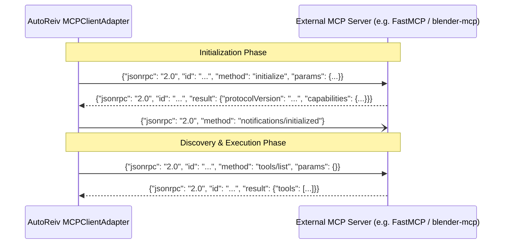

# Technical Design: MCP Lifecycle Handshake & Standard Client Compliance

> **Component**: `src/infrastructure/mcp/client_adapter.py`, `src/web/routers/settings.py`  
> **Requirement**: `[REQ-MCP-HANDSHAKE-001]`, `[REQ-MCP-HANDSHAKE-002]`, `[REQ-MCP-HANDSHAKE-003]`

---

## 1. Context & Architecture Overview

AutoReiv uses `MCPClientAdapter` to talk to Model Context Protocol servers over `stdio` subprocesses and `HTTP/SSE` remote endpoints.
Standard MCP specification requires an initial handshake:
1. `initialize`: Client announces protocol version, capabilities, and client identity. Server responds with server info and capabilities.
2. `notifications/initialized`: Client confirms readiness.
3. Operating phase: `tools/list`, `tools/call`, `resources/list`, etc.

---

## 2. Component Design & Changes

### 2.1 `MCPClientAdapter` (`src/infrastructure/mcp/client_adapter.py`)
- Add state flag: `self._initialized: bool = False`.
- In `_ensure_initialized()`:
  - If already initialized or in the middle of initializing, skip.
  - Send `initialize` JSON-RPC message.
  - Send `notifications/initialized` notification (write and flush, no ID, no waiting for response).
  - Mark `self._initialized = True`.
- Before executing any command in `_send_jsonrpc` (except when the method itself is `initialize`), invoke `await self._ensure_initialized()`.
- Add support for notifications (`_send_notification` or raw line write).

### 2.2 Global Settings Router (`src/web/routers/settings.py`)
- Update `save_mcp_server` to pass `transport=req.transport`, `url=req.url`, `headers=req.headers` to `mcp_manager.mount_server`.
- Update `test_mcp_server_connection` to pass `transport=req.transport`, `url=req.url`, `headers=req.headers` to `MCPClientAdapter`.

### 2.3 Global Settings UI (`src/web/templates/index.html` & `settings.js`)
- Add transport selector (`stdio` vs `HTTP / SSE`) and URL input group to the Add MCP Server form in Settings Studio, matching Forge Studio.
