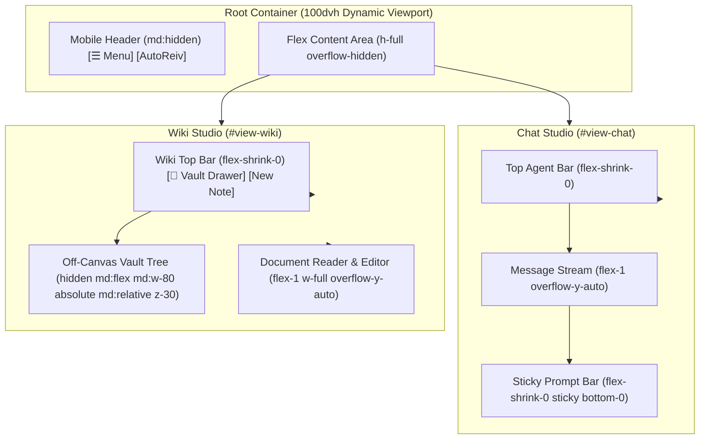

# Technical Design Specification: Mobile-First Responsive Layout & Viewport Overhaul

> **Document ID**: `DESIGN-RESP-001`  
> **Status**: Approved  
> **Traceability ID**: `[REQ-RESP-001]`, `[REQ-RESP-002]`, `[REQ-RESP-003]`

---

## 1. Responsive Viewport Architecture

---

## 2. Breakpoint Strategies (Tailwind CSS)

| Screen Size | Breakpoint | Navigation | Sidebars (Wiki / Docs) | Modals |
| :--- | :--- | :--- | :--- | :--- |
| **Mobile** | `< 768px` | Slide-over Hamburger Drawer | Slide-over Off-canvas Drawer | Fixed Fullscreen / 95vw Sheet |
| **Desktop** | `≥ 768px` | Fixed Left Sidebar (`w-72`) | Fixed Split-Pane Sidebar (`w-80`) | Centered Modal Dialog |
