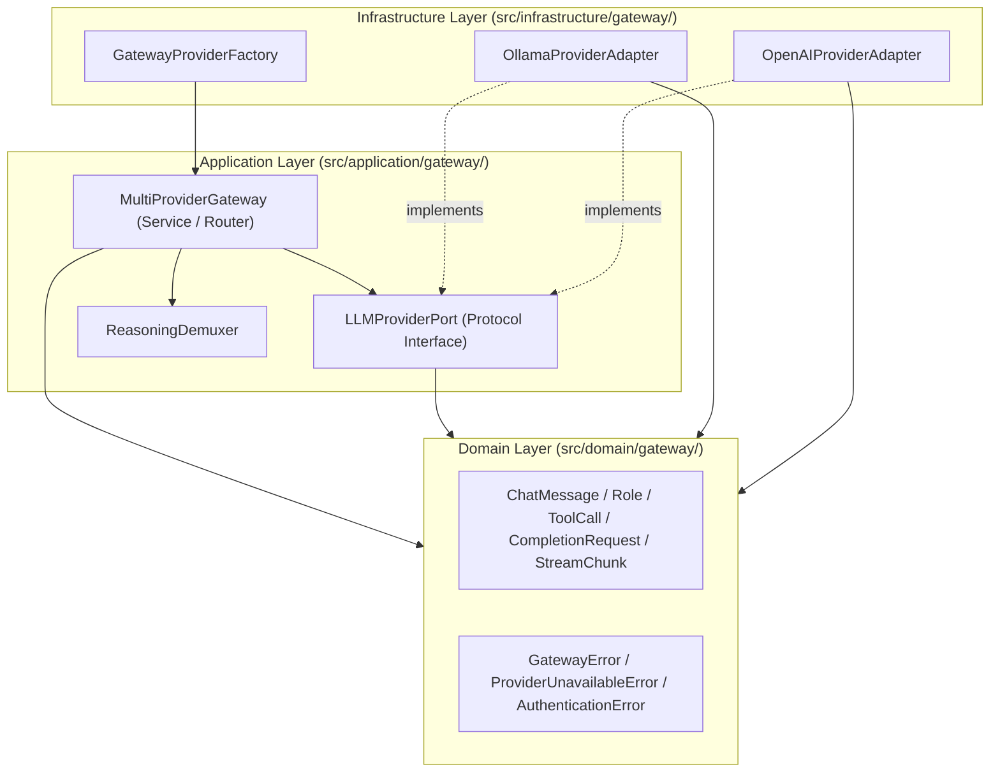
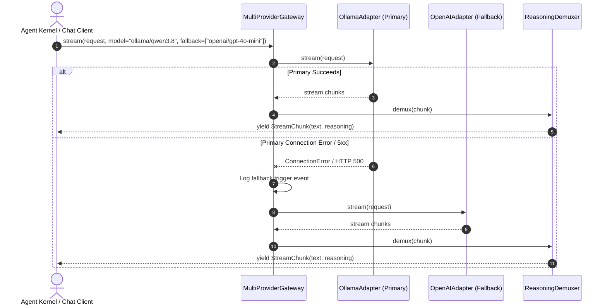

# Technical Design: Multi Provider Gateway

> **Linked Spec**: [`requirements.md`](./requirements.md)  
> **Applicable ADRs**: [`docs/adr/0002-multi-provider-llm-gateway-architecture.md`](../../adr/0002-multi-provider-llm-gateway-architecture.md)

---

## 1. Architectural Overview & Clean Architecture Topology



---

## 2. Sequence Flows

### 2.1 Streaming Token Request with Fallback



---

## 3. Data Contracts & Interfaces

### 3.1 Domain Models (`src/domain/gateway/models.py`)

```python
from enum import Enum
from pydantic import BaseModel, Field
from typing import List, Dict, Any, Optional, AsyncIterator


class Role(str, Enum):
    SYSTEM = "system"
    USER = "user"
    ASSISTANT = "assistant"
    TOOL = "tool"


class ToolCall(BaseModel):
    id: str
    name: str
    arguments: Dict[str, Any]


class ChatMessage(BaseModel):
    role: Role
    content: str = ""
    tool_calls: Optional[List[ToolCall]] = None
    tool_call_id: Optional[str] = None
    name: Optional[str] = None


class ToolDefinition(BaseModel):
    name: str
    description: str
    parameters: Dict[str, Any]


class CompletionRequest(BaseModel):
    model: str
    messages: List[ChatMessage]
    tools: Optional[List[ToolDefinition]] = None
    temperature: float = 0.7
    max_tokens: Optional[int] = None
    stream: bool = False


class StreamChunk(BaseModel):
    content: str = ""
    reasoning_content: str = ""
    tool_calls: Optional[List[ToolCall]] = None
    finish_reason: Optional[str] = None
    is_finished: bool = False


class CompletionResponse(BaseModel):
    model: str
    message: ChatMessage
    finish_reason: str = "stop"
    usage: Optional[Dict[str, int]] = None
```

### 3.2 Provider Port (`src/application/gateway/ports.py`)

```python
from typing import Protocol, AsyncIterator
from src.domain.gateway.models import CompletionRequest, CompletionResponse, StreamChunk


class LLMProviderPort(Protocol):
    provider_id: str

    async def complete(self, request: CompletionRequest) -> CompletionResponse: ...

    async def stream(self, request: CompletionRequest) -> AsyncIterator[StreamChunk]: ...
```

---

## 4. Error Handling & Edge Cases

| Error Scenario | Detection Point | Handling / Fallback | Result |
| :--- | :--- | :--- | :--- |
| Invalid Message Schema / Empty Role | Domain Layer (`ChatMessage`) | Pydantic Validation | `GatewayValidationError` |
| Ollama Host Unreachable / LAN Down | `OllamaAdapter` HTTP Call | Catch `httpx.ConnectError`, wrap as `ProviderUnavailableError` | Gateway triggers fallback model |
| 401 Unauthorized from Cloud API | `OpenAIAdapter` HTTP Call | Wrap as `AuthenticationError` | Fails fast (auth errors are non-retryable) |
| Streaming Stream Interrupted Mid-flight | Gateway Stream Loop | Catch `httpx.ReadTimeout` / `RemoteProtocolError` | Emits error chunk / attempts reconnection |
| Incomplete `<think>` Tag in Single Chunk | `ReasoningDemuxer` | State machine buffers open tags until closing `</think>` | Emits cleanly demuxed tokens |

---

## 5. Security & Operational Boundaries

1. **Zero Secret Leakage**: API keys and authorization headers are never logged or echoed into error messages.
2. **Deterministic Timeouts**: Default 30s connection timeout and 120s read timeout prevent hanging agent loops.
3. **Environment Injection**: Configuration defaults to reading `OLLAMA_HOST`, `OLLAMA_MODEL`, `OPENAI_API_KEY`, `OPENAI_BASE_URL` from `.env`.
