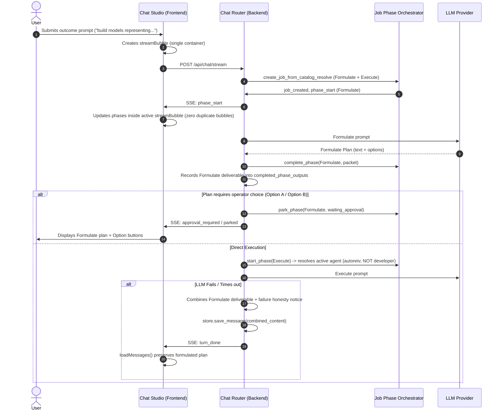

# Technical Design: Multi-Phase Job Chrome Deduplication and Deliverable Preservation

> **Spec Reference**: `docs/specs/multiphase-chrome-and-deliverables/requirements.md`  
> **Card Reference**: `docs/cards/CARD-378-multiphase-job-chrome-and-deliverables.md`

---

## 1. System Architecture & Flow



---

## 2. Component Design & Changes

### 2.1 Job Phase Orchestrator (`src/application/orchestration/job_phase_orchestrator.py`)
- **Prune `developer`**: Remove `has_coding_tools` check that hardcodes `"developer"`. If no custom specialist agent is declared in `store` or `matched_ids`, execution phases default to `default_agent_id` or `"autoreiv"`.
- **Option Park Gating**: In `catalog_resolve_rhe`, detect when Formulate output explicitly requests user confirmation or choices between routes (e.g. Option A vs Option B). When detected, park the job with status `waiting_approval` instead of immediately launching Phase 1.

### 2.2 Chat Router (`src/web/routers/chat.py`)
- **Deliverable Accumulation**: In `execute_goal_job_phases`:
  ```python
  completed_deliverables: list[str] = []
  ```
  Whenever a phase completes successfully (`outcome == "done"`), append its formatted text or packet facts into `completed_deliverables`.
- **Honest Composite Persistence**:
  When a phase fails, construct the persisted message as:
  ```python
  if completed_deliverables:
      final_msg = "\n\n---\n\n".join(completed_deliverables) + f"\n\n---\n\n{honesty_notice}"
  else:
      final_msg = honesty_notice
  ```
  Save `final_msg` to `store.save_message()`. This guarantees that reloading the chat thread preserves the completed work.

### 2.3 Chat Studio Frontend (`src/web/static/modules/studios/chat.js`)
- **Single Stream Container**: In `ensureInlineJobChromeBubble()`:
  - If `streamBubble` is active in `messagesContainer`, reuse `streamBubble`'s internal `.job-chrome-phases` and `.plan-milestone-card` containers instead of appending a second independent bubble with a duplicate `AUTOREIV STREAMING...` header.
- **Goal Title Truncation**:
  In `formatInlineJobChromeHtml`:
  - Sanitize and truncate `m.goal` to the first line (maximum 80 characters with `...`), preventing multi-line prompt blobs and attachment file paths from blowing out the card header.

---

## 3. Verification Plan
1. **Unit Tests**:
   - Test `resolve_specialist_agent_for_capabilities` with coding tools asserts `autoreiv`, never `developer`.
   - Test `execute_goal_job_phases` deliverable preservation: mock a 2-phase job where Phase 0 succeeds and Phase 1 fails; assert saved message contains Phase 0 text + Phase 1 failure honesty string.
   - Frontend Vitest: Assert that during streaming, only one element with `data-job-chrome` or streaming header exists in `#messagesContainer`.
2. **Regression & Linters**:
   - `pytest` on orchestration, kernel, and chat tests.
   - `npm run test:unit:frontend`.
   - `ruff check .` and `npm run lint:frontend`.
