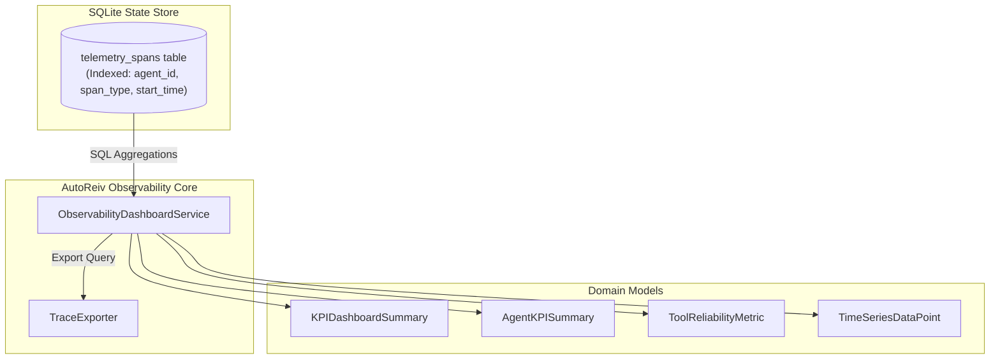

# Technical Design: Observability & KPI Dashboard Backend

> **Linked Spec**: [`requirements.md`](./requirements.md)  
> **Applicable ADRs**: [`docs/adr/0007-comprehensive-telemetry-aggregation-per-agent-kpis-and-tool-reliability-matrix.md`](../../adr/0007-comprehensive-telemetry-aggregation-per-agent-kpis-and-tool-reliability-matrix.md)

---

## 1. Architectural Overview & Workflow



---

## 2. Domain Models (`src/domain/observability/models.py`)

```python
from datetime import datetime
from typing import Dict, List, Optional
from pydantic import BaseModel, Field


class KPIDashboardSummary(BaseModel):
    total_turns: int = 0
    total_prompt_tokens: int = 0
    total_completion_tokens: int = 0
    total_tokens: int = 0
    avg_turn_duration_ms: float = 0.0
    error_count: int = 0
    error_rate_pct: float = 0.0


class AgentKPISummary(BaseModel):
    agent_id: str
    turn_count: int = 0
    prompt_tokens: int = 0
    completion_tokens: int = 0
    total_tokens: int = 0
    tool_call_count: int = 0
    error_count: int = 0
    avg_duration_ms: float = 0.0


class ToolReliabilityMetric(BaseModel):
    tool_name: str
    total_invocations: int = 0
    success_count: int = 0
    failure_count: int = 0
    success_rate_pct: float = 100.0
    avg_duration_ms: float = 0.0


class TelemetryFilter(BaseModel):
    agent_id: Optional[str] = None
    session_id: Optional[str] = None
    span_type: Optional[str] = None
    has_error: Optional[bool] = None
    start_time: Optional[datetime] = None
    end_time: Optional[datetime] = None


class TimeSeriesDataPoint(BaseModel):
    timestamp_bucket: str  # e.g. "2026-08-22 22:00:00"
    token_count: int = 0
    turn_count: int = 0
    error_count: int = 0
```

---

## 3. SQL Query Optimizations & Schema Enhancements

To guarantee instantaneous aggregation even under millions of spans:
```sql
CREATE INDEX IF NOT EXISTS idx_telemetry_spans_query ON telemetry_spans(agent_id, span_type, start_time);
CREATE INDEX IF NOT EXISTS idx_telemetry_spans_error ON telemetry_spans(status, span_type);
```
