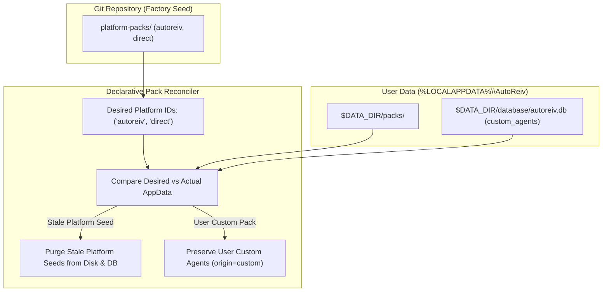
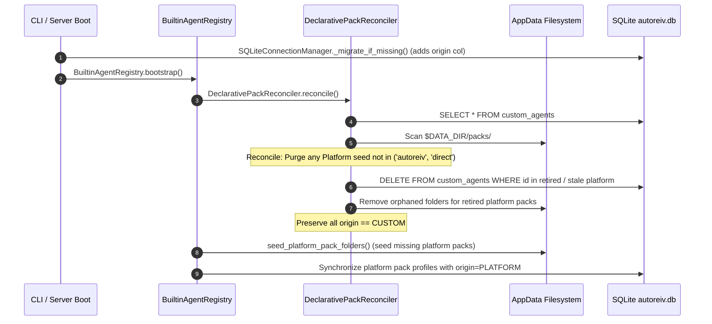

# Technical Design: Declarative Agent Pack Lifecycle Reconciliation & Origin Tracking

> **Linked Spec**: [`requirements.md`](./requirements.md)  
> **Traceability Key**: `[REQ-RECON-001..005]`  
> **Architecture Pattern**: Declarative Desired-State Reconciliation & Explicit Origin Tagging  

---

## 1. Architectural Context & Problem Statement

AutoReiv enforces a clean architectural separation between:
1. **Checkout (Seed)**: `platform-packs/` in the git repository.
2. **User Data (Runtime)**: `%LOCALAPPDATA%\AutoReiv\` containing `packs/`, `database/autoreiv.db`, `wiki/`, and `skills/`.

Previously, the bootstrap engine only had an **imperative copy-if-missing** loop. When the codebase retired platform agents, their copies remained in AppData. Because the SQLite database had no `origin` column, these abandoned platform copies were misclassified as `(Custom)` agents created by the user, and an auto-import loop repeatedly resurrected them if only the database was cleaned.



---

## 2. Component & Data Design

### 2.1 Agent Origin Taxonomy (`[REQ-RECON-001]`)
In `src/domain/kernel/models.py`:
```python
class AgentOrigin(str, Enum):
    PLATFORM = "platform"  # Shipped by AutoReiv core releases (autoreiv, direct)
    SYSTEM = "system"      # Hidden engine primitives (agent-builder)
    CUSTOM = "custom"      # User-created or imported via Agent Studio
```

In `AgentProfile`:
```python
origin: AgentOrigin = Field(default=AgentOrigin.CUSTOM, description="Origin tier of the agent profile.")
```

### 2.2 Database Schema & Migration (`[REQ-RECON-001]`)
In `src/infrastructure/memory/connection.py`:
```python
("custom_agents", "origin", "TEXT NOT NULL DEFAULT 'custom'"),
("agent_overrides", "origin", "TEXT NOT NULL DEFAULT 'custom'"),
```

### 2.3 Declarative Desired-State Reconciler (`[REQ-RECON-002]`, `[REQ-RECON-003]`, `[REQ-RECON-004]`)
In `src/infrastructure/skills/reconciler.py`:
```python
class DeclarativePackReconciler:
    def __init__(self, data_dir: Path, state_store: SQLiteStateStore, agent_registry: Any = None):
        self.data_dir = data_dir
        self.packs_dir = data_dir / "packs"
        self.store = state_store
        self.registry = agent_registry

    def reconcile(self, desired_platform_ids: Sequence[str] = PLATFORM_PACK_IDS) -> ReconciliationReport:
        # 1. Inspect all profiles in SQLite custom_agents
        # 2. If origin == PLATFORM and id not in desired_platform_ids: delete from DB + disk
        # 3. If id in RETIRED_PLATFORM_PACK_IDS: delete from DB + disk
        # 4. If origin == CUSTOM: strictly preserve
        # 5. Return report of purged vs preserved agents
```

### 2.4 API & UI Origin Surfacing (`[REQ-RECON-005]`)
In `src/web/routers/agents.py`:
- `_public_agent()` returns `"origin": profile.origin.value`.
- `DELETE /api/agents/{id}` validates `profile.origin == AgentOrigin.CUSTOM`. If `platform` or `system`, rejects with 403 Forbidden.

---

## 3. Execution Sequence on Server Boot


