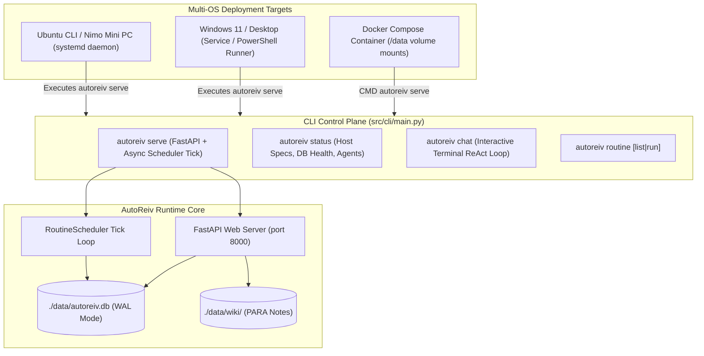

# Technical Design: Multi-OS Packaging & Bare-Metal / Docker Deployment

> **Linked Spec**: [`requirements.md`](./requirements.md)  
> **Applicable ADRs**: [`docs/adr/0009-multi-os-packaging-docker-compose-systemd-and-unified-cli-entry-point.md`](../../adr/0009-multi-os-packaging-docker-compose-systemd-and-unified-cli-entry-point.md)

---

## 1. Architecture Overview & Deployment Topology



---

## 2. CLI Command Specification

```bash
# Start server & background routine engine
autoreiv serve --host 0.0.0.0 --port 8000

# Check system specs, database connectivity, and registered agents
autoreiv status

# Interactive terminal chat with specific agent
autoreiv chat general-assistant

# List registered routines
autoreiv routine list

# Manually trigger a routine execution
autoreiv routine run morning-briefing
```

---

## 3. Server Lifespan & Background Routine Tick

```python
@asynccontextmanager
async def lifespan(app: FastAPI):
    # Startup: Start routine scheduler loop
    scheduler_task = asyncio.create_task(scheduler.start())
    yield
    # Shutdown: Stop scheduler loop cleanly
    scheduler.stop()
    scheduler_task.cancel()
```
