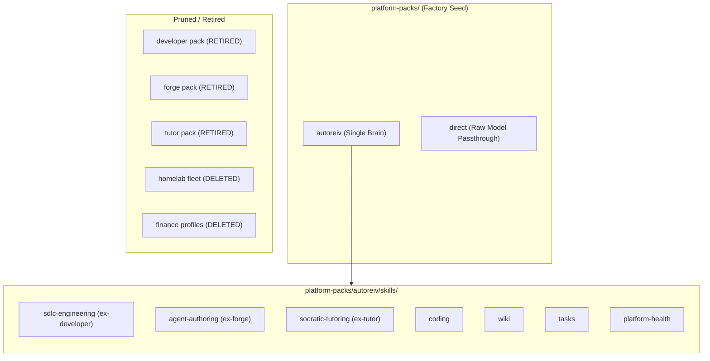
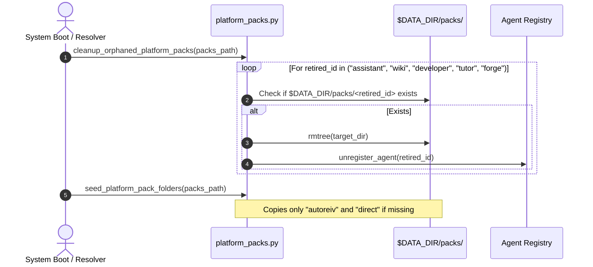

# Technical Design: Persona Skill Consolidation

> **Linked Spec**: [`requirements.md`](./requirements.md)  
> **Applicable ADRs**: `docs/adr/0054-mechanical-capability-contracts.md`

---

## 1. Architectural Overview

AutoReiv consolidates all cognitive workflows under **AutoReiv Core** (`autoreiv`), while preserving **Direct Mode** (`direct`) for raw ungrounded chat. Personas that were previously modeled as standalone agents (`developer`, `forge`, `tutor`) are compiled into modular, on-demand skill runbooks located in `platform-packs/autoreiv/skills/`.

---

## 2. Skill Runbooks Specification

Each absorbed persona becomes an independent, mechanically linted `SKILL.md` under `platform-packs/autoreiv/skills/<id>/SKILL.md`:

### 2.1 `sdlc-engineering` (Absorbs Developer)
- **Path**: `platform-packs/autoreiv/skills/sdlc-engineering/SKILL.md`
- **Requires Tools**: `["read_project_file", "write_project_file", "list_project_dir", "cli_exec", "execute_code", "propose_followup"]` (Budget: 6)
- **Safety**: `read_only: false`, `requires_hitl: true` (for destructive commands)
- **Verification**: Command or Assertion verifying test suites pass cleanly.

### 2.2 `agent-authoring` (Absorbs Forge)
- **Path**: `platform-packs/autoreiv/skills/agent-authoring/SKILL.md`
- **Requires Tools**: `["inspect_agent_pack", "launch_factory_training", "lookup_agents", "handoff_to_agent"]` (Budget: 4)
- **Safety**: `read_only: false`, `requires_hitl: true` (for launching training jobs)
- **Verification**: Assertion verifying training job dispatch with valid job ID.

### 2.3 `socratic-tutoring` (Absorbs Tutor)
- **Path**: `platform-packs/autoreiv/skills/socratic-tutoring/SKILL.md`
- **Requires Tools**: `["wiki_note_read", "wiki_note_search", "wiki_note_list", "list_wiki_templates"]` (Budget: 4)
- **Safety**: `read_only: true`
- **Verification**: Assertion verifying grounded citations from wiki notes and Feynman inquiry.

---

## 3. Platform Pack Lifecycle & Startup Migration

---

## 4. Deletions & Purge Plan

1. **Delete from `src/domain/agents/profiles.py`**:
   - `HOMELAB_COORDINATOR_PROFILE`
   - `HOMELAB_ARCHITECT_PROFILE`
   - `HOMELAB_ENGINEER_PROFILE`
   - `HOMELAB_ADMIN_PROFILE`
   - `HOMELAB_JANITOR_PROFILE`
   - `HOMELAB_FLEET_PROFILES`
   - `get_homelab_profile`
2. **Delete obsolete orchestration modules**:
   - `src/application/orchestration/homelab_domain_recipe.py`
   - `src/application/orchestration/homelab_outcome_smoke.py`
3. **Delete obsolete tests**:
   - `tests/unit/homelab/test_homelab_domain_orchestration.py`
   - `tests/unit/homelab/test_homelab_framework.py`
   - `tests/unit/homelab/test_homelab_fleet_packs.py`
   - `tests/unit/homelab/test_homelab_factory_dogfood.py`
   - `tests/integration/test_homelab_domain_e2e.py`
   - `tests/unit/orchestration/test_card263_homelab_outcome_smoke.py`
   - `tests/unit/orchestration/test_finance_agent_e2e.py`
4. **Delete platform pack folders**:
   - `platform-packs/developer/`
   - `platform-packs/forge/`
   - `platform-packs/tutor/`
5. **Fix Linter Import**:
   - In `src/application/skills/linter.py`, update `from src.infrastructure.data.resolver import resolve_data_dir` to use `resolve_live_data_root`.
