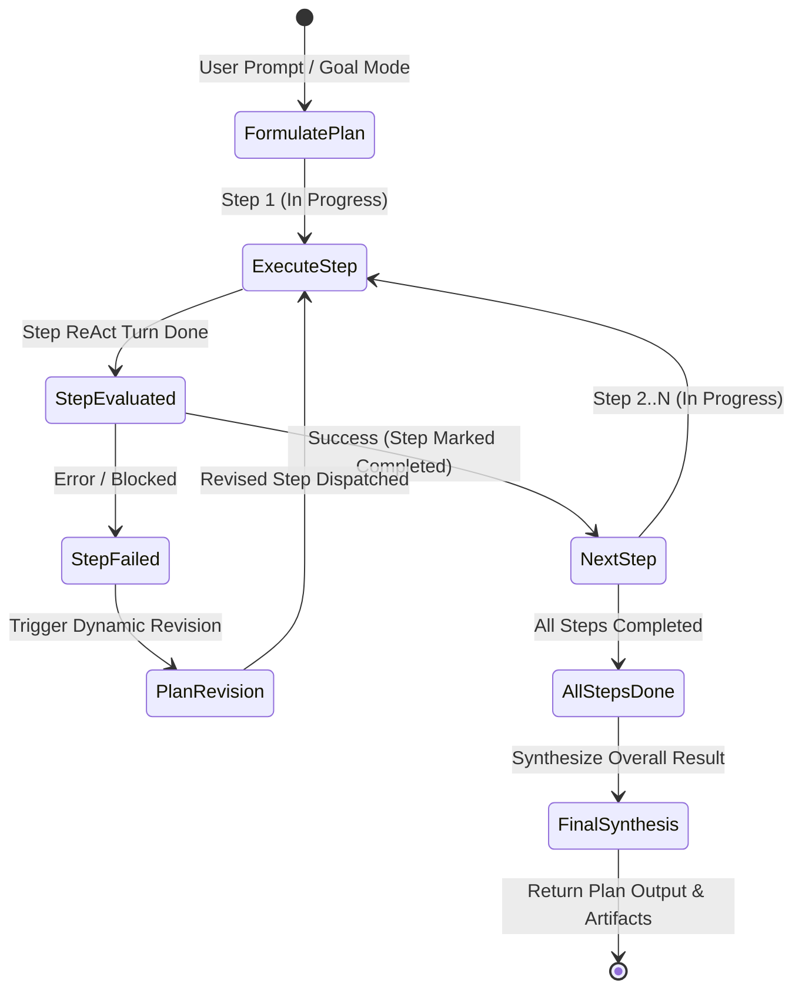

# Technical Design: Plan-and-Execute Graph Engine & Goal Mode

> **Linked Spec**: [`requirements.md`](./requirements.md) | [`tasks.md`](./tasks.md)  
> **Applicable ADRs**: `docs/adr/0015-plan-and-execute-graph-engine-and-goal-mode.md`

---

## 1. System Architecture & Plan Execution State Flow



---

## 2. Component Design & Models

### 2.1. Domain Models (`src/domain/planning/models.py`)
```python
class StepStatus(str, Enum):
    PENDING = "pending"
    IN_PROGRESS = "in_progress"
    COMPLETED = "completed"
    FAILED = "failed"


class PlanStep(BaseModel):
    id: str
    title: str
    description: str = ""
    status: StepStatus = StepStatus.PENDING
    result_summary: Optional[str] = None
    duration_ms: Optional[float] = None


class ExecutionPlan(BaseModel):
    id: str
    goal: str
    agent_id: str
    session_id: str
    steps: List[PlanStep] = Field(default_factory=list)
    is_completed: bool = False
    created_at: datetime = Field(default_factory=utc_now)
```

### 2.2. `PlanAndExecuteEngine` (`src/application/kernel/plan_engine.py`)
```python
class PlanAndExecuteEngine:
    async def formulate_plan(self, agent: AgentProfile, goal: str, session_id: str) -> ExecutionPlan: ...
    async def execute_plan(self, plan: ExecutionPlan, agent: AgentProfile) -> ExecutionPlan: ...
```

### 2.3. `PlanningSkill` (`src/application/skills/planning_skill.py`)
```python
class PlanningSkill:
    def mark_plan_step_completed(self, step_id: str, summary: str) -> Dict[str, Any]: ...
    def append_plan_step(self, title: str, description: str) -> Dict[str, Any]: ...
    def get_active_plan(self) -> Dict[str, Any]: ...
```
