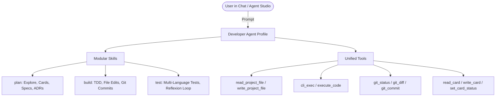

# Design: Platform Core Developer Agent [CARD-181]

## 1. Architecture Overview

## 2. Components & Interactions

- **Platform Pack Root**: `platform-packs/developer/` contains the `pack.json` and three modular skill runbooks (`skills/plan/SKILL.md`, `skills/build/SKILL.md`, `skills/test/SKILL.md`).
- **Seeding Service**: `src/infrastructure/skills/platform_packs.py` inspects `PLATFORM_PACK_IDS` and copies missing pack folders into `$DATA_DIR/packs/` at startup.
- **Pack Registry & Schema**: `src/application/agent_packs/schema.py` exposes `PLATFORM_PACK_IDS = frozenset({"assistant", "autoreiv", "developer"})`.
- **Chat & Studio UI**: `src/web/static/modules/studios/chat.js` hides retired IDs (`conductor`, `coding`, `review`, `agent-builder`) and lists `Developer` with `[Platform]` badge.

## 3. Data Flow & Execution Modes

1. **Normal Chat Mode**: Fast conversational interaction where Developer inspects files and answers questions or formulates plans.
2. **Goal Mode + Verify**: Autonomous multi-step execution. Developer generates phases/steps, executes TDD implementation, executes tests via `cli_exec`, and verifies compliance with `verify_rtm.py`.
