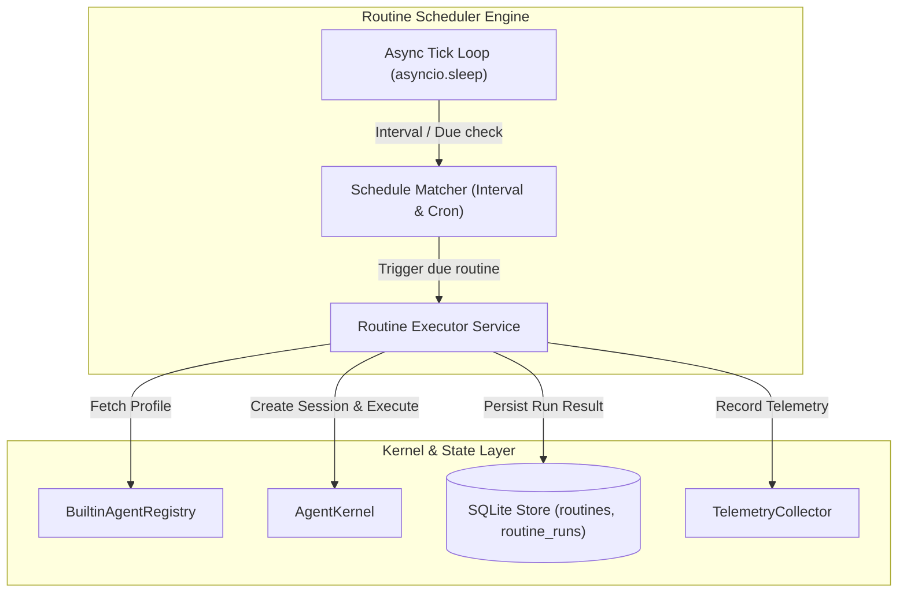

# Technical Design: Autonomous Routine Engine & Background Scheduler

> **Linked Spec**: [`requirements.md`](./requirements.md)  
> **Applicable ADRs**: [`docs/adr/0005-autonomous-routine-engine-and-async-background-scheduler.md`](../../adr/0005-autonomous-routine-engine-and-async-background-scheduler.md)

---

## 1. Architectural Overview & Workflow



---

## 2. Domain Models (`src/domain/routines/models.py`)

```python
from enum import Enum
from datetime import datetime
from typing import Optional, Dict, Any
from pydantic import BaseModel, Field


class ScheduleType(str, Enum):
    INTERVAL = "interval"
    CRON = "cron"


class RoutineStatus(str, Enum):
    IDLE = "idle"
    RUNNING = "running"
    SUCCESS = "success"
    FAILED = "failed"


class Routine(BaseModel):
    id: str
    name: str
    description: str = ""
    agent_id: str
    prompt: str
    schedule_type: ScheduleType = ScheduleType.INTERVAL
    interval_seconds: int = 3600
    cron_expression: Optional[str] = None
    enabled: bool = True
    last_run_at: Optional[datetime] = None
    next_run_at: Optional[datetime] = None
    last_status: RoutineStatus = RoutineStatus.IDLE
    created_at: datetime
    updated_at: datetime


class RoutineRun(BaseModel):
    id: str
    routine_id: str
    agent_id: str
    status: RoutineStatus
    output: str = ""
    error_message: Optional[str] = None
    duration_ms: float = 0.0
    created_at: datetime
```

---

## 3. Database Schema Extension for Routines

```sql
CREATE TABLE IF NOT EXISTS routines (
    id TEXT PRIMARY KEY,
    name TEXT NOT NULL,
    description TEXT DEFAULT '',
    agent_id TEXT NOT NULL,
    prompt TEXT NOT NULL,
    schedule_type TEXT NOT NULL DEFAULT 'interval',
    interval_seconds INTEGER DEFAULT 3600,
    cron_expression TEXT,
    enabled BOOLEAN NOT NULL DEFAULT 1,
    last_run_at TIMESTAMP,
    next_run_at TIMESTAMP,
    last_status TEXT NOT NULL DEFAULT 'idle',
    created_at TIMESTAMP DEFAULT CURRENT_TIMESTAMP,
    updated_at TIMESTAMP DEFAULT CURRENT_TIMESTAMP
);

CREATE TABLE IF NOT EXISTS routine_runs (
    id TEXT PRIMARY KEY,
    routine_id TEXT NOT NULL REFERENCES routines(id) ON DELETE CASCADE,
    agent_id TEXT NOT NULL,
    status TEXT NOT NULL,
    output TEXT DEFAULT '',
    error_message TEXT,
    duration_ms REAL NOT NULL DEFAULT 0.0,
    created_at TIMESTAMP DEFAULT CURRENT_TIMESTAMP
);

CREATE INDEX IF NOT EXISTS idx_routine_runs_routine ON routine_runs(routine_id, created_at);
```

---

## 4. Pre-Configured Day-1 Routines

1. **`morning-briefing`**:
   - Agent: `general-assistant`
   - Schedule: Interval 86400s (Daily)
   - Prompt: `"Review my active tasks in the task tracker and compile a concise morning briefing with top priorities."`
2. **`daily-system-info`**:
   - Agent: `linux-sysadmin`
   - Schedule: Interval 86400s (Daily)
   - Prompt: `"Run a system information inspection, check CPU, RAM, and disk utilization, and summarize host health status."`
3. **`nightly-note-hygiene`**:
   - Agent: `librarian`
   - Schedule: Interval 86400s (Daily)
   - Prompt: `"Scan all markdown notes in the Wiki, check that YAML frontmatter is structured with titles and tags, and summarize the library index."`
4. **`hourly-sre-pulse`**:
   - Agent: `system-agent`
   - Schedule: Interval 3600s (Hourly)
   - Prompt: `"Inspect platform health, database responsiveness, tool reliability rates, and token consumption."`
