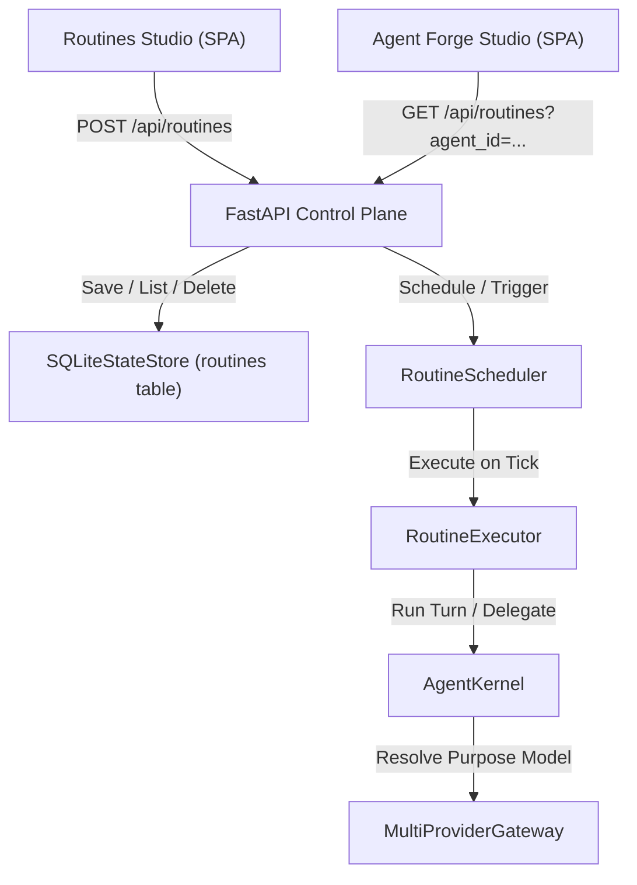

# Design Specification: Routine Management and Agent Binding

> **Linked Spec**: [`requirements.md`](./requirements.md) | [`tasks.md`](./tasks.md)  
> **Traceability Key**: `[REQ-ROUT-xxx]`

---

## 1. Architecture & Component Context



---

## 2. Schedule Humanizer Contract (`[REQ-ROUT-001]`)

A lightweight helper `cron_to_human(cron_expr: str) -> str` translates standard 5-part cron expressions into clean English:
- `* * * * *` $\to$ *"Every minute"*
- `*/5 * * * *` $\to$ *"Every 5 minutes"*
- `*/15 * * * *` $\to$ *"Every 15 minutes"*
- `*/30 * * * *` $\to$ *"Every 30 minutes"*
- `0 * * * *` $\to$ *"Every hour at minute 0"*
- `0 */2 * * *` $\to$ *"Every 2 hours"*
- `0 8 * * *` $\to$ *"Daily at 08:00 UTC"*
- `0 0 * * 0` $\to$ *"Weekly on Sunday at 00:00 UTC"*
- `0 0 1 * *` $\to$ *"Monthly on the 1st at 00:00 UTC"*

And computes `next_execution_time(cron_expr: str, now: datetime) -> str`.

---

## 3. Data Models & API Contracts (`[REQ-ROUT-002]`, `[REQ-ROUT-003]`)

### Routine Domain Model (`src/domain/routines/models.py`)
```python
class RoutinePayload(BaseModel):
    id: Optional[str] = None
    name: str
    description: Optional[str] = ""
    agent_id: str
    schedule_type: ScheduleType = ScheduleType.CRON
    cron_expr: Optional[str] = "0 * * * *"
    interval_seconds: Optional[int] = 3600
    prompt_template: str
    enabled: bool = True
```

### Endpoints
- `GET /api/routines` $\to$ `List[RoutineSummary]` (supports `?agent_id=...`)
- `POST /api/routines` $\to$ creates routine in SQLite & refreshes scheduler
- `PUT /api/routines/{id}` $\to$ updates routine in SQLite & refreshes scheduler
- `DELETE /api/routines/{id}` $\to$ deletes custom routine (protects built-in routines)
- `POST /api/routines/{id}/toggle` $\to$ toggles `enabled: bool` state
- `POST /api/routines/{id}/run` $\to$ triggers immediate out-of-band execution

---

## 4. UI Layout Contracts (`[REQ-ROUT-004]`, `[REQ-ROUT-005]`)

1. **Routines Studio**:
   - Header with `[+ New Routine]` button.
   - Live routine cards with human-friendly frequency (*"Every 15 minutes (cron: `*/15 * * * *`)"*), next run ETA (*"in 12m"*), last run status & duration, and action buttons (`Run Now`, `Edit`, `Pause/Resume`, `Delete`).
   - Routine Creation / Edit Modal with cron frequency presets (`Every 15 min`, `Hourly`, `Daily at 08:00`, `Custom Cron`) and real-time humanizer preview.
2. **Agent Forge Studio**:
   - Added card `[⏰ Assigned Background Routines]` displaying all active routines belonging to the selected agent.
