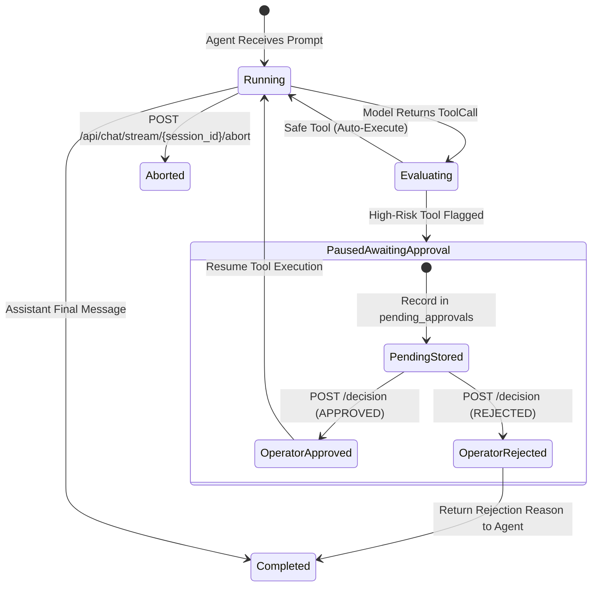

# Technical Design: Sandbox Security Guardrails & HITL Approvals

> **Linked Spec**: [`requirements.md`](./requirements.md) | [`tasks.md`](./tasks.md)  
> **Applicable ADRs**: `docs/adr/0011-ephemeral-sandbox-dangerous-command-guardrails-and-hitl-state-parking.md`

---

## 1. System Architecture & Approval State Machine



---

## 2. Component Design & Interfaces

### 2.1. `DangerousCommandFilter` (`src/application/skills/command_filter.py`)
```python
class DangerousCommandFilter:
    @staticmethod
    def is_dangerous(cmd: str) -> Tuple[bool, Optional[str]]: ...
```

### 2.2. `SandboxedSubprocessWorker` (`src/application/skills/sandbox_worker.py`)
```python
class SandboxedSubprocessWorker:
    @staticmethod
    async def run_sandboxed(
        cmd: List[str],
        timeout_seconds: float = 30.0,
        env_overrides: Optional[Dict[str, str]] = None,
    ) -> SubprocessResult: ...
```

### 2.3. `pending_approvals` Schema (`src/infrastructure/memory/sqlite_store.py`)
```sql
CREATE TABLE IF NOT EXISTS pending_approvals (
    id TEXT PRIMARY KEY,
    session_id TEXT NOT NULL,
    agent_id TEXT NOT NULL,
    tool_name TEXT NOT NULL,
    arguments_json TEXT NOT NULL,
    status TEXT NOT NULL DEFAULT 'pending', -- pending, approved, rejected
    decision_reason TEXT,
    created_at TIMESTAMP DEFAULT CURRENT_TIMESTAMP,
    resolved_at TIMESTAMP
);
CREATE INDEX IF NOT EXISTS idx_approvals_session ON pending_approvals(session_id, status);
```
