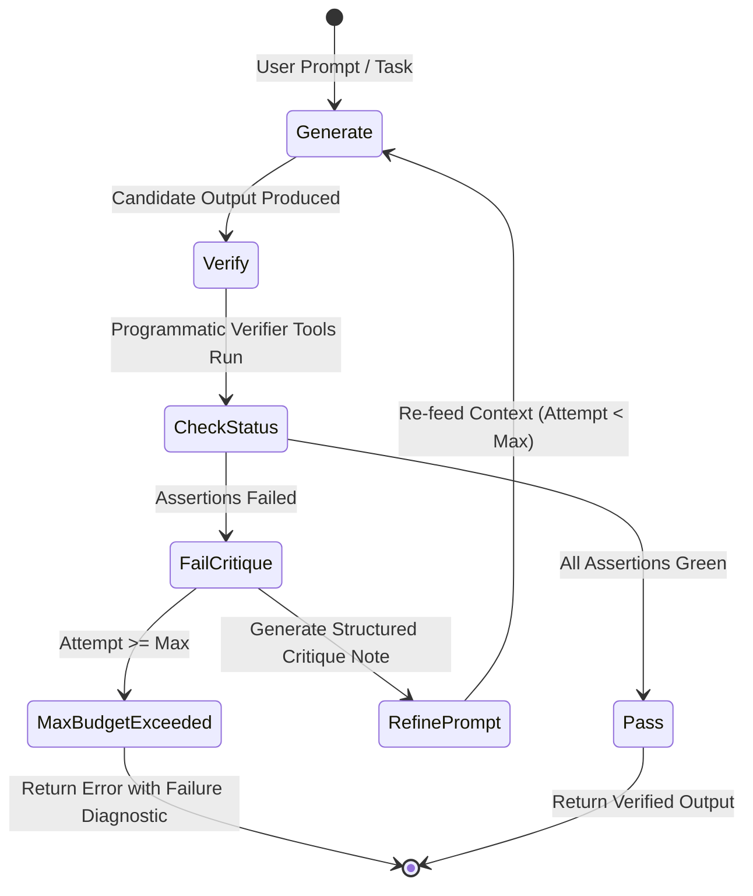

# Technical Design: Self-Verification Loops & SRE Health Auditing

> **Linked Spec**: [`requirements.md`](./requirements.md) | [`tasks.md`](./tasks.md)  
> **Applicable ADRs**: `docs/adr/0014-reflexive-self-verification-loops-and-sre-critic-auditing.md`

---

## 1. System Architecture & Reflexion State Flow



---

## 2. Component Design & Interfaces

### 2.1. `VerificationSkill` (`src/application/skills/verification_skill.py`)
```python
class VerificationSkill:
    def verify_telemetry_consistency(self, reported_errors: int, reported_health_score: float) -> Dict[str, Any]: ...
    def assert_json_schema(self, payload: str, required_keys: List[str]) -> Dict[str, Any]: ...
    def validate_metric_bounds(
        self, metric_name: str, value: float, min_val: float, max_val: float
    ) -> Dict[str, Any]: ...
```

### 2.2. `ReflexionLoopEngine` (`src/application/kernel/reflexion_engine.py`)
```python
class ReflexionLoopEngine:
    async def run_reflexion_turn(
        self,
        agent: AgentProfile,
        session_id: str,
        user_content: str,
        verifier_tool_name: str,
        max_refinements: int = 3,
    ) -> Dict[str, Any]: ...
```

### 2.3. `auditor-critic` Profile (`src/domain/agents/profiles.py`)
```python
AUDITOR_CRITIC_PROFILE = AgentProfile(
    id="auditor-critic",
    name="Auditor Critic",
    description="Adversarial reviewer and rigorous QA auditor for high-stakes actions.",
    system_prompt="You are AutoReiv's Auditor Critic...",
    tone=AgentTone.TECHNICAL,
    allowed_tool_names=["verify_telemetry_consistency", "assert_json_schema", "validate_metric_bounds"],
)
```
