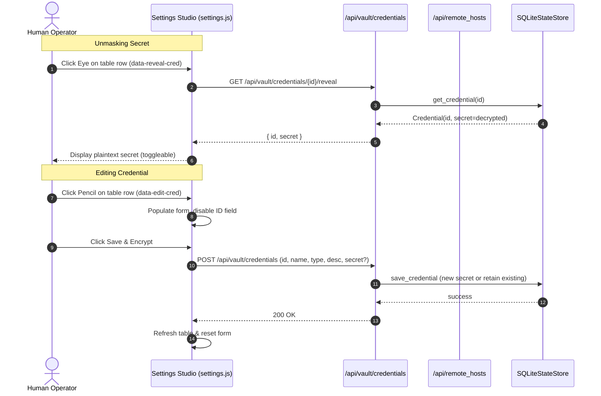

# Technical Design: Settings Studio Edit and Unmask Controls

> **Spec Status**: In Progress  
> **Card Reference**: CARD-188  
> **Primary Component**: `AutoReiv.Web`, `AutoReiv.Security`, `AutoReiv.Settings`  

---

## 1. Architecture Overview

This design enhances the operator control plane within **Settings Studio** by providing update and unmask operations for both Credential Vault entries and Remote SSH Host profiles.



---

## 2. API Contract Changes

### `GET /api/vault/credentials/{cred_id}/reveal`
- **Response** `200 OK`:
  ```json
  {
    "id": "github-token",
    "secret": "ghp_1234567890abcdef"
  }
  ```
- **Response** `404 Not Found`:
  ```json
  {
    "detail": "Credential not found"
  }
  ```

### `POST /api/vault/credentials` Update Behavior
- If `id` matches an existing credential and `secret` is omitted or empty string, the existing decrypted secret is retained while updating `name`, `type`, and `description`.
- If a new `secret` is provided, it is encrypted and saved.
