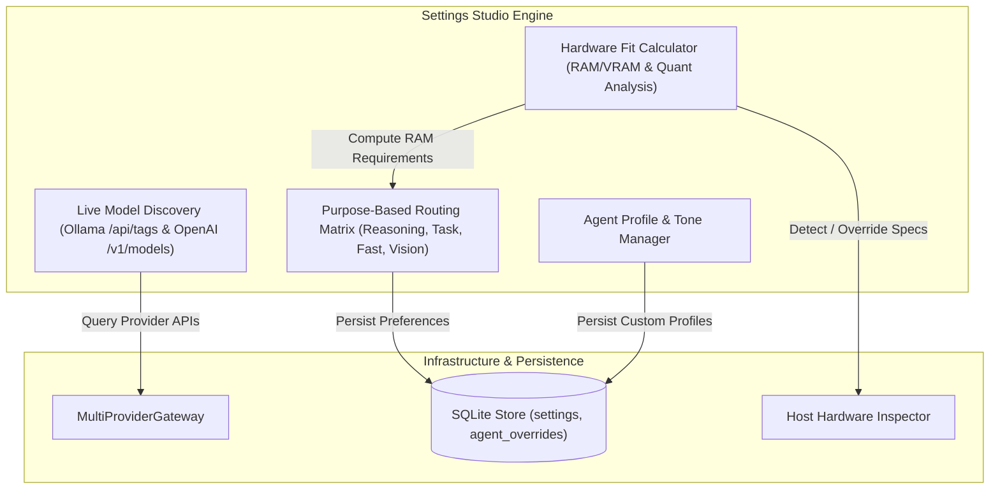

# Technical Design: Settings Studio & Hardware Fit Calculator

> **Linked Spec**: [`requirements.md`](./requirements.md)  
> **Applicable ADRs**: [`docs/adr/0006-live-model-discovery-hardware-fit-recommendations-and-purpose-routing.md`](../../adr/0006-live-model-discovery-hardware-fit-recommendations-and-purpose-routing.md)

---

## 1. Architectural Overview & Workflow



---

## 2. Domain Models (`src/domain/settings/models.py`)

```python
from enum import Enum
from typing import Dict, List, Optional
from pydantic import BaseModel, Field


class ModelPurpose(str, Enum):
    GENERAL = "general"
    REASONING = "reasoning"
    TASK_EXECUTION = "task_execution"
    VISION = "vision"
    AUXILIARY = "auxiliary"
    FAST = "fast"


class FitStatus(str, Enum):
    OPTIMAL = "optimal"  # Fits fully in RAM/VRAM with ample headroom (>30% free)
    RUNNABLE = "runnable"  # Fits in RAM/VRAM with minimal headroom (10-30% free)
    OFFLOADED = "offloaded"  # Exceeds VRAM, partially offloaded to system RAM / swap
    INSUFFICIENT_MEMORY = "insufficient_memory"  # Total RAM/VRAM is smaller than weights + KV cache


class ModelDescriptor(BaseModel):
    id: str
    name: str
    provider: str
    param_size_b: Optional[float] = None  # e.g. 7.0 for 7B, 32.0 for 32B, 70.0 for 70B
    quantization: str = "Q4_K_M"
    family: str = "unknown"
    is_multimodal: bool = False


class HardwareSpecs(BaseModel):
    total_ram_gb: float
    available_ram_gb: float
    vram_gb: float = 0.0
    cpu_cores: int = 4
    is_unified_memory: bool = True
    platform_name: str = "Ubuntu/Linux"


class ModelFitReport(BaseModel):
    model_id: str
    param_size_b: float
    quantization: str
    required_ram_gb: float
    available_ram_gb: float
    fit_status: FitStatus
    recommendation_score: float  # 0.0 to 100.0
    notes: str = ""


class ModelPurposeMatrix(BaseModel):
    default_model: str = "default"
    purposes: Dict[ModelPurpose, str] = Field(default_factory=dict)
```

---

## 3. Database Schema Extension for Settings & Agent Overrides

```sql
CREATE TABLE IF NOT EXISTS settings (
    key TEXT PRIMARY KEY,
    value_json TEXT NOT NULL,
    updated_at TIMESTAMP DEFAULT CURRENT_TIMESTAMP
);

CREATE TABLE IF NOT EXISTS agent_overrides (
    agent_id TEXT PRIMARY KEY,
    tone TEXT,
    system_prompt TEXT,
    model TEXT,
    allowed_tools_json TEXT,
    max_turns INTEGER,
    updated_at TIMESTAMP DEFAULT CURRENT_TIMESTAMP
);
```

---

## 4. Hardware Fit Memory Calculation Formula

$$\text{Weight Memory (GB)} = \text{Param Count (Billions)} \times \text{Bytes Per Weight} \times 1.15 \text{ (quant overhead)}$$

- **Q4_K_M**: $\sim 0.55 \text{ bytes/weight}$ (4.5 bits)
- **Q5_K_M**: $\sim 0.68 \text{ bytes/weight}$ (5.5 bits)
- **Q8_0**: $\sim 1.05 \text{ bytes/weight}$ (8.4 bits)
- **FP16 / BF16**: $\sim 2.00 \text{ bytes/weight}$ (16 bits)
- **KV Cache Overhead**: $2.0 \text{ GB}$ (standard 8k context buffer)
