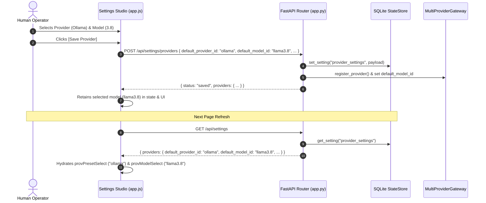

# Technical Design Specification: Provider & Model Settings Persistence

> **Document ID**: `DESIGN-SETTINGS-PERSIST-001`  
> **Status**: Approved  
> **Traceability ID**: `[REQ-SET-007]`, `[REQ-SET-008]`

---

## 1. Architectural Flow



---

## 2. Data Contract Changes

### `ProviderSettingsRequest` (`src/web/app.py`)
```python
class ProviderSettingsRequest(BaseModel):
    ollama_host: Optional[str] = "http://127.0.0.1:11434"
    openai_base_url: Optional[str] = "https://api.openai.com/v1"
    openai_api_key: Optional[str] = None
    default_provider_id: Optional[str] = "ollama"
    default_model_id: Optional[str] = "default"
```
