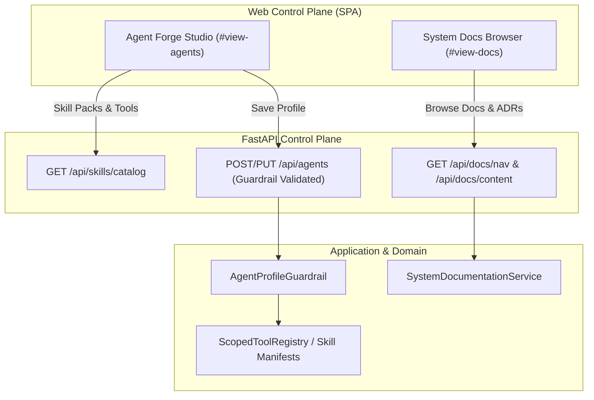

# Design Specification: Skill Pack Hierarchy, Guardrails, and System Documentation Browser

> **Linked Spec**: [`requirements.md`](./requirements.md) | [`tasks.md`](./tasks.md)  
> **Traceability Key**: `[REQ-SKIL-xxx]`

---

## 1. Architecture & Component Context



---

## 2. Skill Pack Manifest & Catalog (`[REQ-SKIL-001]`)

### Data Model
```python
class SkillPackSummary(BaseModel):
    id: str
    name: str
    description: str
    icon: str
    tools: List[ToolSummary]
```

### Registered Built-in Skill Packs:
1. `sysadmin-pack` (Icon: `terminal`): `cli_exec`, `system_info`, `check_port`
2. `librarian-pack` (Icon: `book-open`): `wiki_note_create`, `wiki_note_read`, `wiki_note_search`, `wiki_note_list`
3. `verification-pack` (Icon: `shield-check`): `assert_json_schema`, `assert_regex_match`, `audit_action`
4. `planning-pack` (Icon: `list-checks`): `formulate_plan`, `mark_plan_step_completed`, `append_plan_step`, `get_active_plan`
5. `agent-builder-pack` (Icon: `sparkles`): `list_available_skills_and_tools`, `propose_agent_specification`, `save_agent_specification`
6. `orchestration-pack` (Icon: `network`): `delegate_task`, `handoff_task`
7. `mcp-pack` (Icon: `cpu`): Dynamic MCP tools

---

## 3. Guardrail Engine Contract (`[REQ-SKIL-003]`)

### Validator Invariants:
1. **Slug Validation**: `id` matches `^[a-z0-9][a-z0-9-]*[a-z0-9]$` (kebab-case).
2. **Tool Existence Validation**: Every tool in `allowed_tool_names` MUST exist in the registered `ToolRegistry`. Any unknown/hallucinated tool triggers an explicit `ValidationError` (*"Tool 'xyz' does not exist in catalog"*).
3. **Purpose & Tone Enum Enforcement**: `purpose` must be one of `ModelPurpose` values; `tone` must be one of `AgentTone` values.
4. **Turn Bounds**: `1 <= max_turns <= 50`.
5. **System Prompt Minimum**: `len(system_prompt) >= 20`.

---

## 4. System Documentation Service & Browser Contract (`[REQ-SKIL-004]`, `[REQ-SKIL-005]`)

### Documentation Navigation Tree:
```json
{
  "sections": [
    {
      "title": "Platform Specifications",
      "items": [
        {"title": "CARD-017: Routine Management", "path": "docs/specs/routine-management-and-agent-binding/requirements.md"},
        {"title": "CARD-016: Agent Forge Studio", "path": "docs/specs/agent-forge-and-model-cascade/requirements.md"}
      ]
    },
    {
      "title": "Architecture Decision Records (ADRs)",
      "items": [
        {"title": "ADR-0018: Routine Management", "path": "docs/adr/0018-routine-management-and-agent-binding.md"},
        {"title": "ADR-0017: Agent Forge Studio", "path": "docs/adr/0017-agent-forge-studio-and-purpose-routing-cascade.md"}
      ]
    },
    {
      "title": "SDLC Constitution & Invariants",
      "items": [
        {"title": "Master Constitution (AGENTS.md)", "path": "AGENTS.md"},
        {"title": "Human Engagement Rules", "path": ".agents/rules/human-engagement.md"}
      ]
    }
  ]
}
```

### Security Constraint:
The document service enforces a strict path whitelist (only allowing relative paths inside repo root ending in `.md` or `.json` and explicitly blocking `..` parent traversals outside the repository).
