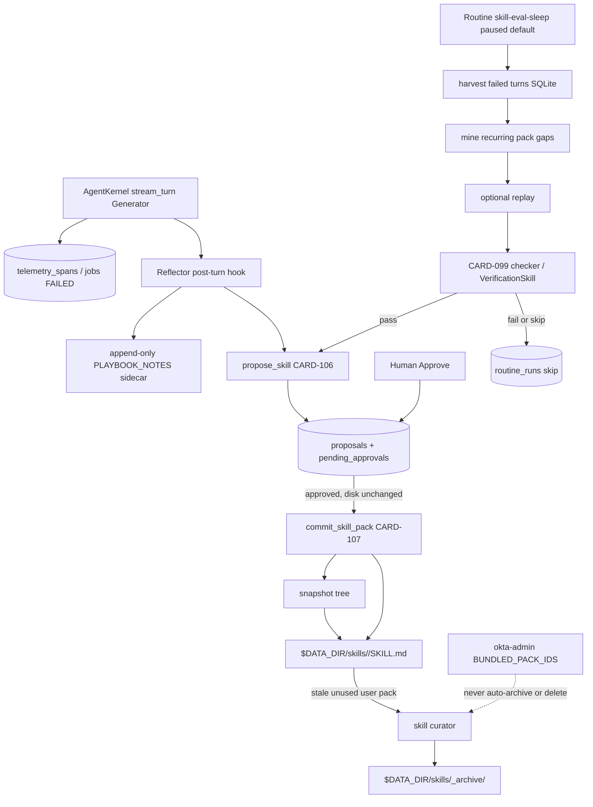
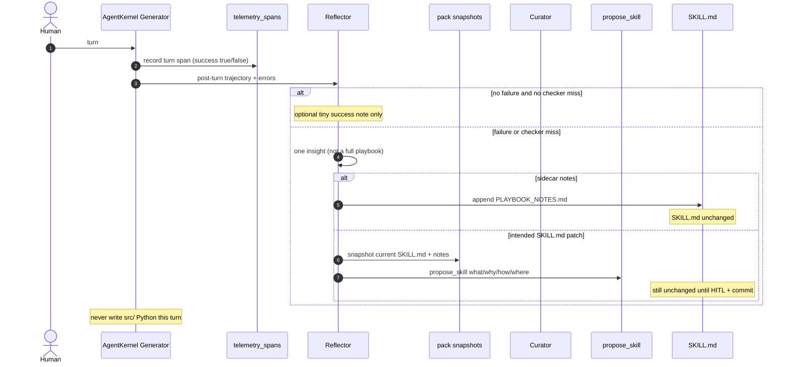

# Technical Design: Skill Self-Improve

> **Linked Spec**: [`requirements.md`](./requirements.md)
> **Applicable ADRs**: `docs/adr/0001-baseline-sdlc.md`, `docs/adr/0005-autonomous-routine-engine-and-async-background-scheduler.md`, `docs/adr/0013-mcp-standard-client-adapter-and-dynamic-skill-loader.md`
> **Locked architecture**: Slice A Job/Phase, Slice B data dir / Skills Studio, Slice C Agent Builder HITL stay. Implement ACE + SkillOpt-Sleep **patterns** in-process. Do not vendor microsoft/SkillOpt. Do not add a second kernel, scheduler, or proposals table.

---

## 1. Architectural Overview & C4 Context

Adopt proven patterns only: ACE (Generator / Reflector / Curator with incremental playbook deltas + snapshot/rollback), SkillOpt-Sleep (harvest → mine → optional replay → checker gate → stage for human adopt), skill curator pack hygiene (archive, never delete bundled seeds), CARD-106 `propose_skill` as the write gate, existing `routines` table as the nightly clock.



Existing modules this slice extends (no new kernel, no SkillOpt package):

| Layer | Today | Slice D |
|-------|--------|---------|
| Kernel | `AgentKernel` records `telemetry_spans` and `react_state=FAILED` | Generator. Post-turn Reflector hook reads the trajectory |
| HITL packs | CARD-106 `propose_skill` + CARD-107 `commit_skill_pack` | Curator for `SKILL.md` patches. 106 gate holds |
| User packs | `$DATA_DIR/skills` + `UserSkillCatalog` + Skills Studio | Sidecar notes + snapshots under the pack dir. Archive tree for stale user packs |
| Routines | `routines` / `routine_runs`, `BUILTIN_ROUTINES`, UTC `ScheduleMatcher` | New `skill-eval-sleep` row. `enabled=false`. `next_run_at` computed for 21:00 America/New_York weekdays |
| Telemetry | `telemetry_spans` success flag, `get_recent_errors` | Harvest source. Read-only |
| Seeds | `BUNDLED_PACK_IDS = (okta-admin,)` copy-if-missing | Curator never deletes these or repo `seeds/` |
| Verify | CARD-099 checker gate, `VerificationSkill` | Nightly apply gate. Missing checker is honest skip, not pass |

### 1.1 ACE mapping (do not vendor the paper repo)

[Agentic Context Engineering](https://arxiv.org/abs/2510.04618) (Generator / Reflector / Curator, incremental deltas to avoid context collapse). In AutoReiv:

| ACE role | AutoReiv object | Must not |
|----------|-----------------|----------|
| Generator | Existing `AgentKernel` turn | Second ReAct loop, LangGraph |
| Reflector | Post-turn function/tool: trajectory + telemetry → one insight | Full `SKILL.md` rewrite, Python codegen |
| Curator | Append sidecar note and/or `propose_skill` | Direct `UserSkillCatalog.save_pack` from the turn |

Prefer `propose_skill` whenever the durable artifact is the playbook so CARD-106 still parks HITL. Sidecar notes are the escape hatch for "tiny breadcrumbs" that are not yet a playbook patch.

### 1.2 SkillOpt-Sleep mapping (do not pip install)

[SkillOpt-Sleep](https://github.com/microsoft/SkillOpt/blob/main/docs/sleep/README.md) is harvest → mine → replay → consolidate → held-out gate → stage → human adopt. No weight training. AutoReiv implements the **shape** with:

| Sleep step | AutoReiv |
|------------|----------|
| Harvest | SQLite `telemetry_spans` + FAILED jobs/phases, lookback 24–72h |
| Mine | Group by pack id / tool name / error string |
| Replay | Optional, default off, Ollama slot 1 |
| Consolidate | Bounded delta text (ACE curator), not a full rewrite |
| Gate | CARD-099 Verify / `VerificationSkill`. Fail or skip ⇒ do not stage |
| Stage | `propose_skill` draft |
| Adopt | Existing Chat HITL Approve + CARD-107 commit. No `--auto-adopt` |

`pyproject.toml` does not gain `skillopt`. A thin adapter is allowed only as optional extra that fails closed if missing.

### 1.3 Timezone (Jacob, America/New_York)

`ScheduleMatcher.is_routine_due` uses `datetime.now(timezone.utc)` and does **not** parse cron expressions (cron falls back to `interval_seconds`). Existing builtins mix `cron_expression="0 23 * * *"` with `schedule_type=INTERVAL`.

CARD-111 must not pretend `0 2 * * *` or "2am local" is correct. 02:00 America/New_York is the wrong default for this operator (surprise GPU load in the middle of the night). 21:00 UTC is 17:00 EDT — also wrong.

**Default:** routine `enabled=false` (paused). When enabled, `next_run_at` is the next weekday 21:00 in `America/New_York` stored as UTC instant. Implementation may extend `ScheduleMatcher` / `Routine.metadata` with `timezone: America/New_York` rather than invent a second scheduler.

---

## 2. Sequence Flow

### 2.1 Online ACE delta (CARD-110)



Rollback: restore `$DATA_DIR/skills/<id>/SKILL.md` (and sidecar) from the latest snapshot directory. No git reset of the checkout.

### 2.2 Nightly SkillOpt-Sleep-shaped routine (CARD-111)

```mermaid
sequenceDiagram
    autonumber
    participant Sch as RoutineScheduler
    participant Rt as routines skill-eval-sleep
    participant H as harvest SQLite
    participant M as mine
    participant Rep as optional replay
    participant G as checker gate
    participant P as propose_skill
    participant Run as routine_runs

    Sch->>Rt: due? enabled and next_run_at 21:00 ET weekday
    alt paused enabled=false
        Note over Rt: no run
    else due
        Rt->>H: failed turns lookback 24-72h
        H->>M: group by pack / tool / error
        opt replay on
            M->>Rep: bounded stream_turn
        end
        M->>G: CARD-099 checker
        alt pass
            G->>P: stage propose_skill draft
            P->>Run: success + proposal_id
        else fail or skip
            G->>Run: skip/fail; no proposal; no SKILL.md write
        end
    end
```

Default paused means first boot after Slice D does **not** fire a sleep cycle until Jacob enables the routine.

### 2.3 Skill curator (CARD-112)

```mermaid
sequenceDiagram
    autonumber
    participant Cur as skill curator
    participant Cat as UserSkillCatalog
    participant Live as $DATA_DIR/skills
    participant Arc as $DATA_DIR/skills/_archive
    participant Seed as BUNDLED_PACK_IDS / repo seeds

    Cur->>Cat: list live packs
    loop each pack
        alt id in BUNDLED_PACK_IDS or okta-admin
            Note over Seed: skip; never delete; no auto-archive
        else user pack unused past stale window
            Cur->>Live: move directory
            Live->>Arc: archive tree
        end
    end
    Note over Seed: src/infrastructure/skills/seeds untouched
```

Unarchive is the reverse move with fail-closed if live dest exists.

---

## 3. Data Contracts & Interfaces

### 3.1 ACE delta note

Sidecar append (JSONL or markdown bullet). Example JSONL line:

```json
{
  "ts": "2026-08-30T01:00:00+00:00",
  "pack_id": "okta-admin",
  "source": "online-ace",
  "session_id": "...",
  "turn_span_id": "...",
  "insight": "Reset/unlock stub was invoked; tell human it is not a live Okta API.",
  "evidence": "tool okta_reset_or_unlock returned playbook stub"
}
```

Promotion into `SKILL.md` uses CARD-106 payload:

```json
{
  "what": "Append ACE insight to okta-admin SOP",
  "why": "Failed turn showed the stub was treated as a live API",
  "how": "Patch SKILL.md SOP with one bullet; no Python",
  "where": "skills/okta-admin/SKILL.md",
  "kind": "skill",
  "ace_delta": true,
  "snapshot_id": "2026-08-30T010000Z"
}
```

### 3.2 Snapshot tree

```text
$DATA_DIR/skills/<pack_id>/
  SKILL.md
  PLAYBOOK_NOTES.md          # optional sidecar
  snapshots/
    2026-08-30T01-00-00Z/
      SKILL.md
      PLAYBOOK_NOTES.md
```

Jail all paths under `$DATA_DIR/skills`. No writes to repo `.agents/skills` or `src/`.

### 3.3 Nightly routine seed

Add to `src/domain/routines/manifests.py` `BUILTIN_ROUTINES` (implementation card; spec-open does not ship the Python):

```text
id: skill-eval-sleep
name: Nightly skill eval (SkillOpt-Sleep shape)
agent_id: agent-builder
enabled: false
schedule_type: cron (or interval with computed next_run_at)
timezone: America/New_York
local_time: 21:00
days: Mon-Fri
prompt: Harvest failed turns from telemetry/sqlite in the lookback window.
        Mine pack gaps. Replay only if metadata.replay is true.
        Run the Verify checker. If it passes, propose_skill the bounded delta.
        Do not write SKILL.md. Do not write Python under src/.
        Do not archive bundled packs.
metadata:
  timezone: America/New_York
  hour: 21
  minute: 0
  weekdays_only: true
  lookback_hours: 72
  replay: false
  auto_commit: false
```

`RoutineScheduler.seed_default_routines` already copy-if-missing by id; do not overwrite an operator-edited row.

### 3.4 Harvest query (intent)

Reuse `TelemetryRepositoryMixin.get_telemetry_spans` / `get_recent_errors`:

- `span_type=turn` and `success=false` within lookback
- plus phases/jobs with `react_state=FAILED` in the same window
- cap `max_sessions` / `max_tasks` (suggested 20 / 10) so Nimo does not replay an unbounded set

Live DB is `$DATA_DIR/autoreiv.db` = `%LOCALAPPDATA%\AutoReiv\autoreiv.db` on Jarvis after CARD-109. Do not harvest checkout `D:\Projects\Active\AutoReiv\data\autoreiv.db`.

### 3.5 Skill curator archive

```text
$DATA_DIR/skills/<id>/           # live
$DATA_DIR/skills/_archive/<id>/  # archived user packs
```

`_archive` is not a pack (no SKILL.md at that level). `UserSkillCatalog` skips `_archive` and `snapshots` when listing live packs. Bundled ids from `BUNDLED_PACK_IDS` are excluded from auto-archive. Stale window default 30 days; last-used can be max(mtime of SKILL.md, last `skill_view`, last tool invoke metadata). If last-used is unknown, fail closed (do not archive).

### 3.6 HTTP / UI

No new Studio required for CARD-110/111. Reuse:

- Chat HITL Approve/Reject for `propose_skill`
- Routines Studio to enable `skill-eval-sleep` and inspect `routine_runs`
- Skills Studio to open packs; optional later: list archived + Unarchive button (CARD-112 may add `POST /api/skills/user-packs/{id}/archive` and `/unarchive` jailed to the skills tree)

Do not add a Settings "2am sleep" toggle.

---

## 4. Error Handling & Edge Cases

| Error Scenario | Detection Point | Handling / Fallback | User Response |
| :--- | :--- | :--- | :--- |
| Reflector LLM fail | Post-turn hook | Skip note; turn result already delivered | No SKILL.md write |
| Snapshot fail | Before propose/commit | Fail closed; no apply | Honest error |
| `propose_skill` missing fields | CARD-106 | Fail closed; no row | Honest error |
| Nightly due while paused | Scheduler | No run | Routines UI shows disabled |
| `next_run_at` computed as 02:00 ET | Seed / matcher review | Forbidden default | 21:00 ET weekdays or paused |
| Cron string treated as UTC 21:00 | Matcher | Must not ship | Timezone-aware `next_run_at` |
| Checker missing | Nightly gate | Honest skip; no proposal | `routine_runs` records skip |
| Checker fail | Nightly gate | No proposal; no SKILL.md write | Run status failed/skip |
| Replay would exceed Ollama slot | Replay | Queue or skip replay | Harvest/gate may still run |
| Harvest empty | Nightly | Success no-op | No proposal |
| Archive `okta-admin` automatically | Curator | Skip | Seed stays live |
| Delete pack | Curator | Never | Archive move only |
| Unarchive dest exists | Unarchive | Fail closed | Tell human |
| Optional `skillopt` import missing | Adapter | Fail closed; in-process path only | No crash on boot |
| Online ACE during nightly | Both | Separate; no lock on chat beyond Ollama slot | Chat wins the slot |
| Write `src/` Python | Reflector / nightly | Forbidden | Tests assert no `src/` mtime change |

---

## 5. UI wireframes

### 5.1 Chat - ACE propose_skill (CARD-110)

```text
| Chat agent: [ Agent Builder v ]  (or the specialist that just failed)

[HITL] propose_skill  status: pending  ace_delta: true
  what: Append insight to okta-admin SOP
  why:  Failed turn treated stub as live Okta API
  how:  One SOP bullet; no Python
  where: $DATA_DIR/skills/okta-admin/SKILL.md
  snapshot: 2026-08-30T01-00-00Z
  [ Approve ]  [ Reject ]
```

Approve does not write. Rollback tool (if exposed) restores snapshot without Approve.

### 5.2 Routines - skill-eval-sleep (CARD-111)

```text
Routines
- Nightly skill eval (SkillOpt-Sleep shape)
  enabled: [ off ]     schedule: weekdays 21:00 America/New_York
  last_run: never      next_run: (paused)
  lookback: 72h        replay: off     auto_commit: off
```

Operator flips enabled. Default off is the product, not a bug.

### 5.3 Skills Studio - archive (CARD-112)

```text
Packs (live)                    | okta-admin
- okta-admin  (bundled seed)    | (no Archive for bundled without confirm)
- my-homelab-pack               | [ Archive ]  (move to _archive)
Archived
- old-experiment                | [ Unarchive ]
```

---

## 6. Mapping to existing code (implementation later; this card is spec-only)

- Reflector hook: next to `AgentKernel` turn-span recording (`record_turn_span` in `src/application/kernel/agent_kernel.py` and `src/web/routers/chat.py`).
- Curator HITL: `src/application/skills/agent_builder_skill.py` `propose_skill` + `src/application/orchestration/skill_proposals.py` (or followup sibling). Do not add a second builder.
- Catalog / jail: `src/application/skills/user_catalog.py`. Snapshots and `_archive` skipped by live list.
- Seeds: `src/infrastructure/skills/seed.py` `BUNDLED_PACK_IDS`. Curator reads that tuple.
- Routines: `src/domain/routines/manifests.py`, `src/application/routines/scheduler.py`, `src/application/routines/matcher.py` (timezone-aware `next_run_at`), `src/domain/routines/models.py` metadata.
- Harvest: `src/infrastructure/memory/repositories/telemetry.py`, jobs react_state in `src/infrastructure/memory/repositories/jobs.py`.
- Gate: CARD-099 verify path in `src/web/routers/chat.py` / `src/application/skills/verification_skill.py`.
- Tests: no `src/` writes; propose_skill still no SKILL.md; paused seed; 21:00 ET next_run; okta-admin not archived; rollback restores snapshot.

---

## 7. Non-goals (do not design)

Training weights, LangGraph, live tool Python codegen, required `skillopt` pip / microsoft/SkillOpt vendor, SkillOpt `--auto-adopt`, 02:00 local default, deleting packs, replacing Agent Builder or Conductor, wiping or merging CARD-109 databases, CARD-014 DAG.
