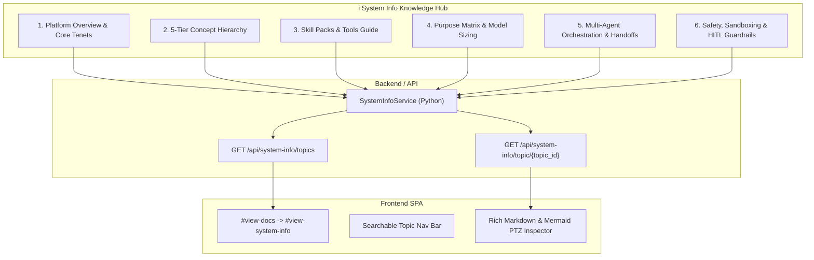

# Design Specification: System Info Conceptual Knowledge Hub and Architectural Overviews

> **Linked Spec**: [`requirements.md`](./requirements.md) | [`tasks.md`](./tasks.md)  
> **Traceability Key**: `[REQ-SYST-xxx]`

---

## 1. Architecture & Navigation Structure



---

## 2. Topic Catalog Schema

```python
@dataclass(frozen=True)
class SystemInfoTopic:
    id: str
    title: str
    category: str
    icon: str
    summary: str
    content_markdown: str
```

---

## 3. Endpoints

- `GET /api/system-info/topics`: Returns list of categories and topic metadata for navigation sidebar.
- `GET /api/system-info/topic/{id}`: Returns full topic document with Markdown content and title.
