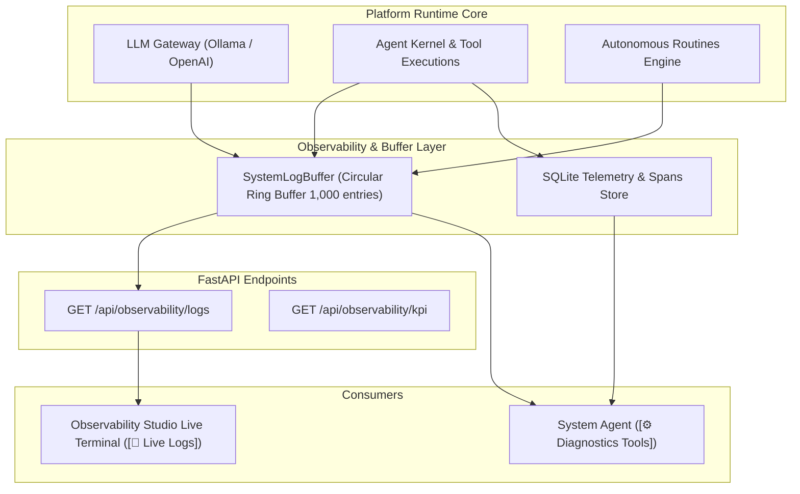

# Technical Design Specification: System Observability Live Event Stream & Diagnostics

> **Document ID**: `DESIGN-OBS-002`  
> **Status**: Approved  
> **Traceability ID**: `[REQ-OBS-007]`, `[REQ-OBS-008]`, `[REQ-AGENTS-007]`, `[REQ-WIKI-010]`

---

## 1. System Logging & Diagnostic Architecture

---

## 2. Component Design & Contracts

### 2.1 `SystemLogBuffer` (`src/application/observability/log_buffer.py`)
- Thread-safe deque ring buffer (capacity: 1,000 lines).
- Records: `timestamp`, `level` (`INFO`, `WARN`, `ERROR`), `component` (`gateway`, `kernel`, `skills`, `web`, `routines`), `message`, and optional `metadata`.
- Standard Python `logging.Handler` attached to root logger.

### 2.2 System Agent Diagnostics (`src/application/skills/system_agent_skill.py`)
- `get_recent_errors(limit, agent_id)`: Fetches error turn spans and tool failure logs from SQLite telemetry.
- `get_session_transcript(session_id, agent_id, limit)`: Reads chat turns for a session from `SQLiteStateStore`.
- `get_agent_sessions(agent_id, limit)`: Lists recent active sessions.
- `test_provider_connectivity(provider_id, host_url)`: Sends probe ping to LLM provider host and returns latency and model list.
- `get_system_logs(lines, level)`: Returns tail of `SystemLogBuffer`.

### 2.3 Librarian Organization (`WikiStore.organize_note` & `LibrarianSkill.organize_wiki_note`)
- Source: `inbox/<slug>.md` or existing note.
- Target: `notes/<domain>/<topic>/<slug>.md`.
- Atomically copies/writes with hydrated frontmatter and unlinks source.
