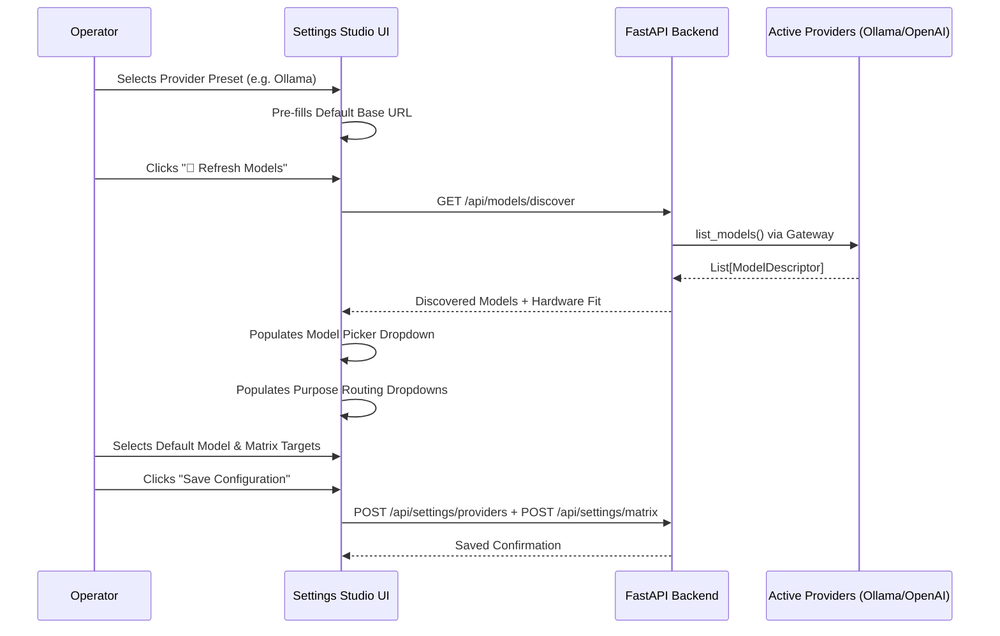

# Technical Design: Unified Settings Studio & Model Matrix

> **Linked Spec**: [`requirements.md`](./requirements.md) | [`tasks.md`](./tasks.md)  
> **Applicable ADRs**: `docs/adr/0016-unified-llm-provider-presets-and-dynamic-matrix-routing.md`

---

## 1. Provider Presets & Data Contracts

```python
PROVIDER_PRESETS = [
    {
        "id": "ollama",
        "name": "Ollama (Local)",
        "default_url": "http://127.0.0.1:11434",
        "requires_key": False,
        "adapter_type": "ollama",
    },
    {
        "id": "openai",
        "name": "OpenAI",
        "default_url": "https://api.openai.com/v1",
        "requires_key": True,
        "adapter_type": "openai_compatible",
    },
    {
        "id": "anthropic",
        "name": "Anthropic Claude",
        "default_url": "https://api.anthropic.com/v1",
        "requires_key": True,
        "adapter_type": "openai_compatible",
    },
    {
        "id": "openrouter",
        "name": "OpenRouter",
        "default_url": "https://openrouter.ai/api/v1",
        "requires_key": True,
        "adapter_type": "openai_compatible",
    },
    {
        "id": "groq",
        "name": "Groq Cloud",
        "default_url": "https://api.groq.com/openai/v1",
        "requires_key": True,
        "adapter_type": "openai_compatible",
    },
    {
        "id": "deepseek",
        "name": "DeepSeek",
        "default_url": "https://api.deepseek.com/v1",
        "requires_key": True,
        "adapter_type": "openai_compatible",
    },
    {
        "id": "vllm",
        "name": "vLLM / Local OpenAI Server",
        "default_url": "http://127.0.0.1:8000/v1",
        "requires_key": False,
        "adapter_type": "openai_compatible",
    },
]
```

---

## 2. Dynamic Model Discovery & Matrix Integration Flow


