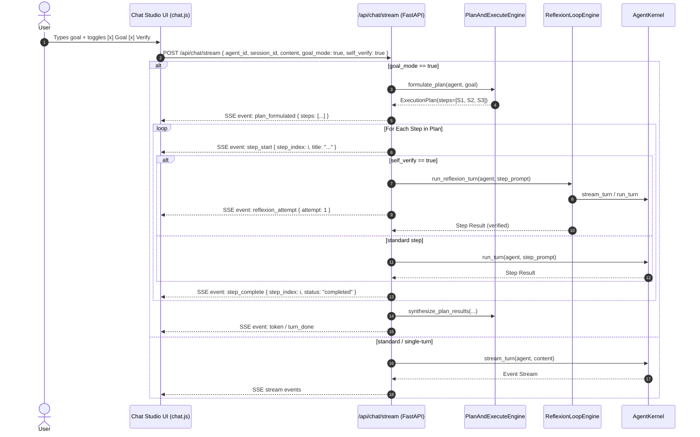

# Technical Design: Visual Goal Mode & Reflexion Streaming

## Architecture Context & Data Flow

---

## Component Modifications

1. **`src/web/routers/chat.py`**:
   - Update `ChatStreamRequest` to include `goal_mode: bool = False` and `self_verify: bool = False`.
   - Update `chat_stream` generator to dispatch through `PlanAndExecuteEngine` and `ReflexionLoopEngine` when flags are set.
2. **`src/web/static/modules/studios/chat.js`**:
   - Include `goal_mode: state.goalEnabled` and `self_verify: state.verifyEnabled` in `/api/chat/stream` payload.
   - Add SSE listeners for `plan_formulated`, `step_start`, `step_complete`, `reflexion_attempt`, `reflexion_critique`, and `reflexion_verified`.
   - Render the dynamic milestone DAG card and reflexion badge inside `streamBubble`.
