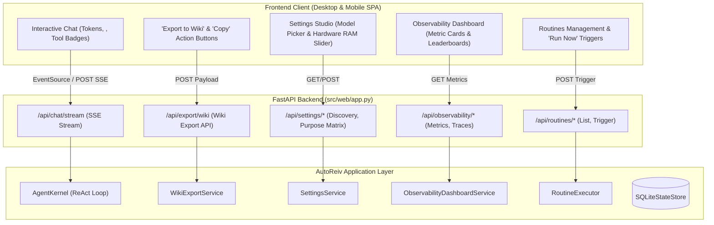

# Technical Design: Responsive Web & Mobile Front-Door with Wiki Export

> **Linked Spec**: [`requirements.md`](./requirements.md)  
> **Applicable ADRs**: [`docs/adr/0008-fastapi-web-application-rest-streaming-api-and-responsive-multi-view-spa.md`](../../adr/0008-fastapi-web-application-rest-streaming-api-and-responsive-multi-view-spa.md)

---

## 1. Architectural Overview & Workflow



---

## 2. API Contract & Schemas

### Chat Stream Request (`POST /api/chat/stream`)
```json
{
  "agent_id": "general-assistant",
  "session_id": "sess-123",
  "content": "Synthesize today's high-priority tasks."
}
```

### Server-Sent Events Protocol
- `event: token` $\rightarrow$ `data: {"text": "Hello"}`
- `event: reasoning` $\rightarrow$ `data: {"text": "Analyzing tasks..."}`
- `event: tool_start` $\rightarrow$ `data: {"tool_name": "task_tracker_list", "arguments": {}}`
- `event: tool_output` $\rightarrow$ `data: {"tool_name": "task_tracker_list", "result": "..."}`
- `event: turn_done` $\rightarrow$ `data: {"content": "...", "duration_ms": 320.0, "total_tokens": 140}`

### Wiki Export Request (`POST /api/export/wiki`)
```json
{
  "title": "Morning Briefing - 2026-08-22",
  "content": "...",
  "agent_id": "general-assistant",
  "session_id": "sess-123",
  "category": "03_Resources",
  "tags": ["briefing", "daily"]
}
```
- **Response**:
```json
{
  "status": "success",
  "filepath": "data/wiki/03_Resources/morning_briefing_2026_08_22.md",
  "filename": "morning_briefing_2026_08_22.md"
}
```

---

## 3. Wiki Note File Format Structure

```markdown
---
title: "Morning Briefing - 2026-08-22"
agent: "general-assistant"
session_id: "sess-123"
exported_at: "2026-08-22T22:55:00Z"
tags:
  - "briefing"
  - "daily"
---

# Morning Briefing - 2026-08-22

[Markdown Conversation or AI Response Body]
```
