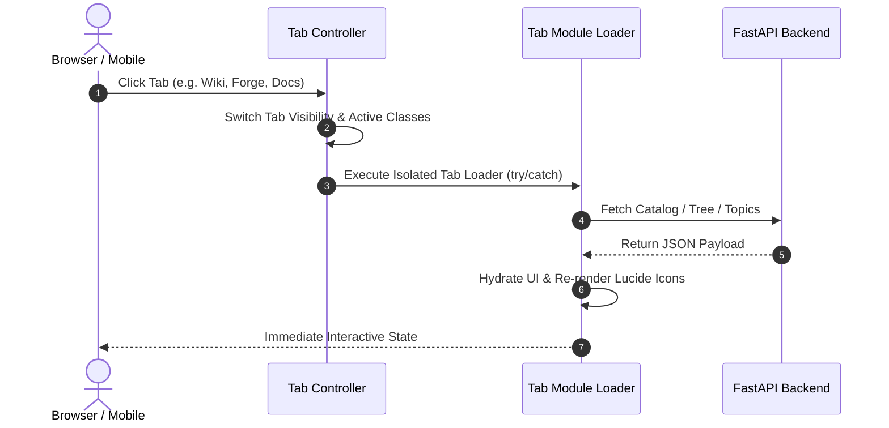

# Technical Design: Web UI Tab Hydration And Rendering Fixes

> **Linked Spec**: [`requirements.md`](./requirements.md)  
> **Applicable ADRs**: `docs/adr/0001-baseline-sdlc.md`

---

## 1. Architectural Overview & C4 Context

```mermaid
graph TD
    User([Browser User]) --> Router[Tab Navigation Controller]
    Router --> Chat[Chat Studio Controller]
    Router --> Routines[Routines Controller]
    Router --> Obs[Observability & Logs Controller]
    Router --> Forge[Agent Forge & Skills Grid]
    Router --> Settings[Settings Studio Controller]
    Router --> Docs[System Info Hub Controller]
    Router --> Wiki[Wiki Studio & Mind Map Engine]
    
    Forge --> API_Skills[/api/skills/catalog]
    Docs --> API_Topics[/api/system-info/topics]
    Wiki --> API_Tree[/api/wiki/tree]
    Wiki --> API_MindMap[/api/wiki/mindmap]
    Wiki --> API_Graph[/api/wiki/graph]
```

---

## 2. Sequence Flow



---

## 3. Data Contracts & UI Components

### Agent Forge Skills Grid
- Re-renders `renderSkillsCatalog(cachedSkillsCatalog)` on every tab load.
- Re-checks checkboxes according to active agent's `allowed_tool_names`.

### System Info Hub
- Traverses `categories` array from `/api/system-info/topics`.
- Auto-loads initial topic markdown via `/api/system-info/topic/{topic_id}` with pan-tilt-zoom diagram support.

### Wiki Studio & Mind Map
- Renders 3 sections: Inbox (staging), Notes (domain/topic hierarchy), Resources.
- Auto-loads first available note on initial tab activation.
- Interactive 2D physics simulation with customizable repulsion and zoom.

---

## 4. Error Handling & Edge Cases

| Error Scenario | Detection Point | Handling / Fallback | User Response |
| :--- | :--- | :--- | :--- |
| Network fetch failure | Tab loader `catch` | Inline error card inside tab viewport | Clear error message with retry button |
| Syntax error in Mermaid | `renderMarkdown` `catch` | Retain original markdown codeblock | Styled warning card without blanking page |
| Unmounted Canvas on mobile | `resizeMindMapCanvas` | Fallback to viewport bounds | Valid non-zero canvas geometry |

