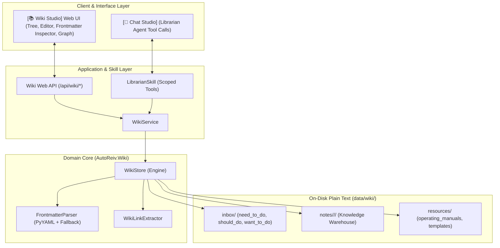

# Technical Design: Wiki Document Management System & Librarian Architecture

> **Feature Name**: `wiki-document-management`  
> **Card Reference**: `CARD-022`  
> **ADR Reference**: `docs/adr/0023-wiki-document-management-system-and-librarian-architecture.md`  
> **Traceability Root**: `[REQ-WIKI-001]` through `[REQ-WIKI-006]`

---

## 1. System Architecture & Topology

The Wiki system operates as a local-first plain-text markdown warehouse mounted at `data/wiki/` (or user-configurable root).



---

## 2. Frontmatter Schema & Data Models

### 2.1 Frontmatter Metadata Contract (`WikiNoteMeta`)

```python
class WikiNoteMeta(BaseModel):
    uid: str = Field(description="Timestamp format YYYYMMDD-HHMMSS")
    title: str
    aliases: list[str] = Field(default_factory=list)
    domain: str = Field(description="Level 1 Degree field, e.g. information_technology")
    topic: str = Field(description="Level 2 Class/Subject, e.g. ai_engineering")
    subtopic: str = ""
    document_type: str = Field(
        default="atomic_note"
    )  # atomic_note, master_note, proxy_note, moc, operating_manual, template, log
    tags: list[str] = Field(default_factory=list)
    parent: str = ""  # [[parent_note]]
    related: list[str] = Field(default_factory=list)  # [[[related_note]]]
    moc: str = ""  # [[map_of_content]]
    summary: str = ""
    status: str = Field(default="draft")  # backlog, draft, in_review, final, deprecated, active, archived
    priority: str = Field(default="medium")  # need_to_do, should_do, want_to_do, high, medium, low
    sensitivity: str = Field(default="internal")  # public, internal, private, secret
    confidence_score: float = 1.0
    supersedes: list[str] = Field(default_factory=list)
    superseded_by: str = ""
    target_artifact: str = ""
    artifact_type: str = ""
    schema_version: str = "1.0"
    date_created: str  # YYYY-MM-DD
    last_updated: str  # YYYY-MM-DD
    last_accessed: str  # YYYY-MM-DD
    word_count: int = 0
    context_tokens: int = 0
```

---

## 3. Core Engine Primitives (`WikiStore`)

```python
class WikiStore:
    def __init__(self, root_dir: str = "data/wiki"): ...
    def scaffold(self) -> None: ...
    def file_note(
        self,
        title: str,
        content: str,
        domain: str = "general",
        topic: str = "general",
        category: str = "notes",
        **metadata,
    ) -> dict: ...
    def read_note(self, rel_path: str) -> dict: ...
    def write_note(self, rel_path: str, content: str, update_frontmatter: dict | None = None) -> dict: ...
    def delete_note(self, rel_path: str) -> bool: ...
    def search_notes(self, query: str, limit: int = 5) -> list[dict]: ...
    def get_tree(self) -> dict[str, Any]: ...
    def get_graph(self) -> dict[str, Any]: ...
    def get_overview(self, max_items: int = 20) -> str: ...
    def get_stats(self) -> dict[str, Any]: ...
```

---

## 4. Web API Contract

- `GET /api/wiki/tree` $\to$ Returns hierarchical folder tree with note counts.
- `GET /api/wiki/note?path={rel_path}` $\to$ Returns parsed frontmatter and raw markdown body.
- `POST /api/wiki/note` $\to$ Ingests/creates a new note.
- `PUT /api/wiki/note` $\to$ Edits note body / metadata non-destructively.
- `DELETE /api/wiki/note?path={rel_path}` $\to$ Deletes note.
- `GET /api/wiki/search?q={query}` $\to$ Returns ranked search hits.
- `GET /api/wiki/graph` $\to$ Returns `{nodes, edges}`.
- `GET /api/wiki/overview` $\to$ Returns compact text summary for LLMs.
