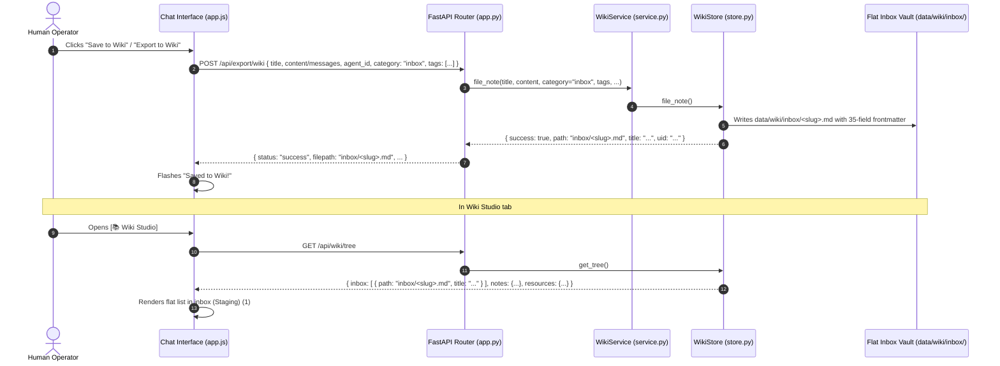

# Technical Design Specification: Chat to Wiki Inbox Export & Flat Staging Vault

> **Document ID**: `DESIGN-WIKI-INBOX-001`  
> **Status**: Approved  
> **Traceability ID**: `[REQ-WIKI-007]`, `[REQ-WIKI-008]`, `[REQ-WIKI-009]`

---

## 1. Architectural Overview



---

## 2. Directory Structure Changes

```text
data/wiki/
├── inbox/                        <-- Flat staging folder (NO subfolders)
│   ├── note_1.md
│   └── chat_export_20260823.md
├── notes/                        <-- Degree / Class Knowledge Base
│   └── information_technology/
│       └── ai_engineering/
│           └── agent_memory.md
└── resources/
    ├── operating_manuals/
    └── templates/
```
